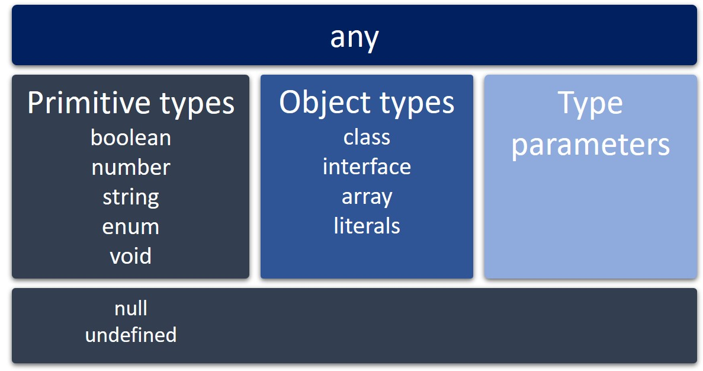

## Tipos e Subtipos

Vamos falar um pouco mais sobre o grande recurso do TypeScript em relação ao JavaScript : os tipos.

Em TypeScript todos os tipos são subtipos de um tipo principal chamado any , e este é um tipo que pode representar qualquer valor em JavaScript . Os demais tipos são os tipos primitivos , tipos de objeto ou parâmetros de tipo .

### Tipos primitivos:

Hoje nós vamos focar em alguns dos tipos primitivos que são os tipos boolean , number , string , void , null e undefined .

**boolean** : recebe verdadeiro ( true ) ou falso ( false )

let yes: boolean = true; // cria uma variável de nome "yes" e diz que o tipo é boleano e o valor é true

let no: boolean = false; // cria uma variável de nome "no" e diz que o tipo é boleano e o valor é false

**number** : recebe valores numéricos e assim como no JavaScript todos são valores de ponto flutuante.

// cria uma variável de nome "x" e diz que o tipo é number mas não seta o valor
// isso não funciona com const
let x: number;

let y: number = 0;
let z: number = 123.456;

**string** : recebe uma sequência de caracteres armazenados como unidades de código UTF-16 Unicode.

let s: string;
let empty: string = "";
let abc: string = 'abc';

**void** : existe apenas para indicar a ausência de um valor, como em uma função sem valor retornado.

function sayHelloWorld(): void {
  console.log("Hello World!");
}

**null** e **undefined** : são subtipos de todos os outros tipos.

let nullValue = null;
let undefinedValue = undefined;
