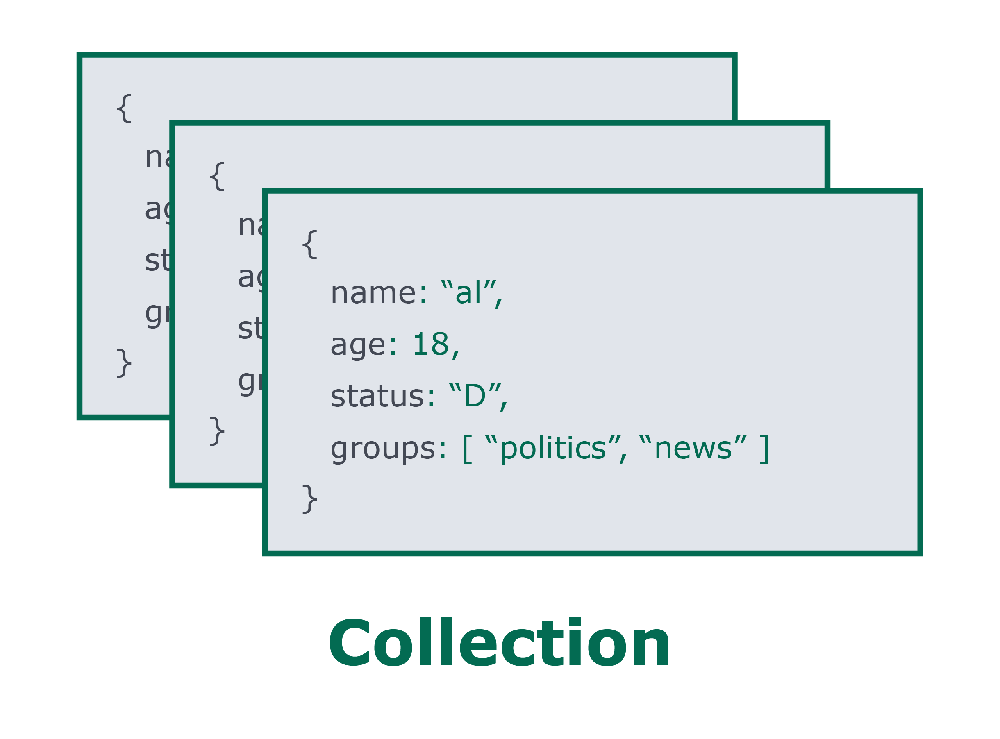

## Bancos de Dados, Coleções e Documentos

A estrutura de armazenamento do MongoDB consiste em:
ter diversos bancos de dados;
dentro destes bancos temos as coleções (que seriam equivalentes às tabelas dos bancos de dados relacionais);
dentro destas coleções temos os documentos (que seriam equivalentes aos registros dos bancos de dados relacionais).
O MongoDB armazena os documentos no formato BSON (Binary JSON). Entenda mais sobre esse formato aqui . https://docs.mongodb.com/manual/core/document/#bson-document-format

## Bancos de Dados

Assim como nos sistemas gerenciadores de bancos de dados relacionais, dentro de uma mesma instância do MongoDB você pode ter um ou vários bancos de dados. Uma grande diferença, é que não temos a formalidade de criar um banco de dados antes de fazer uma operação nele.

Por exemplo, quando vamos fazer um insert , o MongoDB cuida disso para você: criando o banco e a coleção (caso não existam previamente) juntos com o documento inserido. Tudo isso em uma mesma operação.

Uma vez conectado à uma instância do MongoDB através do MongoDB Shell, você só precisa especificar o contexto em que essa escrita acontecerá. Nesse caso, o contexto é o nome do banco de dados que você quer criar:

use nomeDoBanco
db.nomeDaColecao.insertOne({ x: 1 })

Feito! A função insertOne() cria tanto o banco de dados nomeDoBanco , como a coleção nomeDaColecao , caso eles não existam. Se existirem, apenas mapeia o documento a ser inserido dentro deles e, por fim, executa a operação.

Uma dica para nomear bancos e coleções é seguir este guia https://docs.mongodb.com/manual/reference/limits/#restrictions-on-db-names .
