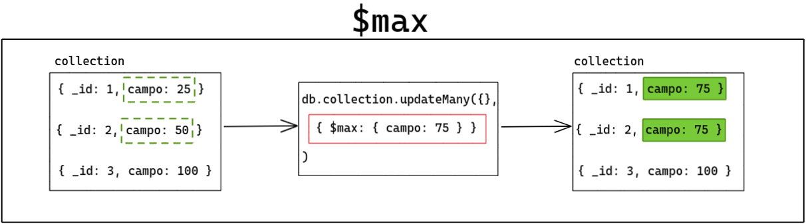
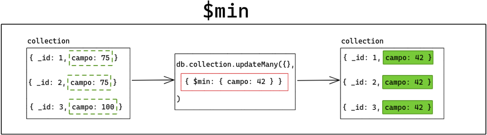

## Operadores $min e $max
Aqui temos dois operadores que também são bastante interessantes. Ambos fazem o mesmo tipo de comparação antes de executar a operação, porém em "sentidos" diferentes:

$min : altera o valor do campo atual para o valor passado pelo método se o valor passado pelo método for menor do que o valor do campo atual.

$max : altera o valor do campo atual para o valor passado pelo método se o valor passado pelo método for maior do que o valor do campo atual.

Ambos podem comparar valores de diferentes tipos, utilizando sempre a ordem de comparação BSON. https://docs.mongodb.com/manual/reference/bson-type-comparison-order/#faq-dev-compare-order-for-bson-types

Considere um cenário em que temos uma collection com três documentos, cada documento possui um atributo id e um atributo campo que é um número inteiro :

db.collection.find();
Resultado:

[
  { _id: 1, campo: 25 },
  { _id: 2, campo: 50 },
  { _id: 3, campo: 100 }
]
A seguir, vamos aplicar um update utilizando o operador $max . Nosso intuito é atingir todos os documentos com o atributo campo que possuem um valor de no máximo 75 . Nesse caso, o operador não só define o escopo máximo, como também o conteúdo que o campo deve passar a ter :

db.collection.updateMany({}, { $max: { campo: 75 } });
// Atualizando todos os valores do atributo "campo"
// para 75 caso sejam menores

db.collection.find();
Resultado:

[
  { _id: 1, campo: 75 }, // valor anterior: 25
  { _id: 2, campo: 75 }, // valor anterior: 50
  { _id: 3, campo: 100 }, // não encontrou no escopo
]
Portanto, teremos os ids 1 e 2 atingidos, alterando o atributo campo para 75.
Com o operador $min é praticamente a mesma coisa, porém na direção inversa :

db.collection.updateMany({}, { $min: { campo: 42 } });
// Atualizando todos os valores do atributo "campo"
// para 42 caso sejam maiores

db.collection.find();
Resultado:

[
  { _id: 1, campo: 42 }, // valor anterior: 75
  { _id: 2, campo: 42 }, // valor anterior: 75
  { _id: 3, campo: 42 }, // valor anterior: 100
]
Aqui atingimos todas os ids, justamente pelo fato de termos definido um escopo que é de no mínimo, 42. Dessa forma, todos os documentos com atributos campo que tivessem um valor superior, foram redefinidos.
Poderíamos resumir ${max} da seguinte forma em um diagrama:
$max : "arrasta" os valores para cima.

Por outro lado, o diagrama de ${min} ficaria estruturado da seguinte forma:
$min : "arrasta" os valores para baixo.

Vamos ver alguns exemplos para ficar mais nítido, utilizando o seguinte documento na coleção scores :

*use conteudo_trybe;*

db.scores.insertOne(
  { _id: 1, highScore: 800, lowScore: 200 }
);

### Exemplo 1: Comparando números

No documento de exemplo, o valor atual do campo lowscore é 200 . A operação abaixo utiliza o $min para comparar 200 com o valor especificado 150 e altera o valor do campo lowscore para 150 porque 150 é menor do que 200 :

*db.scores.update({ _id: 1 }, { $min: { lowScore: 150 } });*
Agora o documento modificado na coleção scores ficou assim:

*{ _id: 1, highScore: 800, lowScore: 150 }*
Se você executar a operação abaixo, ela não terá efeito no documento porque o valor do campo lowscore é menor do que 250 , e o documento não será alterado:

*db.scores.update({ _id: 1 }, { $min: { lowScore: 250 } })*
Atualmente, o campo highscore tem o valor 800 . A operação abaixo usa o $max para comparar 800 e o valor especificado 950 , e então altera o valor do campo highscore para 950 porque 950 é maior que 800 :

*db.scores.update({ _id: 1 }, { $max: { highScore: 950 } });*
E o documento agora fica assim:

*{ _id: 1, highScore: 950, lowScore: 150 }*
Assim como no exemplo utilizando o operador $min , a operação abaixo também não afetará em nada o documento porque o valor de highscore é maior do que 870 :

*db.scores.update({ _id: 1 }, { $max: { highScore: 870 } });*

### Exemplo 2: Comparando datas

Você pode utilizar os operadores $min e $max para comparar valores do tipo Date .
Considere o seguinte documento da coleção tags :

*use conteudo_trybe;*
db.tags.insertOne(
  {
    _id: 1,
    desc: "crafts",
    dateEntered: ISODate("2019-10-01T05:00:00Z"),
    dateExpired: ISODate("2019-10-01T16:38:16Z")
  }
);
A operação abaixo utiliza o operador $min para comparar o valor do campo dateEntered e altera seu valor porque 25/09/2019 é uma data menor (anterior) do que o valor atual, ao mesmo tempo em que o operador $max também é usado para comparar o valor do campo dateExpired e altera esse valor porque 02/10/2019 é uma data maior (posterior) do que o valor atual:

*db.tags.update(*
  { _id: 1 },
  {
    $min: { dateEntered: new Date("2019-09-25") },
    $max: { dateExpired: new Date("2019-10-02") }
  }
);
