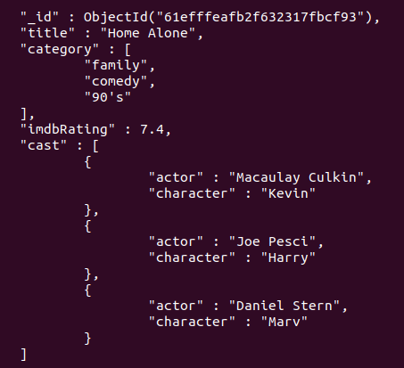

## Agora, a prática

Para praticar, você utilizará um dataset de filmes. Para isso, conecte-se à sua instância e utilize o trecho de código abaixo para criar o banco de dados e inserir os documentos:

use cinema;
db.movies.drop();
db.movies.insertMany([
  {
    title: "Batman",
    category: [
      "action",
      "adventure",
    ],
    imdbRating: 7.7,
    budget: 35,
  },
  {
    title: "Godzilla",
    category: [
      "action",
      "adventure",
      "sci-fi",
    ],
    imdbRating: 6.6,
    budget: 1,
  },
  {
    title: "Home Alone",
    category: [
      "family",
      "comedy",
    ],
    imdbRating: 7.4,
  },
]);

Para cada execução, utilize o método find() para conferir as alterações nos documentos

O MongoDB possui diversas ferramentas, como, por exemplo, mongo , mongosh , Compass e outras ferramentas de terceiros. Você pode utilizar o que achar melhor para executar as queries . O importante é realizá-las.

Exercício 1: Adicione a categoria "superhero" ao filme Batman .

Após a execução do método .find().pretty() , o resultado do filme Batman será parecido com o dessa imagem:

Exercício 2: Utilizando o modificador $each , adicione as categorias "villain" e "comic-based" ao filme Batman .
Após a execução do método .find().pretty() , o resultado do filme Batman será parecido com o dessa imagem:

Exercício 3: Remova a categoria "action" do filme Batman .
Após a execução do método .find().pretty() , o resultado do filme Batman será parecido com o dessa imagem:

Exercício 4: Remova o primeiro elemento do array category do filme Batman .
Após a execução do método .find().pretty() , o resultado do filme Batman será parecido com o dessa imagem:

Exercício 5: Remova o último elemento do array category do filme Batman .
Após a execução do método .find().pretty() , o resultado do filme Batman será parecido com o dessa imagem:

Exercício 6: Adicione o elemento "action" ao array category do filme Batman , garantindo que esse valor não se duplique.
Após a execução do método .find().pretty() o resultado do filme Batman será parecido com o dessa imagem:

Exercício 7: Adicione a categoria "90's" aos filmes Batman e Home Alone .
Após a execução do método .find().pretty() , o resultado do filme Batman e do filme Home Alone será parecido com o dessa imagem:

Exercício 8: Crie um array de documentos chamado cast para o filme Home Alone com os seguintes dados:

{
  "actor": "Macaulay Culkin",
  "character": "Kevin"
},
{
  "actor": "Joe Pesci",
  "character": "Harry"
},
{
  "actor": "Daniel Stern"
}

Após a execução do método .find().pretty() , o resultado do filme Home Alone será parecido com o dessa imagem:

Exercício 9: Adicione o campo character com o valor Marv ao array de cast em que o campo actor seja igual a Daniel Stern no filme Home Alone .
Dica : Para isso, leia aqui sobre o operador $ . https://docs.mongodb.com/manual/reference/operator/update/positional/

Após a execução do método .find().pretty() , o resultado do filme Home Alone será parecido com o dessa imagem:

Exercício 10: Crie um array de documentos chamado cast para o filme Batman com os seguintes dados:

{
  "character": "Batman"
},
{
  "character": "Alfred"
},
{
  "character": "Coringa"
}

Após a execução do método .find().pretty() , o resultado do filme Batman será parecido com o dessa imagem:

Exercício 11: Produza três querys para o filme Batman :

Adicione o campo actor , que deve ser um array com o valor Christian Bale , ao array de cast em que o campo character seja igual a Batman ;
Adicione o campo actor , que deve ser um array com o valor Michael Caine , ao array de cast em que o campo character seja igual a Alfred ;
Adicione o campo actor , que deve ser um array com o valor Heath Ledger , ao array de cast em que o campo character seja igual a Coringa .

Dica : Para isso, leia aqui sobre o operador $ . https://www.mongodb.com/docs/manual/reference/operator/update/positional/

Após a execução do método .find().pretty() o resultado do filme Batman será parecido com o dessa imagem:

Exercício 12: Adicione aos atores de cast do character Batman do filme Batman os valores "Michael Keaton" , "Val Kilmer" e "George Clooney" , e deixe o array em ordem alfabética.

Dica : Para isso, leia aqui sobre o operador $ . https://docs.mongodb.com/manual/reference/operator/update/positional/

Após a execução do método .find().pretty() , o resultado do filme Batman será parecido com o dessa imagem:

