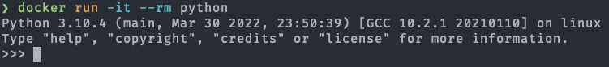

## Python no Docker

Como usar a imagem do Python no Docker?
Opção 01: Usar o REPL do Python dentro do Docker. Para isso siga as instruções abaixo:
Baixe a imagem do python.

# Baixe a última versão do python
docker pull python

# Baixe uma versão específica
docker pull python:tag

Observação: troque a palavra tag pela versão desejada.
Execute o REPL a partir da imagem baixada:

docker run -it --rm python:tag

Opção 02 : Criar um Dockerfile para o seu projeto como no exemplo abaixo:

FROM python:3

WORKDIR /usr/src/app

COPY requirements.txt ./
RUN pip install --no-cache-dir -r requirements.txt

COPY . .

CMD [ "python", "./seu-arquivo.py" ]

Agora você pode construir e rodar a imagem Docker:

docker build -t my-python-app .
docker run -it --rm --name my-running-app my-python-app

Opção 03: Para muitos projetos simples de arquivo único, você pode achar inconveniente escrever um Dockerfile completo. Nesses casos, execute um script Python usando a imagem de Python do Docker diretamente:

docker run -it --rm --name nome-do-seu-script -v "$PWD":/usr/src/myapp -w /usr/src/myapp python:3 python seu-arquivo.py
# -v "$PWD":/usr/src/myapp - monta o diretório atual para dentro do contêiner
# -w /usr/src/myapp - muda o WORKDIR para executar o comando no diretório recém montado.