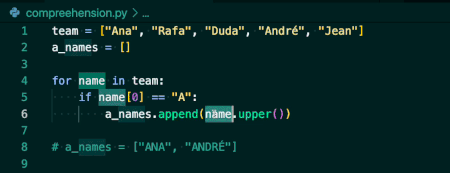

## Estruturas de repetição

for

Imagine um sistema que faça a listagem de restaurantes. Estes restaurantes possuem uma nota proveniente da avaliação dos seus clientes.

restaurants = [
    {"name": "Restaurante A", "nota": 4.5},
    {"name": "Restaurante B", "nota": 3.0},
    {"name": "Restaurante C", "nota": 4.2},
    {"name": "Restaurante D", "nota": 2.3},
]

Quando um cliente pede a listagem de restaurantes, ele pode escolher filtrar o resultado de acordo com a nota. Essa filtragem pode ocorrer percorrendo a lista de restaurantes ou criando uma nova lista com somente aqueles que atendem ao filtro, assim como mostra o exemplo abaixo:

filtered_restaurants = []
min_rating = 3.0

for restaurant in restaurants:
    if restaurant["nota"] > min_rating:
        filtered_restaurants.append(restaurant)
print(filtered_restaurants)  # imprime a lista de restaurantes, sem o B e D

Dado que a maior parte do tempo estamos percorrendo estruturas, os criadores do Python decidiram que o for each seria o laço de repetição principal na linguagem.

Para cada repetição do nosso laço, um novo elemento da estrutura iterável é atribuído a variável de iteração. No exemplo acima, vemos que a cada iteração um novo restaurante é colocado na variável restaurant.

Anota ai ✏️: Em alguns casos, podemos ainda querer percorrer uma sequência numérica, e para isto iteramos sobre a estrutura de dados range.

for index in range(5):
    print(index)

Além de listas, várias outras estruturas são iteráveis, como strings (str), tuplas (tuple), conjuntos (set), dicionários (dict) e até mesmo arquivos.

## Compreensão de lista (list comprehension)

A compreensão de listas em Python possui a sintaxe fácil e compacta para criação de listas, seja a partir de uma string ou de outra lista. É uma maneira concisa de criação que executa uma operação em cada item da lista já existente.

Quando uma nova lista é criada como resultado de uma iteração, podemos simplificar utilizando compreensão de listas. https://pt.wikipedia.org/wiki/Compreens%C3%A3o_de_lista

min_rating = 3.0
filtered_restaurants = [restaurant
                         for restaurant in restaurants
                         if restaurant["nota"] > min_rating]
print(filtered_restaurants)  # imprime a lista de restaurantes, sem o B e D

A compreensão de listas é declarada da mesma maneira que uma lista comum, porém no lugar dos elementos nós colocamos a iteração que vai gerar os elementos da nova lista.

De olho na dica👀: É possível filtrar esses elementos utilizando o if.
Poderíamos listar também somente o nome dos restaurantes, veja o exemplo abaixo:

# min_rating = 3.0
filtered_restaurants = [restaurant["name"]  # aqui pedimos somente o nome do restaurante
#                        for restaurant in restaurants
#                        if restaurant["nota"] > min_rating]
# print(filtered_restaurants)  # imprime a lista de restaurantes, sem o B e D

A compreensão de listas também funciona com listas de strings. A seguinte cria uma nova lista de strings que contém 'a'.

nomes = ['Duda', 'Rafa', 'Cris', 'Yuri']
nomes2 = [s for s in nomes if 'a' in s]
print(nomes2)

# Saída

['Duda', 'Rafa']
O exemplo a seguir usa uma compreensão de listas para criar uma lista com o quadrado dos números entre 1 e 10.

quadrados = [x*x for x in range(11)]
print(quadrados)

# Saída
[0, 1, 4, 9, 16, 25, 36, 49, 64, 81, 100]

Isto é equivalente às operações de map e filter em JavaScript.

## while

🔢 A Sequência de Fibonacci, muito presente em diversas formas na natureza, é uma sequência numérica começando por 0 e 1 e cada termo subsequente corresponde à soma dos dois anteriores.

Podemos escrever esta sequência da seguinte maneira:

n = 10
last, next = 0, 1
while last < n:
    print(last)
    last, next = next, last + next

O laço de repetição while acontecerá enquanto a condição for satisfeita.

⚠️ Aviso: Tenha cuidado ao manipular a variável presente na condicional ou entrará em uma repetição infinita.

No exemplo anterior, estamos imprimindo os elementos da sequência até que atinja o valor 10. Neste caso, foi utilizado um truque chamado atribuição múltipla. Isto é, atribuição de vários valores a múltiplas variáveis ao mesmo tempo.

De olho na dica👀: Este truque pode ser utilizado também para fazer a troca de valores entre variáveis: a, b = b, a.

## enumerate

Em Python, um loop for geralmente é escrito como um loop sobre um objeto iterável. Isso significa que você não precisa de uma variável de contagem para acessar itens no iterável.

Porém, às vezes, pode acontecer de você querer uma variável que muda em cada iteração do loop. Em vez de criar e incrementar uma variável você mesmo, você pode usar enumerate() do Python para obter um contador e o valor do iterável ao mesmo tempo!

languages = ['Python', 'Java', 'JavaScript']

enumerate_prime = enumerate(languages)

# converte um objeto enumerate em uma lista
print(list(enumerate_prime))

# Saída: [(0, 'Python'), (1, 'Java'), (2, 'JavaScript')]
Você também pode desestruturar (unpack) os itens da lista ou tupla:

languages = ['Python', 'Java', 'JavaScript']

for index, language in enumerate(['Python', 'Java']):
    print(f'{index} - {language}')
# Saída:
0 - Python
1 - Java

Veja a documentação do enumerate https://docs.python.org/pt-br/3/library/functions.html#enumerate para entender como essa ferramenta pode te ajudar em outros casos.

Para fixar as estruturas de repetição, vamos continuar resolvendo alguns exercícios!? 💪

Exercício 12: O Fatorial de um número inteiro é representado pela multiplicação de todos os números predecessores maiores que 0. Por exemplo, o fatorial de 5 é 120 pois 5! = 1 * 2 * 3 * 4 * 5. Escreva um código que calcule o fatorial de um número inteiro.

R: number = 5
counter = 1
result = 1

while counter <= number:
    result = result * counter
    counter += 1
result

Exercício 13: Um sistema de avaliações registra valores de 0 a 10 para cada avaliação. Após algumas mudanças estes valores precisam ser ajustados para avaliações de 0 a 100. Dado uma sequência de avaliações ratings = [6, 8, 5, 9, 10]. Escreva um código capaz de gerar as avaliações após a mudança. Neste caso o resultado deveria ser [60, 80, 50, 90, 100].

R:number = 5
counter = 1
result = 1

while counter <= number:
    result = result * counter
    counter += 1
result

Experimente utilizar a sintaxe de compreensão de listas.

Exercício 14: Percorra a lista do exercício 14 e imprima "Múltiplo de 3" se o elemento for divisível por 3.