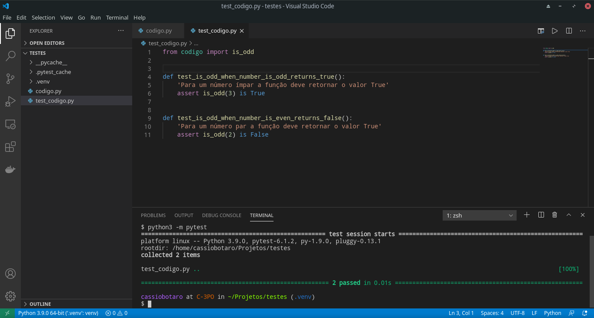

## Testes automatizados

Quem nunca arrumou um problema em um código e acabou atrapalhando o funcionamento dele em outro cenário? Ou ficou horas testando as mais diversas condições para um algoritmo e no meio do caminho teve de mexer no código e recomeçar tudo novamente. 😁

Através de testes automatizados, a pessoa desenvolvedora é capaz de identificar mais facilmente um bug ou verificar que alterações do código não afetaram o comportamento esperado do sistema.

Em nosso curso utilizaremos a biblioteca pytest https://docs.pytest.org/en/latest/, um framework que facilita a escrita de testes simples, mas capazes de testar funcionalidades complexas em aplicações e bibliotecas.

⚠️ Lembre-se de instalar a biblioteca somente no ambiente virtual do seu projeto.

A instalação é feita através do pip utilizando o comando:

python3 -m pip install pytest
E podemos verificar utilizando o comando:

python3 -m pytest --version

A saída esperada é similar à apresentada abaixo.

This is pytest version 5.3.0, imported from /home/cassiobotaro/projects/gerenciador-tarefas/.venv/lib/python3.8/site-packages/pytest.py

📝 Que tal vermos um exemplo?

codigo.py

def is_odd(number):
    'Retorna True se um número é ímpar, senão False.'
    return number % 2 != 0

test_codigo.py

from codigo import is_odd

def test_is_odd_when_number_is_odd_returns_true():
    'Para um número ímpar a função deve retornar o valor True'
    assert is_odd(3) is True

def test_is_odd_when_number_is_even_returns_false():
    'Para um número par a função deve retornar o valor False'
    assert is_odd(2) is False

Notem que o nome do arquivo de testes possui o prefixo test_, assim como a definição das funções de teste. Isto é necessário para que seus testes sejam descobertos pela ferramenta.

Uma função de teste é similar a qualquer outra, porém tem o propósito de verificar se o resultado obtido foi o mesmo do esperado. No código isto pode ser visto através da utilização da palavra reservada assert.

O comando assert funciona da seguinte maneira: caso a expressão recebida seja verdadeira (avaliada como True), nada acontece. Porém, caso seja falsa (avaliada como False), uma exceção do tipo AssertionError é lançada. A pytest captura este erro e tenta apresentar uma comparação entre o esperado e o recebido da melhor maneira possível.

Vamos rodar nossos testes e ver o resultado? Vamos utilizar o comando:

python3 -m pytest

💡 Experimente modificar estes testes para uma falha e veja o resultado.
