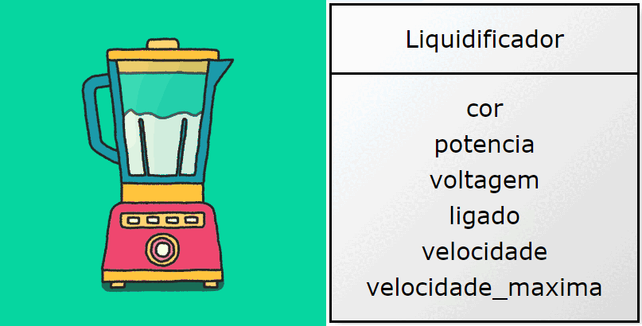

## O que são Objetos?

Objetos são entidades da aplicação, ou seja, eles interagem entre si para solucionar os requisitos do sistema.

Olhe ao seu redor. Uma pessoa está sempre cercada por objetos, tais como: eletrônicos, móveis, pessoas, animais, carros, casas e assim por diante. Os objetos podem ser iguais ou possuir diferenças entre si e, para descobrir isso, nós observamos os seus Atributos, por exemplo: tamanho, cor, formato, peso.

Além disso, devemos nos atentar aos seus métodos/comportamentos, por exemplo:
Objeto Carro [acelera e freia...]
Objeto Pessoa [se alimenta, respira e sente...]
Objeto Elevador [sobe, desce, abre e fecha...]
Objeto Relatório [Imprime, se atualiza, calcula seus resultados...]
De olho na dica👀: Os métodos podem manipular os atributos.

Primeiro Exemplo

Como podemos modelar a Classe do Objeto Liquidificador?
Identificamos os principais atributos deste objeto, pois eles serão úteis logo no primeiro passo, que será criar o construtor.

