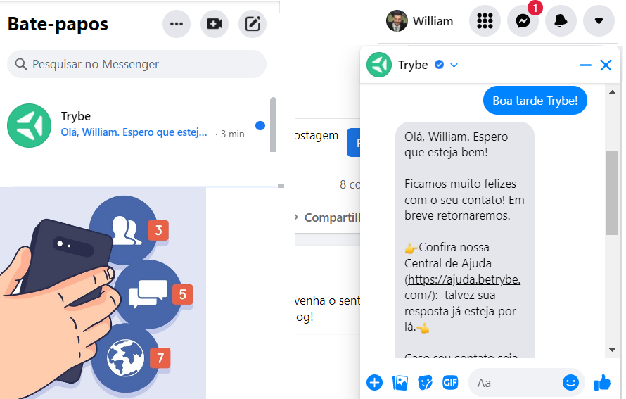

## Padrão Observer

O Observer é um padrão comportamental, pois o foco é sobre as responsabilidades dos objetos. Uma classe observadora se responsabiliza por monitorar outro objeto. Assim, quando ocorrer alguma alteração ou eventos no objeto monitorado, o observador vai notificar os demais objetos do sistema.

Para simplificar: lembre do que acontece quando você recebe uma nova mensagem no Facebook. Quantos objetos/componentes são atualizados?

Será que cada objeto componente fica consultando o objeto listaDeMensagens freneticamente a cada segundo? 🤔 O que ocorre é justamente o conceito do padrão Observer, onde um objeto notifica os demais sobre essa atualização. O React Redux pode ser considerado uma implementação do padrão Observer.

### Aplicando o Padrão Observer

Vamos implementar a representação de um sistema de notificação de uma rede social, de modo que, quando uma pessoa realizar uma nova postagem em seu perfil, todos as pessoas que a seguem serão notificadas. Entretanto, as pessoas seguidoras podem decidir se querem ser notificadas por mensagem, push notification ou e-mail.

1️⃣ Precisaremos criar a classe Perfil, que ao adicionar um novo post (adicionar_post()), exibirá o mesmo (mostrar_post) e notificará todas as pessoas seguidoras ( notificar_todos) pelos sistemas (\_\_sistemas de notificação) que possui. O método adicionar_sistema_de_notificacao() permitirá que o cadastro de novos sistemas seja feito de forma dinâmica:

class Perfil:
def **init**(self):
self.**sistemas_de_notificacao = []
self.**new_post = None

    def adicionar_sistema_de_notificacao(self, sistema):
        self.__sistemas_de_notificacao.append(sistema)

    def notificar_todos(self):
        for sistema in self.__sistemas_de_notificacao:
            sistema.notificar()

    def adicionar_post(self, post):
        self.__new_post = post
        self.mostrar_post()
        self.notificar_todos()

    def mostrar_post(self):
        print(f"\nPost: {self.__new_post}\n")

2️⃣ Para implementar o padrão Observer, precisaremos criar as classes observadoras que acompanharão o objeto Perfil, observando se ele ganha um novo Post. Quando verdadeiro, cada observador vai disparar as notificações.

Criaremos então, uma classe Observador para cada sistema de envio (E-mail, PushNotification, Mensagem). Como a estrutura dessas classes será parecida, nada mais justo que padronizá-las para uma Interface Abstrata, garantindo que exista o método notificar():

from abc import ABC, abstractmethod

# Interface Observer

class Notificador(ABC):
@abstractmethod
def notificar(self):
pass

# Observador Mensagem

class NotificadorMensagem(Notificador):
def **init**(self, perfil, seguidores):
self.perfil = perfil
self.seguidores = seguidores
self.perfil.adicionar_sistema_de_notificacao(self)

    def notificar(self):
        print(f"Notificando via Mensagens: {self.seguidores}")

# Observador Push Notification

class NotificadorPushNotification(Notificador):
def **init**(self, perfil, seguidores):
self.perfil = perfil
self.seguidores = seguidores
self.perfil.adicionar_sistema_de_notificacao(self)

    def notificar(self):
        print(f"Disparando Push Notification para: {self.seguidores}")

# Observador Email

class NotificadorEmail(Notificador):
def **init**(self, perfil, seguidores):
self.perfil = perfil
self.seguidores = seguidores
self.perfil.adicionar_sistema_de_notificacao(self)

    def notificar(self):
        print(f"Disparando Email's para: {self.seguidores}")

3️⃣ Pronto, agora podemos usar nosso código com o padrão Observer! O código que vamos utilizar é conhecido na literatura como código Cliente:
Agora, podemos ver como cada pessoa seguidora deseja ser notificada:
Carlos quer ser notificado por mensagem
Marcia e Claudia querem ser notificadas por mensagem e email
Rodolfo quer ser notificado somente por mensagem

# Cliente

if **name** == "**main**":
seguidores_mensagem = ["Carlos", "Claudia", "Marcia", "Rodolfo"]
seguidores_push_notification = ["Carlos"]
seguidores_email = ["Claudia", "Marcia"]

    meuPerfil = Perfil()
    NotificadorMensagem(meuPerfil, seguidores_mensagem)
    NotificadorPushNotification(meuPerfil, seguidores_push_notification)
    NotificadorEmail(meuPerfil, seguidores_email)

    meuPerfil.adicionar_post("Olá universo da programação!")

4️⃣ Podemos perceber que apenas o uso de meuPerfil.adicionar_post() é suficiente para realizar as notificações. Inclusive ainda podemos notificar as pessoas seguidoras a qualquer momento chamando diretamente meuPerfil.notificar_todos(). Isso é interessante, pois podemos ativar/desativar as formas de notificação apenas alterando um bloco parcial de código, sem precisar alterar o método notificar_todos(). Esta facilidade é conhecida como baixo acoplamento e facilita muito as manutenções futuras.

### Exercício de fixação

No exemplo acima, temos o código adicionar_sistema_de_notificacao, que adiciona um sistema de notificação. Porém, imagine que o serviço de email esteja indisponível. Nesse sentido, implemente o método remover_sistema_de_notificacao, que deve realizar um remove na lista de sistemas.
