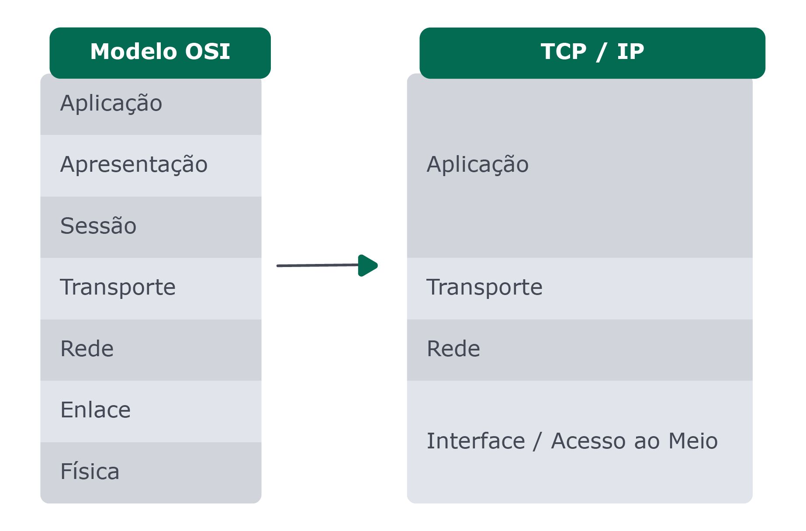

## Modelo de Rede

Existem diversos protocolos, cada um é responsável por definir as regras para um objetivo específico. Assim, cada protocolo pode se preocupar apenas com a parte pela qual ele é responsável e conforme a nossa necessidade podemos utilizar combinações de protocolos.

Dividimos então os protocolos em grupos, agrupando cada tipo no que chamamos de camadas. Por exemplo, precisamos de uma camada para identificar quem está enviando a informação e pra quem ela se destina, precisamos de outra camada para traduzir os dados a serem trafegados, etc.

Um conjunto dessas camadas forma o que chamamos de modelo. O modelo basicamente define quais são as camadas necessárias para a montagem de um pacote.

### Modelo ISO/OSI

O modelo ISO/OSI (em inglês Open Systems Interconnection) foi lançado com o objetivo de ser um padrão entre os diversos dispositivos de comunicação. Esse modelo divide as redes de computadores em 7 camadas:

▶️ Cada camada é responsável pela inserção de uma funcionalidade ao modelo, de forma que a informação passa por uma primeira camada, sendo formatada e tendo informações adicionadas de acordo com sua regra.

▶️ Em seguida, o resultado desse primeiro encapsulamento é passado para a outra camada, onde a informação é novamente tratada e são adicionadas as informações pertinentes àquela camada. Esse processo é repetido por todas as camadas até que os dados estejam aptos para serem trafegados ao seu destino.

▶️ Da maneira inversa, o destinatário realiza o desencapsulamento, compreendendo os dados de cada camada e então prosseguindo para a camada seguinte.
👀 De olho na dica: se você quiser se aprofundar um pouco mais nesse assunto, leia este artigo no Real Life Engeneer https://app.betrybe.com/course/real-life-engineer/arquitetura-de-redes .

### Modelo Internet - TCP/IP

O modelo ISO/OSI, como o nome já diz, é um "modelo": isso quer dizer que ele define camadas abstratas a serem tratadas. É necessária, portanto, uma implementação que aplique esses conceitos. Uma das implementações desse modelo é a TCP/IP, que é um conjunto de protocolos de comunicação: TCP (Transmission Control Protocol - Protocolo de Controle de Transmissão) e o IP (Internet Protocol - Protocolo de Internet).

O TCP/IP define 4 camadas mesclando as 7 do modelo OSI:

### Aplicação

A camada de aplicação contém os protocolos responsáveis por dar significado às informações, sendo a primeira camada passada para a mensagem.
Como exemplos de protocolos dessa camada temos o SMTP (Simple Mail Transfer Protocol - Transmissão de e-mails), FTP (File Transfer Protocol - Transferência de arquivos) e o nosso velho amigo HTTP (Hypertext Transfer Protocol - Comunicação WEB).

Tomando como exemplo o HTTP: quando subimos um front-end e temos um servidor capaz de servir páginas web, esse processo é realizado utilizando HTTP. Ao subirmos o servidor, o mesmo ficará aguardando por um pedido, por requisições. Quando acessamos aquele serviço pelo navegador, por exemplo, o navegador está fazendo uma chamada HTTP ao servidor, ou seja, o pedido é feito seguindo os padrões desse protocolo, de modo que o servidor saberá como interpretá-lo, processá-lo e devolver a devida resposta. Essa resposta também seguirá as regras do protocolo, de modo que o navegador (client) também saiba entender o que foi retornado e, além do conteúdo das páginas (o html, css e o js), também são entregues na resposta outros dados do protocolo, como os headers.

Dessa mesma forma, outros protocolos podem ser utilizados nessa camada: SMTP, FTP, DHCP, entre outros. Cada protocolo terá suas regras e padrões de modo que ambos os lados, cliente e servidor, saibam interpretar as informações.

### DNS

Estamos falando constantemente de endereços IP, que toda máquina possui um endereço IP para poder se comunicar na rede e ao endereçar um pacote nós o utilizamos. Mas a realidade é que não costumamos ver muito esses números ao utilizar a internet...

🤔 Então, se os endereços IP são essenciais para se navegar, onde eles ficam?

Nós utilizamos um sistema de nomes para identificar pontos da rede em vez de usar números, já que nomes são mais fáceis de serem utilizados por pessoas. Por exemplo: imagine que para acessar o google.com fosse necessário digitar no navegador "8.8.8.8", ou para acessar o site da Trybe fosse necessário digitar "34.193.204.92". Seria muito complexo e nada fácil, certo? Para simplificar isso existe o sistema de DNS.

Dessa forma, de maneira bem resumida, conseguimos atribuir um "nome" a um endereço IP específico.

### Transporte

A camada de transporte, como o próprio nome indica, é a camada responsável pela transferência de dados entre diferentes máquinas (seja um servidor ou um computador pessoal). Os principais protocolos dessa camada são o TCP e o UDP.

Os protocolos possuem diferentes aplicabilidades. Por exemplo, para criarmos um servidor para servir uma página web não podemos ter perda de informações, caso contrário a página não chegará por completo a quem pediu. Da mesma forma que, ao construirmos uma API, temos que garantir que os dados enviados, como o conteúdo de um formulário de cadastro, chegue até o servidor, assim como garantir que os dados respondidos em uma consulta feita ao servidor, por exemplo, sejam entregues por inteiro ao cliente que fez essa solicitação. Nesses casos o TCP é o protocolo mais adequado.

Por outro lado, ao assistirmos uma live ou jogarmos algum jogo online, alguns dados podem ser perdidos ao perdermos parte da transmissão do vídeo, de maneira que perceberemos apenas uma oscilação na transmissão. Nesse caso, o UDP é mais indicado, já que com TCP, caso essa perda de pacote ocorra, será necessário aguardar o reenvio para dar continuidade ao processo. Além disso, o UDP permitirá uma maior velocidade na transmissão e também que o conteúdo seja transmitido para diversos clientes ao mesmo tempo, dando a oportunidade de várias pessoas assistirem àquele conteúdo em tempo real.

### Rede

O principal protocolo utilizado nessa camada é o IP - Internet Protocol, que inclusive dá nome ao modelo. Outras opções de protocolos dessa camada são o ICMP, NAT, ARP. Todos eles lidam com o endereçamento da comunicação. Mas o que seria o endereçamento?!
Imagine que você vai enviar uma mensagem para alguém por meio de uma carta. Você então escreve a mensagem em uma folha e a coloca em um envelope. Nesse envelope é necessário que você coloque o endereço do destinatário, para que seja possível entregar sua carta. Da mesma maneira, você precisa informar o seu endereço para que o destinatário possa enviar uma mensagem de resposta para você. 📫
A camada de rede do TCP/IP é utilizada para isso. Ela vai identificar o remetente e o destinatário para que o pacote possa ser transmitido na rede.
👀 De olho na dica: caso queira conhecer um pouco mais sobre o IPv6 assista, como conteúdo extra, ao vídeo: 'Os endereços IP não são todos iguais do NIC.br'\_
https://www.youtube.com/watch?v=jnuHODaLcO8

### Interface / Acesso ao Meio

Por último, mas não menos importante, temos a camada física ou de abstração do hardware, também chamada de camada de interface ou de acesso ao meio.
A principal função dessa camada é realizar a interface do modelo TCP/IP com os diversos modelos de rede. Por exemplo o protocolo Ethernet, que transmite os dados através dos meios físicos, encontrando e transmitindo tudo pelo melhor caminho possível. Esta camada lida com os meios de comunicação e corresponde ao nível de hardware, ou meio físico, que trata dos sinais eletrônicos, conector, pinagem, níveis de tensão, dimensões físicas, características mecânicas e elétricas, etc.
