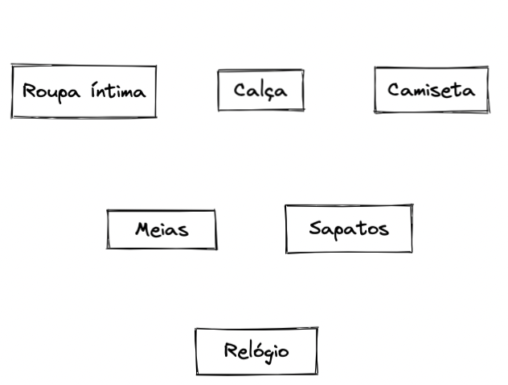
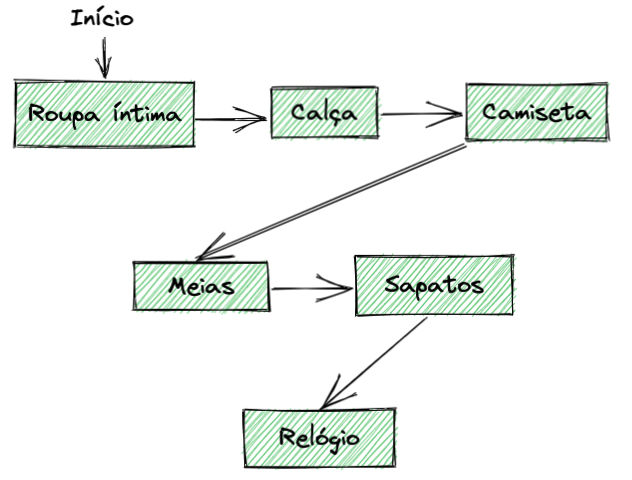
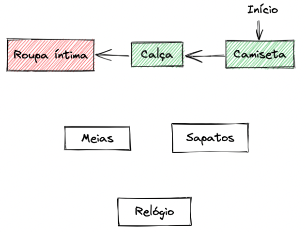

## O que é um algoritmo?

Uma vez que usamos essa palavra com frequência, é preciso que tenhamos a definição bem nítida para esse conceito, de modo a garantir que estamos partindo do mesmo ponto quando falamos de Complexidade Algorítmica.
"Informalmente, um algoritmo é qualquer procedimento computacional bem definido que toma algum valor ou conjunto de valores como entrada e produz algum valor ou conjunto de valores como saída. Portanto, um algoritmo é uma sequência de etapas computacionais que transformam a entrada na saída" (CLRS - Introduction to Algorithms)
"Um algoritmo é um conjunto de instruções que realizam uma tarefa." (BHARGAVA, ADITYA Y. - Entendendo Algoritmos)
Basicamente, um algoritmo é uma sequência lógica de passos bem definida (entrada, processamento e saída) que realiza determinada tarefa.
Pode parecer que usamos algoritmos somente para resolver problemas computacionais, entretanto, também os utilizamos no nosso dia a dia! Observe alguns exemplos a seguir:
Se vestir;
Assar um bolo;
Preparar um sanduíche;
Trocar uma lâmpada;
Vejamos como seria um exemplo de algoritmo para se vestir:
Imagine que precisamos executar essas tarefas abaixo, elas estão representadas por retângulos:

Podemos decidir uma ordem de vestimenta da seguinte maneira:

Exemplificando em texto:
Vista roupa íntima;
Vista a calça;
Vista a camiseta;
Calçar as meias;
Calçar os sapatos;
Por fim, coloque o relógio.
Você deve estar se perguntando: "Mas, e se eu quiser me vestir em outra ordem?"🤔
É completamente possível!
Vamos ver uma outra maneira?

No entanto, em alguns momentos não teremos a possibilidade de mudar a ordem dos processos, observe o exemplo abaixo:

Pois bem! Apesar de existirem diversas formas de realizarmos uma tarefa, nem sempre a forma que escolhemos nos retornará o resultado esperado. Com isso, um algoritmo pode ou não ser correto, podemos considerá-lo correto se, e somente se, nos entrega a saída esperada para todas as entradas, isto é, ele resolve aquele problema.

⚠️ Aviso: Algoritmos incorretos não têm o comportamento de resolver um problema, e são utilizados apenas quando é possível controlar bem sua taxa de erro; algo que é raro, entretanto devemos mencionar isso a título de conhecimento.

Agora que estamos na mesma página em relação aos conceitos de algoritmo e algoritmos corretos (ou corretude), vamos compreender o que é a Complexidade Algorítmica.

Para começar, observe o algoritmo abaixo:

def sum_array(numbers):
sum = 0
for number in numbers:
sum += number

    return sum

Anota aí 🖊: A função sum_array recebe um array de números, percorre-o e executa a soma de cada um de seus valores (number), retornando a soma de todos os números pertencentes ao array.

Você consegue imaginar quanto tempo esse código vai demorar em sua execução?

Resposta: "Isso depende de muitos fatores". Afinal, o tempo de execução depende da máquina, do que está rodando nela, dos recursos etc. Não conseguimos dizer isso apenas ao olhar para o código.

Porém, vamos supor que estamos falando de uma máquina padrão e sem mais nada rodando nela. Quanto tempo você imagina que o algoritmo vai demorar para executar? Um segundo? Dez segundos?

Temos mais um "depende" aqui, não é mesmo? O tempo de execução depende do tamanho do array passado por parâmetro! Quanto maior o tamanho dele, mais tempo o algoritmo gastará em sua execução.

Dito isso, não sabemos quanto tempo o algoritmo vai demorar para executar, pois vai depender de inúmeros fatores que vão além do nosso controle. Mas, uma coisa podemos afirmar: O tempo de execução dele é proporcional ao tamanho do dado de entrada. Por exemplo:

# def sum_array(numbers):

# ...

# Suponha que, para o array abaixo, o tempo de execução seja `n`

sum_array(array_com_dez_mil_numeros)

# Nesse caso, aqui o tempo de execução vai ser `10 * n`, ou `10n`, já que o array é dez vezes maior que o anterior

sum_array(array_com_cem_mil_numeros)

# Já esse é dez mil vezes maior que o primeiro, então esse aqui executa em `100n`

sum_array(array_com_um_milhão_de_numeros)

Note que conforme aumentamos o valor da entrada, o tempo de execução do algoritmo aumenta proporcionalmente, de acordo com uma taxa.

É isso que chamamos de complexidade: A taxa de crescimento do tempo de execução de um algoritmo; quanto maior é essa taxa, maior é seu tempo de execução e, portanto, maior sua complexidade.

No exemplo anterior, os valores de entrada podem variar, mas as proporções não: Um aumento no tamanho da entrada aumenta o tempo de execução na mesma proporção.

Podemos dizer, em suma, que a Ordem de Complexidade nada mais é do que a representação dessa proporção (ou taxa) de crescimento. Dado que o algoritmo é linearmente proporcional ao tempo de execução, dizemos que este é um algoritmo linear.

Anota aí 🖊: A Ordem de Complexidade nada mais é do que a representação dessa proporção (ou taxa) de crescimento. Dado que o algoritmo é linearmente proporcional ao tempo de execução, dizemos que este é um algoritmo linear.

A função matemática que representa uma relação linear é f(n) = n e a notação de Ordem de Complexidade para representar a taxa de crescimento do tempo de execução de um algoritmo é dada por O(n), onde o n representa a quantidade de operações que o algoritmo vai realizar.

⚠️ Aviso: A partir de agora, sempre que falarmos sobre a Ordem de Complexidade não iremos nos referir ao tempo em segundos que um algoritmo leva para ser executado, mas sim a quantidade de operações que ele realiza. 🙂

A Ordem de Complexidade pode ser chamada, também, de Complexidade Assintótica.
