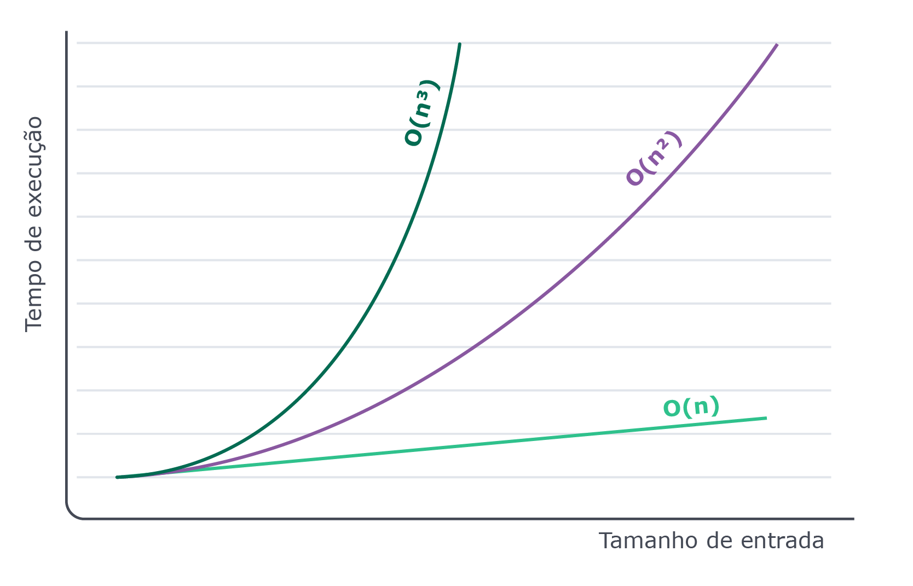

## Comparando complexidades

Relembrando🧠:

A Ordem de Complexidade diz respeito à taxa de crescimento do tempo de execução (ou espaço de memória ocupado) de um algoritmo, na medida em que aumentamos o tamanho da sua entrada;

Uma complexidade é O(1) (constante), quando o tempo de execução do algoritmo independe do tamanho da entrada;

Uma complexidade é O(n) (linear) quando a taxa de crescimento em seu tempo de execução é linear: se aumentamos a entrada em 2 vezes, aumentamos o tempo de execução em 2 vezes;

Uma complexidade é O(n²) (quadrática) quando a taxa de crescimento do tempo de execução do algoritmo é quadrática: se aumentamos a entrada em 2 vezes, aumentamos o tempo de execução em 4 (ou 2²) vezes;

Uma complexidade é O(n³) (cúbica) quando a taxa de crescimento do tempo de execução do algoritmo é cúbica: se aumentamos a entrada em 2 vezes, aumentamos o tempo de execução em 8 (2³) vezes.

Falamos aqui de algoritmos O(n), O(n²) e até de O(n³). Mas, para ilustrar melhor a matemática dos algoritmos, vamos mostrar o que eles significam de outra forma.

Observe, o gráfico abaixo e veja como o tempo de execução de um algoritmo cúbico cresce muito mais para uma entrada, muito menor que a do algoritmo linear:

Para exemplificar, vamos pensar do seguinte modo: para um algoritmo linear, com n = 1000, teremos mil operações a serem realizadas. Quando o algoritmo é O(n²), um n = 1000 gera um milhão de operações (ou n² de operações). Essa mesma quantidade (um milhão) para O(n³), se atinge com n = 100.

Está entendendo como alguns algoritmos podem ficar rapidamente inviáveis de se executar? Por isso, compreender a taxa de crescimento de um algoritmo é tão importante!

A seguir, vamos explorar outros tipos de complexidades de algoritmos!

De olho na dica👀: Caso você se confunda com a quantidade de números, rode exemplos na sua máquina contando o número de iterações! É uma excelente forma de visualizar a complexidade acontecendo. E não deixe de falar com a gente no Slack se algum exemplo estiver te confundindo!
