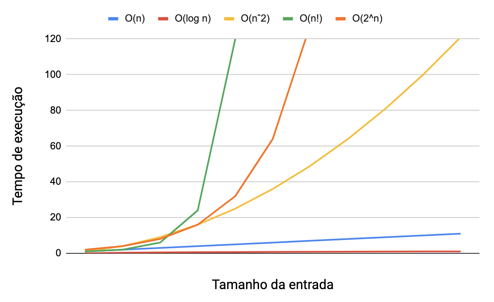

## Analisando algoritmos com várias estruturas de repetição

Agora que já sabemos analisar a Ordem de Complexidade, vamos para alguns algoritmos.

Observe o algoritmo o abaixo:

def calculations(n):
number1 = 0
for n1 in range(n):
number1 += n1

    number2 = 0
    for n1 in range(n):
       for n2 in range(n):
            number2 += n1 + n2

    number3 = 0
    for n1 in range(n):
       for n2 in range(n):
           for n3 in range(n):
               number3 += n1 + n2 + n3

    return number1, number2, number3

n1, n2, n3 = calculations(100)
print(f'{n1}, {n2}, {n3}')

Esse algoritmo tem três estruturas de repetição evidentes: uma linear, uma quadrática e uma cúbica.

Qual é a Ordem de Complexidade dele? 🤔

Resposta: A rigor, ela seria O(n + n² + n³).

De olho na dica👀: Se os loops estão aninhados você os multiplica, e se estão paralelos você os soma.

Podemos pensar em alguns outros exemplos:

Um algoritmo de busca binária que roda três vezes teria O(3 \* log n) de complexidade;

Um algoritmo que roda uma busca binária num array de tamanho n para cada elemento de um array de tamanho m teria O(m \* log n) de complexidade.

No entanto, geralmente simplificam-se essas notações. Estamos vendo, ao longo dos nossos estudos, que ordens de complexidade diferentes, para entradas grandes, têm valores absurdamente diferentes.

Imagine escrever O(n! + log(n)). Ora, para uma entrada de tamanho 8 esse número seria O(40320 + 3). Observe como o componente fatorial da equação, n! = 40320, domina completamente a ordem de complexidade. Nesse cenário, dizemos que a complexidade menor é desprezível e, então, a omitimos.

Anota aí 🖊: Para valores grandes, dizer a maior ordem de complexidade do conjunto já basta para uma boa análise. Sendo assim, ao analisar várias estruturas de repetição em paralelo, responda somente com o valor da estrutura que tiver maior ordem de complexidade na hora de fazer a sua análise.

