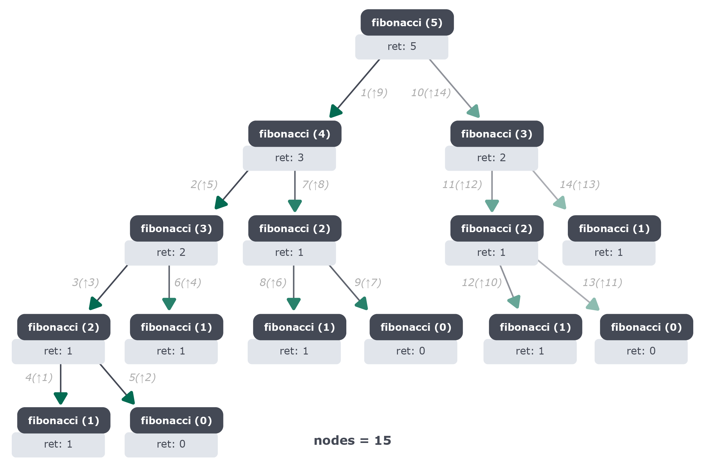
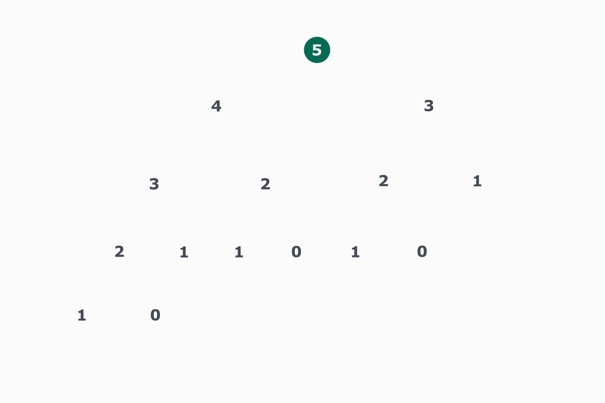

## Análise de algoritmos recursivos

Para que consigamos realizar a análise de algoritmos recursivos, iremos fazer o uso da Árvore de Recorrência!
Você pode estar se perguntando: "Mas o que é isso?!"🤔

### Árvore de Recursão

O método da árvore de recursão pode ser utilizado para estimar o custo de um algoritmo. É um modo de analisarmos seu custo, o que nos ajuda a decidir se tal solução recursiva vale a pena ou não.

Podemos visualizar nível a nível da estrutura de um algoritmo recursivo por meio de uma árvore recursiva. No final, tem-se a estimativa de tempo do problema.

Vamos ver na prática como isso acontece:

```
def fibonacci(num):  # nome da função e parâmetro
    if (num <= 1):  # condição de parada
        return num
    else:
        return fibonacci(num - 2) + fibonacci(num - 1)  # chamada de si mesma com um novo valor

```

No exemplo acima, estamos fazendo um código recursivo para cálculo de Fibonacci.

Na imagem abaixo, visualizamos a representação do algoritmo Fibonacci recursivo, que acabamos de montar, convertido em uma estrutura que chamamos de árvore:



<br>
Cada nó da árvore acima representa o custo da solução de um subproblema. Quando olhamos para a árvore como um todo, ou seja, quando expandimos ela, podemos somar todos os custos de cada nível dessa árvore e então teríamos o resultado total do problema.

<br>
O problema começa com apenas um nó e vai decompondo até alcançar os casos base, que são as "folhas" da árvore. Folhas são, basicamente, nós da estrutura que não possuem nenhum nó abaixo deles.

Vamos ver agora, de forma interativa, como essa árvore chegou a esse resultado passo a passo:



⚠️ Aviso: Caso você se confunda com as estratégias de análise de recursão, tenha tranquilidade! Isso é um assunto mais desafiador e com o tempo e experiência esse conhecimento será consolidado.

Se algum exemplo estiver te confundindo,fale com a gente no Slack. 😁

De olho na dica👀: desenhe todas as recursões do problema até chegar aos casos base e some as complexidades! Fique de olho nas proporções! Se cada subproblema é O(n) e você criou um para cada elemento da sua entrada de tamanho n, você tem aí uma complexidade O(n _ n), ou seja, uma complexidade quadrática. Se, por outro lado, a cada subproblema você dividiu o tamanho do problema original por dois, você gerará log n subproblemas. Se cada um desses custa O(n), você teria uma complexidade O(n_ log n)

A forma de traduzir a lógica da árvore de recursão para uma notação puramente matemática se chama Teorema Mestre! Não é o nosso escopo por agora, ok? Mas fique à vontade para pesquisar a respeito e nos trazer todas as perguntas, se quiser!
