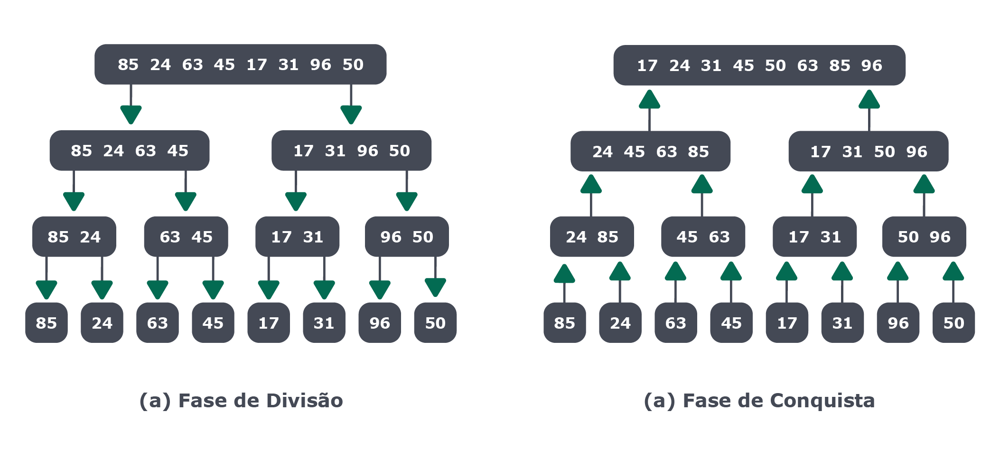

## Estratégias para solução de problemas

Nos deparamos com diversos problemas diferentes no nosso dia a dia e na nossa vida. Na nossa carreira como pessoa desenvolvedora não será diferente!

Como diria Brad Miller e David Ranum no livro Resolução de Problemas com Algoritmos e Estruturas de Dados usando Python, escrito por ambos, e traduzido pela USP: "a ciência da computação é muitas vezes difícil de definir. Isto é provavelmente devido ao infeliz uso da palavra 'computador' no nome. (...) A ciência da computação é o estudo de problemas, resolução de problemas e soluções que surgem do processo de resolução de problemas."

Bora ver os tipos de estratégias:

### Iterativa

A solução iterativa é caracterizada pela repetição de uma determinada operação, procurando resolver algum problema encontrando sucessivas aproximações, a partir de uma suposição inicial.

A ideia nesse tipo de processo é repetir um determinado cálculo várias vezes, obtendo-se a cada repetição, ou iteração, um resultado mais preciso que aquele obtido na iteração anterior.

A cada iteração, utiliza-se o resultado da anterior como parâmetro de entrada para o cálculo seguinte. O resultado é uma sequência de valores aproximados, não exatos, mas que estão dentro de uma faixa de erro aceitável.

### Força bruta

A força bruta, também conhecida como tentativa e erro ou busca exaustiva, é a estratégia mais trivial e intuitiva para solução de problemas. Ela consiste basicamente em enumerar todas as combinações possíveis para uma solução e avaliar se satisfazem o problema. Dessa forma, é possível escolher a melhor das soluções,mas apesar de trivial, em alguns casos, a força bruta possui desempenho geralmente ruim.

Vamos exemplificar essa estratégia, solucionando um problema chamado de problema da mochila:

Dada uma mochila com capacidade C, e n objetos com peso (i = 1...n), deve ser possível preencher a mochila com o maior peso total, respeitando a capacidade C.

Suponha uma mochila com capacidade de 15kg e objetos de peso 12kg, 2kg, 4kg e 8kg.

Este problema possui mais que uma solução ótima, ou seja, possui soluções ótimas equivalentes:

```
Uma solução ótima: 12kg + 2kg = 14kg;

Outra solução ótima: 8kg + 2kg + 4kg = 14kg.
```

Soluções viáveis seriam, entre outras:

```
- 12kg;

- 2kg;

- 4kg;

- 8kg;

- 2kg + 4kg.

# ...
```

No caso acima, as soluções são viáveis, porém não são ótimas. Elas não são ótimas, pois a mochila está sendo preenchida, mas não está chegando mais próximo possível ao peso máximo. Por exemplo, uma das soluções que temos acima é preencher a mochila com um objeto de 2kg apenas, sendo que a mochila suporta 15kg.

Observe mais uma possível solução:

`- 12 kg + 4 kg = 16kg.`

O caso acima é inviável, pois o peso máximo que a mochila comporta é 15kg. Com isso, podemos concluir que o exemplo acima é inviável, pois ultrapassa os 15kg.

Um método baseado em tentativa e erro testaria todas as combinações entre elementos checando:

Se a solução é viável;

Se a solução possui valor melhor que outra encontrada anteriormente.

Para conseguir definir qual seria a melhor solução, todas devem ser enumeradas e registradas, e, ao final, os caminhos que não chegaram a um solução final, devem ser retirados.

### Dividir e conquistar

A estratégia dividir e conquistar, também chamada de divisão e conquista, consiste em dividir o problema em partes menores, encontrar soluções para as partes, e só então combinar as soluções obtidas em uma solução global.

Usar essa estratégia para resolver problemas, nos quais os subproblemas são versões menores do problema original, geralmente leva à soluções eficientes e harmoniosas, especialmente quando é utilizado a recursividade.

A estratégia emprega modularização de programas e frequentemente conduz a um algoritmo simples e eficiente. Esta técnica é bastante utilizada em desenvolvimento de algoritmos paralelos, onde os subproblemas são tipicamente independentes um dos outros, podendo assim serem resolvidos separadamente.

Anota aí 🖊: A modularização de um programa consiste em dividi-lo em partes funcionais que conversam entre si, tornando o software mais eficiente.

A técnica de Divisão e Conquista consistem em três passos:

Divisão: dividir a instância do problema original em duas ou mais instâncias menores, considerando-as como subproblemas;

Conquista: resolver cada subproblema recursivamente;

Combinação: combinar as soluções encontradas em cada subproblema, compondo uma solução para o problema original.

Um exemplo para ilustrar o uso dessa técnica é o algoritmo de ordenação de um vetor por intercalação, ou, como é chamado, MergeSort. Sua representação pode ser feita por meio de uma árvore binária, conforme a imagem abaixo:



Observe na imagem acima que o primeiro (a) faz a divisão dos elementos, e o segundo (b) de baixo para cima, faz a conquista, ou seja, resolve cada parte do problema e depois combina todas as soluções encontradas.

“Agora que já aprendemos sobre Recursividade e Estratégias para solução de problemas, borá para prática! 🚀
