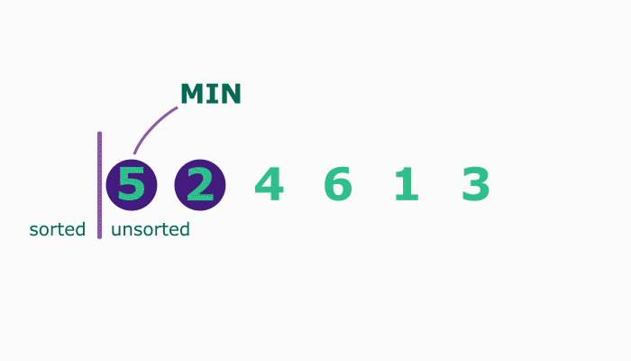

## Algoritmos que usam força bruta

Como já vimos anteriormente, a força bruta caracteriza-se por ser uma técnica que testa cada possibilidade existente, uma a uma, até resolver um problema.

Por exemplo: imagine que você tem um cadeado com 4 dígitos, cada um de 0-9. Você esqueceu sua combinação, mas não quer comprar outro cadeado. Como você não consegue se lembrar de nenhum dos dígitos, é necessário usar um método de força bruta para abrir a fechadura. Portanto, você define todos os números de volta para 0 e os tenta um por um: 0001, 0002, 0003 e assim por diante até que seja aberto. Na pior das hipóteses, seriam necessárias 10⁴ ou 10.000 tentativas para encontrar sua combinação.

### Vamos entender qual é a ideia do Selection Sort?

A ideia do Selection Sort é bem intuitiva:

1️⃣ Encontre o menor elemento da lista (nesse caso, a ideia é ordenar em ordem alfabética);

2️⃣ Adicione o elemento encontrado em uma outra lista;

3️⃣ Repita o processo para todos os elementos restantes.

Achou intuitivo? 😉

Agora, vamos para um exemplo computacional simples! A nossa tarefa aqui será ordenar a lista abaixo:

Primeiro, encontraremos o menor elemento da lista:


Neste caso, não criaremos outra lista para adicionar o elemento a ela. Simplesmente faremos a troca do menor elemento para a posição em que ele deve estar:


Agora que o primeiro elemento está ordenado, repetiremos o processo para ordenar os próximos elementos!

👀De olho na dica: se chamarmos de N a quantidade de elementos da lista, podemos observar que precisamos ordenar os primeiros N-1 elementos. Nesse caso, o último elemento também estará na ordem correta!


O gif abaixo pode ajudar ainda mais no entendimento:



**Vamos ver um exemplo de implementação:**

```
def selection_sort(numbers):
    n = len(numbers) # Quantidade de elementos da lista

    for index in range(n - 1): # Precisamos ordenar N-1 elementos
        min_element_index = index # Definimos a variável para buscar o menor elemento

        for search_index in range(index + 1, n): # Início da busca pelo menor elemento
            if numbers[search_index] < numbers[min_element_index]:
                min_element_index = search_index # Atualiza o índice atual do menor elemento

        # Troca os elementos de posição
        current_element = numbers[index]
        numbers[index] = numbers[min_element_index]
        numbers[min_element_index] = current_element

    return numbers

numbers = [7, 5, 9, 2, 6, 8]
print(f"Lista inicial: {numbers}")
ordered_numbers = selection_sort(numbers)
print(f"Lista final: {ordered_numbers}")
```

**Outra maneira de implementar o Selection Sort (com mais recursos Pythônicos):**

```
def search(numbers, start, end):
    min_element = numbers[start]
    min_element_index = start

    for i in range(start + 1, end): # Busca pelo menor elemento
        if numbers[i] < min_element:
            min_element = numbers[i]
            min_element_index = i

    return min_element_index # Retorna a posição do menor elemento

def selection_sort(numbers):
    n = len(numbers)

    for index in range(n - 1): # Início da iteração para ordenar os N-1 elementos
        min_element_index = search(numbers, index, n)
        numbers[index], numbers[min_element_index] = numbers[min_element_index], numbers[index] # Trocando os elementos utilizando desempacotamento.

    return numbers
```

Analisando a complexidade deste algoritmo, vemos que independente de todos os elementos estarem ordenados (ou não), ou parcialmente ordenados, sempre teremos que percorrer o array completamente e também n - 1 elementos a cada iteração. Isto nos leva a uma complexidade O(n²) para todos os casos (pior, médio, melhor).

Como criamos apenas algumas variáveis de controle e não criamos uma lista auxiliar, nosso algoritmo tem uma complexidade de espaço constante, ou seja, não muda, seja para 10, 1000 ou 10.000 elementos.
