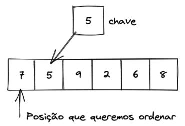

## Insertion Sort

A ordenação por inserção (insertion sort) tem esse nome por inserir um elemento de cada vez em sua posição correta. Fazendo uma analogia a um jogo de cartas, onde sua "mão" esteja ordenada, é como se a cada nova carta recebida fossemos movendo ela até achar a posição correta e a inserimos ali, e faremos isso sucessivamente até que não tenha novas cartas e por consequência, nossa mão esteja ordenada. A ordenação por inserção é mais eficiente que a ordenação por seleção e também considerada mais simples.

Vamos entender como podemos traduzir essa ideia para um algoritmo?

Basicamente, o algoritmo reorganiza os elementos da lista a cada iteração.

Utilizaremos a mesma lista do problema anterior para aplicarmos o Insertion Sort:


Como queremos começar a ordenação a partir da primeira posição, pegaremos o elemento imediatamente à frente e o chamaremos de chave:



Agora, vamos comparar essa chave com os elementos que estão na posição anterior e, se a chave for menor, copiaremos o elemento que estamos olhando para a sua frente:


Como não há outros elementos para comparar, paramos a iteração e colocaremos a chave na posição em que a iteração parou:


Repetimos esses passos até que não existam mais elementos para ordenar:


O gif abaixo pode ajudar ainda mais no entendimento:


**Vamos ver um exemplo de implementação:**

```
def insertion_sort(numbers):
  n = len(numbers) # Quantidade de elementos na lista

  for index in range(1, n): # Começaremos a ordenar pelo segundo elemento
      key = numbers[index] # Pegamos o segundo elemento e o definimos como chave

      new_position = index - 1 # Tomamos a posição anterior para iniciar a comparação
      while new_position >= 0 and numbers[new_position] > key: # Enquanto a chave for menor, remaneja o elemento para frente
          numbers[new_position + 1] = numbers[new_position] # Remaneja o elemento
          new_position = new_position - 1

      numbers[new_position + 1] = key # Insere a chave na posição correta

  return numbers

numbers = [7, 5, 9, 2, 6, 8]
print(insertion_sort(numbers))

```

Como precisamos percorrer cada um dos elementos e depois percorrer comparando os elementos à esquerda do mesmo, em um pior caso, onde a lista esteja inversamente ordenada, teremos uma complexidade de O(n²). Isto se repete também em média, para listas parcialmente ordenadas. Porém, se inicialmente a lista estiver ordenada, este algoritmo terá complexidade O(n), pois só fará a iteração de todos os elementos, e não precisará ficar remanejando os elementos.

Assim como na ordenação por seleção, como criamos apenas algumas variáveis de controle e não criamos uma lista auxiliar, nosso algoritmo tem uma complexidade de espaço constante, ou seja, não muda, seja para 10, 1000 ou 10.000 elementos.
