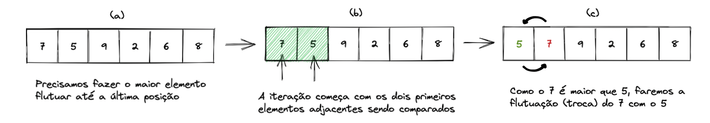
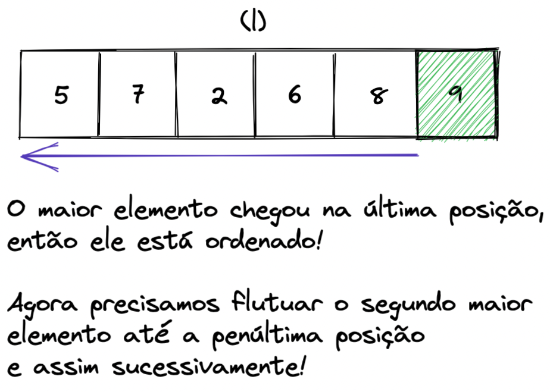
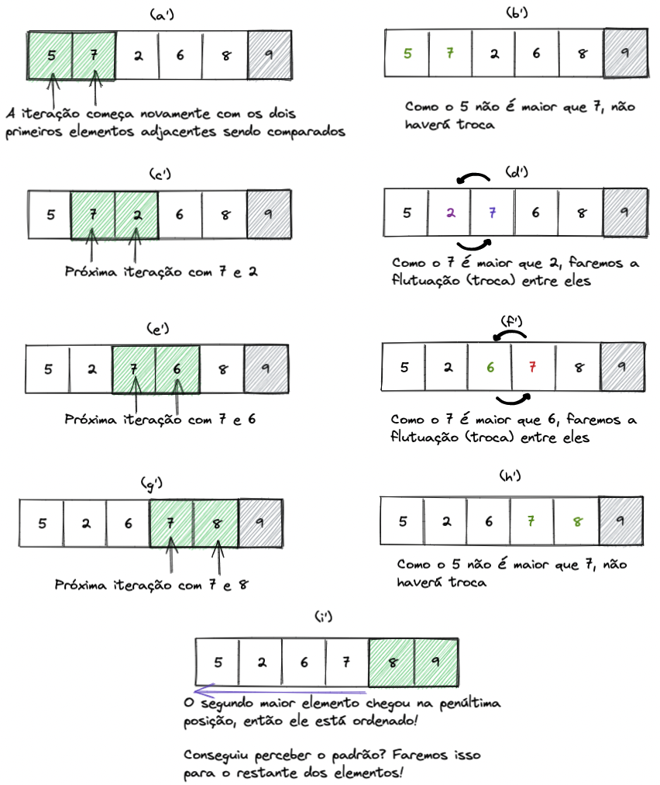

## Algoritmos que usam soluções iterativas

Soluções iterativas consistem na realização de uma ou mais operações repetidas vezes, por meios de comandos de repetição. As ordenações demonstradas acima (seleção, inserção), são consideradas iterativas, pois estamos realizando operações de comparação e troca de elementos repetidas vezes por meios de comandos de repetição (for).

👀De olho na dica: toda solução iterativa pode ser reescrita de forma recursiva.

### Bubble Sort

Também conhecido como ordenação por bolha (bubble sort), têm esse nome, pois a movimentação dos elementos lembra o movimento de bolhas flutuando. Nesse caso, são realizadas múltiplas iterações sobre a coleção, sempre comparando o valor ao item adjacente e realizando a troca daqueles que estão fora de ordem. A cada iteração o próximo maior valor é colocado em sua posição correta, ou seja, cada item se desloca como uma bolha para a posição a qual pertence.

Vamos entender melhor usando a lista que já conhecemos?

Trazendo a ideia do método Bubble Sort para algoritmo, podemos imaginar que os maiores elementos da lista serão jogados para as últimas posições como se eles flutuassem.

1️⃣ O primeiro passo é começar a iteração com os dois primeiros elementos, trocando-os caso o maior esteja em uma posição anterior:



2️⃣ Continuaremos essa iteração até o maior elemento flutuar para a última posição:


3️⃣ O último elemento foi levado até a posição correta e, portanto, está ordenado:



4️⃣ Como esse elemento está ordenado, é necessário ordenar somente os elementos que estão antes dele. Diante disso, agora o segundo maior elemento deve ser flutuado:



5️⃣ Essa sequência de iterações deverá ocorrer n - 1 vezes, onde n é a quantidade de elementos da lista. Ordenando n - 1 elementos, por consequência, o último também estará ordenado.

**Vamos ver um exemplo de implementação?**

```
def bubble_sort(numbers):
    n = len(numbers) # Quantidade de elementos na lista

    for ordered_elements in range(n - 1): # Precisamos ordenar n-1 elementos
        for item in range(0, n - 1 - ordered_elements): # Vamos percorrer até o elemento anterior ao ordenado
            if numbers[item] > numbers[item + 1]: # se um elemento for maior, flutuamos ele para cima
                current_element = numbers[item]
                numbers[item] = numbers[item + 1]
                numbers[item + 1] = current_element

                # Lembra da troca com desempacotamento?
                # numbers[item], numbers[item + 1] = numbers[item + 1], numbers[item]
    return numbers

numbers = [7, 5, 9, 2, 6, 8]
print(bubble_sort(numbers))
```

Assim como nos algoritmos de força bruta, no pior caso do Bubble Sort ele executará O(n²) operações, então, ele também é um algoritmo de ordem quadrática. Além disso, é possível observar nas imagens a quantidade de passos para ordenarmos 1 elemento.
