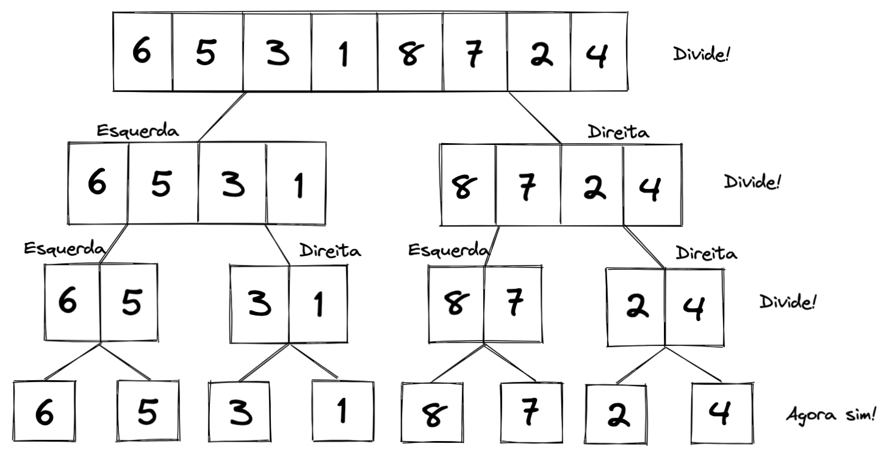
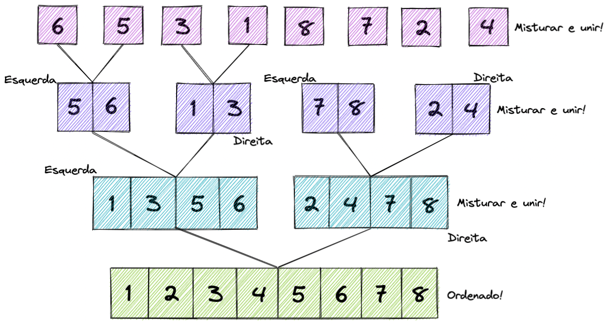
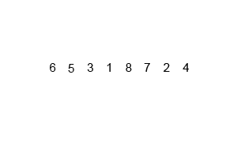

## Algoritmos que usam dividir e conquistar

Algoritmos que utilizam da técnica de dividir e conquistar, consistem em dividir um problema grande em partes menores, encontrar soluções para as partes menores, e então combinar as soluções obtidas em uma solução global. Esta técnica produz um algoritmo eficiente caso a divisão e conquista sejam eficientes.

👀De olho na dica: os algoritmos abaixo foram implementados de forma recursiva, mas lembre-se que toda solução recursiva pode ser reescrita de forma iterativa.

### Merge sort

A ordenação por mistura (merge sort), é um algoritmo onde empregamos a técnica da divisão e conquista. Vamos dividindo a nossa coleção em porções menores até atingirmos uma coleção mínima. Em seguida, vamos misturando as porções de forma ordenada até que toda a coleção seja reunida novamente, resultando na ordenação.

Beleza, mas como podemos deixar essa ideia mais nítida? 🤔

💡 Para estarmos na mesma página aqui, precisamos saber: você lembra do conteúdo sobre Divisão e Conquista? Se não lembra, faça uma revisão do dia de Recursividade e Estratégias para solução de problemas.

Bom, a ideia não é tão intuitiva, mas vamos analisar com calma e entender esse algoritmo incrível!

Vamos lá! Também utilizaremos uma lista para fazermos a ordenação:

1️⃣ Precisamos dividir essa lista de elementos em uma lista menor e que seja mais fácil de ser ordenada. Nesse primeiro passo, essa lista será dividida várias vezes pela metade até chegar a uma lista irredutível. Em outras palavras, a lista original será dividida pela metade, as próximas duas coleções também serão divididas pela metade e esse processo ocorre até sobrar somente um elemento em cada coleção:



Mas, como é realizado essa mistura (merge) de forma ordenada?

2️⃣ Essa pergunta nos leva ao segundo passo: após essa sequência de divisões, vamos começar a misturar essas listas menores ordenando cada uma individualmente. Nós vamos comparar cada elemento de uma lista com a outra de forma linear e montaremos uma nova lista que voltará na recursão até que a lista completa seja montada:



Vamos observar o gif abaixo para compreender melhor!



⚠️ Na implementação nós não criaremos diversas listas, apenas trabalharemos com os índices da lista original de forma a simular essa divisão/união de listas.

**Vamos para um exemplo de implementação? Chega mais!**

```python
def merge_sort(numbers, start=0, end=None):
    if end is None:
        end = len(numbers)
    if (end - start) > 1: # se não reduzi o suficiente, continua
        mid = (start + end) // 2 # encontrando o meio
        merge_sort(numbers, start, mid) # dividindo as listas
        merge_sort(numbers, mid, end)
        merge(numbers, start, mid, end) # unindo as listas

# função auxiliar que realiza a mistura dos dois arrays

def merge(numbers, start, mid, end):
    left = numbers[start:mid] # indexando a lista da esquerda
    right = numbers[mid:end] # indexando a lista da direita

    left_index, right_index = 0, 0 # as duas listas começarão do início

    for general_index in range(start, end): # percorrer sobre a lista inteira como se fosse uma
        if left_index >= len(left): # se os elementos da esquerda acabaram, preenche o restante com a lista da direita
            numbers[general_index] = right[right_index]
            right_index = right_index + 1
        elif right_index >= len(right): # se os elementos da direita acabaram, preenche o restante com a lista da esquerda
            numbers[general_index] = left[left_index]
            left_index = left_index + 1
        elif left[left_index] < right[right_index]: # se o elemento do topo da esquerda for menor que o da direita, ele será o escolhido
            numbers[general_index] = left[left_index]
            left_index = left_index + 1
        else:
            numbers[general_index] = right[right_index] # caso o da direita seja menor, ele será o escolhido
            right_index = right_index + 1


numbers = [6, 5, 3, 1, 8, 7, 2, 4]
merge_sort(numbers, 0, len(numbers))
print(numbers)
```

⚠️ Existem diversas implementações do merge sort. A implementação acima foi retirada do canal Programação Dinâmica, no YouTube, que foi escolhida por sua facilidade em comparação a outras implementações.

A separação em partes traz uma complexidade O(log n), e as misturas O(n). Com isso, temos uma complexidade de O(n log n), independente do array estar ordenado por completo, não ordenado, ou parcialmente ordenado.

Como é um algoritmo recursivo, consome mais memória, possuindo uma complexidade de espaço O(n), ou seja, cresce linearmente proporcional à entrada de dados.
