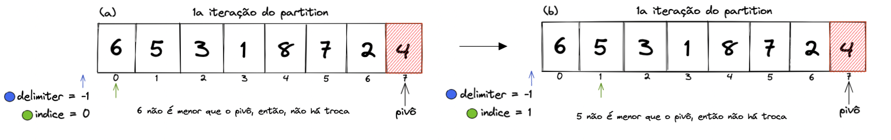
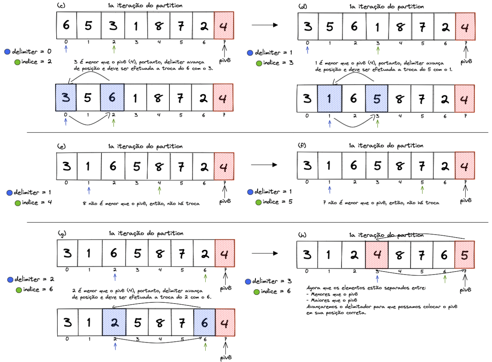
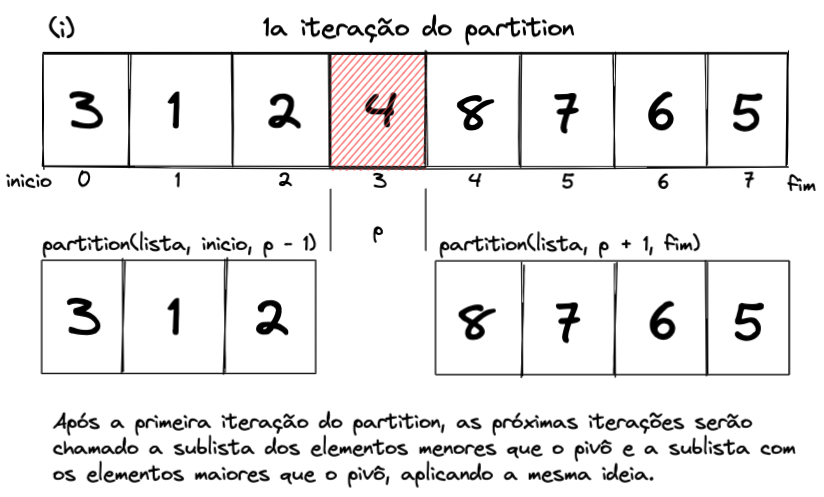

## Quick Sort

O quicksort é um algoritmo que também utiliza da técnica de divisão e conquista. Sua estratégia de ordenação consiste em determinar um elemento pivô (nome dado ao elemento que divide o array em porções menores). Em seguida, todos os elementos maiores que o pivô serão colocados à direita e os menores à esquerda. Com isto, o pivô será colocado em sua posição correta e teremos duas subcoleções não ordenadas ao seu redor. Recursivamente ordenamos os sub arrays, repetindo o mesmo processo de escolha do pivô e particionamento (divisão).

Além disso, o quicksort possui dois procedimentos:

Função quicksort: nela a coleção será particionada de acordo com o pivô;

Função partition: ela é a chave para o algoritmo. Nela, a coleção será reorganizada.

**Para facilitar, vamos tornar essa ideia do algoritmo mais visual:**

O exemplo abaixo trata-se da função partition. A função quick_sort simplesmente separa as listas para que o partition faça a reorganização (quick_sort ficará mais nítida no exemplo de implementação).

Na primeira iteração do partition, a lista que será passada para reorganização é a lista completa. O pivo sempre será o último elemento da lista (ou sublista); a variável indice percorrerá toda a lista até chegar no pivo; a variável delimiter começará com -1 e é quem determinará quais elementos são maiores e menores que o pivo. Os elementos à esquerda são menores que o pivo e os elementos à direita são maiores; delimiter andará para frente somente quando o elemento visto pelo indice for menor que o pivo, pois nesse momento será feita a troca entre o elemento visto por delimiter e o elemento visto por indice. Entenda melhor na imagem abaixo:



Até o momento não houve trocas. No entanto, a partir do terceiro elemento ficará mais nítido como delimiter funciona. Além disso, ao final da iteração do partition, o pivô será colocado na sua posição correta, que por sua vez é a posição seguinte do delimiter (delimiter + 1):



Quando partition encerrar ele retornará a posição do pivô, e com isso duas sublistas irão para as próximas iterações do partition: a sublista dos elementos menores que o pivô e a sublista dos elementos maiores que o pivô. Entenda como isso acontece:



Esse padrão se repete até que as sublistas fiquem irredutíveis, semelhante ao Merge Sort.

**Vamos ver um exemplo de implementação:**

```python
def quick_sort(numbers, start, end):
    if start < end:
        p = partition(numbers, start, end)
        quick_sort(numbers, start, p - 1) # Os menores em relação ao pivô ficarão à esquerda
        quick_sort(numbers, p + 1, end) # Os maiores elementos em relação ao pivô ficarão à direita

# função auxiliar responsável pela partição do array
# escolhendo um pivô e fazendo movimentações dos sub arrays gerados

def partition(numbers, start, end):
    pivot = numbers[end]
    delimiter = start - 1

    for index in range(start, end):
        # o indice será o elemento em análise no momento, ele passará por todos os elementos
        if numbers[index] <= pivot:
          delimiter = delimiter + 1
          numbers[index], numbers[delimiter] = numbers[delimiter], numbers[index]

    numbers[delimiter + 1], numbers[end] = numbers[end], numbers[delimiter + 1]

    return delimiter + 1

numbers = [6, 5, 3, 1, 8, 7, 2, 4]
quick_sort(numbers, 0, len(numbers) - 1)
print(numbers)
```

Normalmente esta ordenação ocorre com complexidade O(n log n), porém em um pior caso (onde o array está ordenado de forma inversa), ocorrerá com complexidade O(n²).

💡 Curiosidade: por baixo dos panos, quando você utiliza a função sorted padrão do python ou faz array.sort, você está utilizando uma ordenação chamada TimSort, que é um algoritmo híbrido que mistura o merge sort e insertion sort. Ele também é utilizado pela linguagem Java para ordenar arrays.
