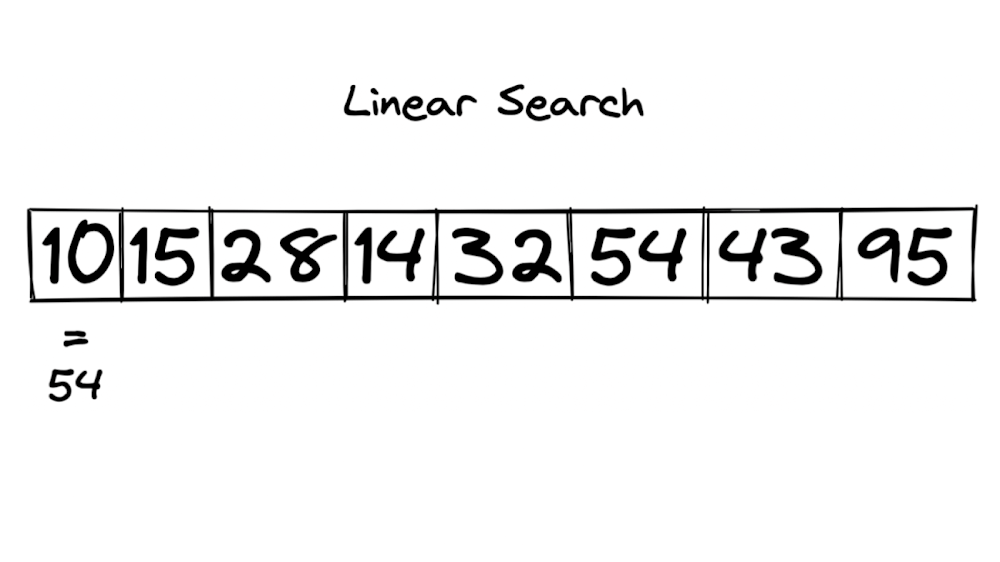
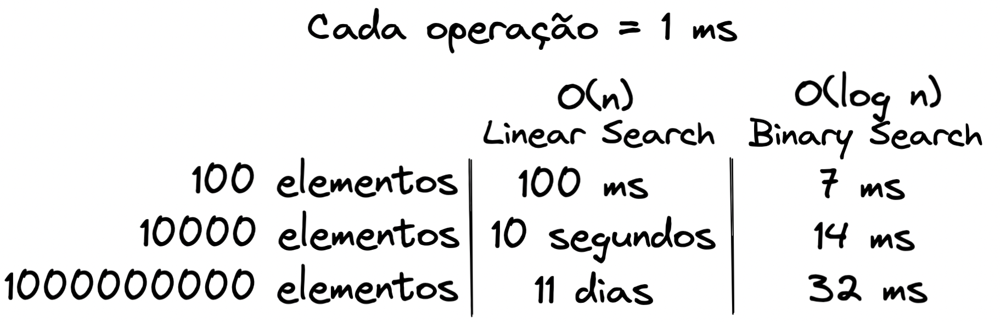

## Algoritmos de Busca

**Algoritmos desta categoria buscam um item com uma determinada propriedade dentro de uma coleção,** podendo esta coleção ser gerada elemento a elemento, a partir de uma série de operações (fórmula matemática, procedimento), não necessitando uma coleção de fato. Esses algoritmos não devem ser associados somente com arrays. São considerados algoritmos desta categoria aqueles que fazem travessias em estruturas de dados com o propósito de encontrar um valor.

### Busca Linear

Uma forma simples de fazer a busca de algum valor em um array ou lista é usando a busca linear, que consiste em percorrer toda a estrutura elemento a elemento, tentando encontrar o valor. Também é conhecida como busca sequencial, por conta da maneira com que percorremos a estrutura em busca do valor.

A busca linear pode ser simples, mas não necessariamente será a solução mais rápida, já que ela faz uma verificação de todos os elementos para encontrar qual é o correspondente.

Veja na imagem abaixo:



Um exemplo de implementação da busca linear é:

```
def linear_search(numbers, target):
    n = len(numbers) # N será a quantidade de elementos da lista
    for index in range(0, n): # vamos iterar a lista completa
        if numbers[index] == target: # se encontrar o elemento alvo, retorne a posição
            return index

    return -1 # Não encontrou? Retorne -1


print(linear_search([1, 2, 3], 2))  # saída: 1
print(linear_search([1, 2, 3], 4))  # saída: -1
```

## Busca Binária

A Busca binária (binary search) é mais um exemplo onde empregamos a técnica da divisão e conquista. É importante destacar que ela supõe que nossa coleção está ordenada e seu funcionamento se dá através de múltiplas divisões do espaço de busca, reduzindo-o, buscando o elemento no meio do espaço.

Vamos entender melhor? 💪

Vamos imaginar que você está estudando inglês e precisa encontrar uma palavra mind no dicionário. Como sabemos que ele já está ordenado, eu suponho que você o abriria em uma página mais próxima da metade, certo? Pois você estará mais perto da letra M!

Supondo que você abriu uma página com as iniciais em J, agora você percebe que deve avançar, pois o M vem após o J na ordem alfabética. Visto isso, você abre mais um bloco para frente.

Agora você abriu o dicionário na letra N. Puxa, foi quase! Você observa que o M está logo antes do N e volta poucas páginas.

Pois bem! Agora você está na letra M e pode encontrar a palavra desejada.

Com esse exemplo você já pode ter uma ideia do que é uma busca binária. Agora vamos para um exemplo computacional:

Vamos supor a seguinte lista: [1, 10, 35, 42, 51, 60, 75].

Nesse caso, o número buscado é 60.

Dividimos a lista em duas partes e verificamos se o elemento do meio (42) é o elemento procurado.

Como sabemos que a lista está ordenada e que o valor buscado é maior que o encontrado, não precisamos comparar com todos os outros à esquerda. Vamos procurar somente os valores posteriores a ele [51, 60, 75].

Realizamos o mesmo processo de divisão e nosso elemento do meio passa a ser 60.

Como encontramos o valor, vamos retornar o seu índice, 5.

👀 De olho na dica: a busca binária é mais rápida que a busca linear, visto que o número de comparações necessárias, mesmo em um caso onde não encontre um elemento, é menor.

Veja na imagem abaixo:


**Agora vamos ver na prática:**

```
def binary_search(numbers, target):
    # definir os índices
    start = 0
    end = len(numbers) - 1

    while start <= end: # os índices podem ser no máximo iguais, o início não pode ultrapassar o fim
        mid = (start + end) // 2 # encontro o meio

        if numbers[mid] == target: # se o elemento do meio for o alvo, devolve a posição do meio
            return mid

        if target < numbers[mid]: # se o elemento for menor, atualiza o índíce do fim
            end = mid - 1
        else: # caso contrário, atualiza o índíce do inicio
            start = mid + 1

    return -1 # Não encontrou? Retorna -1

numbers = [2, 3, 4, 10, 40]
target = 40

result = binary_search(numbers, target)
print(f"Elemento encontrado na posição: {result}")
```

## Complexidade

O algoritmo linear_search, no pior caso (se o elemento estiver na última posição ou não existir), precisará percorrer toda a estrutura para encontrar o elemento. Diante disso, sua complexidade é O(n). No entanto, o algoritmo de linear_search não necessita que a coleção esteja ordenada.

No caso do algoritmo binary_search, no pior caso ele precisará de O(log n) operações para encontrar o elemento (também ocorre caso o elemento não exista).

Vamos ver uma comparação entre as buscas? Suponha que cada operação computacional execute em um tempo de 1ms.


