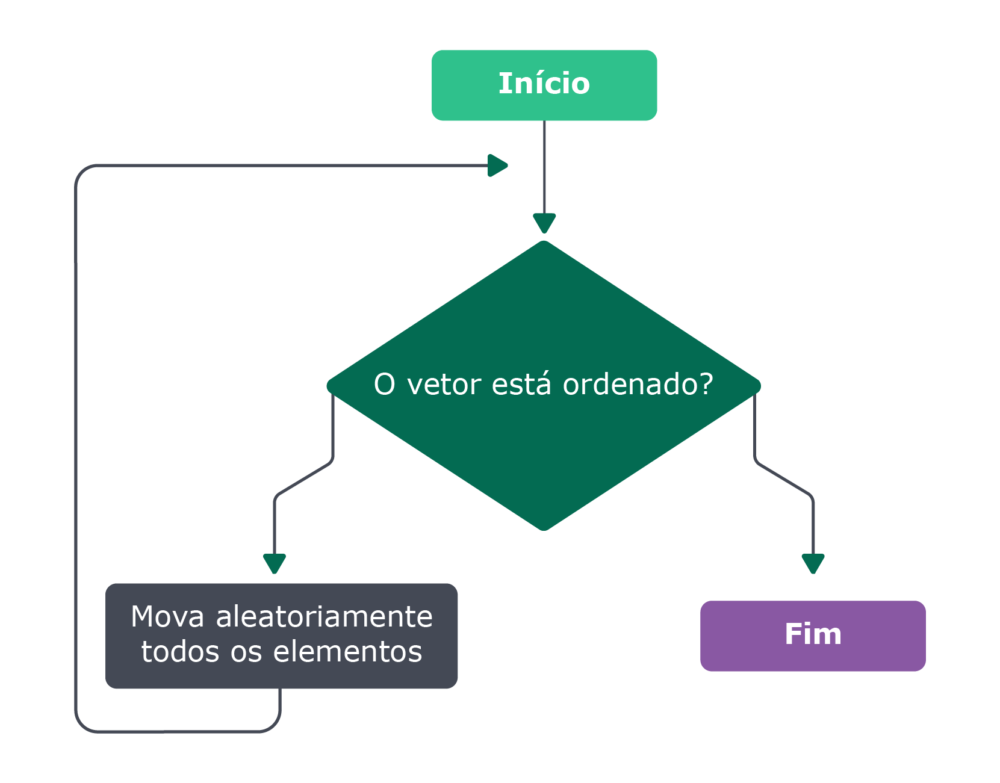

### O que vamos aprender?

Olá, bom te ver novamente por aqui! 😊
Hoje nós estudaremos o que são os algoritmos de ordenação e os algoritmos de busca. Além disso, entenderemos as ideias por trás desses algoritmos e faremos a implementação dos mesmos.

Vamos nessa?

### Referências bibliográficas do bloco

Para este bloco, a bibliografia tomada como referência é:
Introduction to Algorithms, 3rd Edition (The MIT Press) por Thomas H. Cormen, Charles E. Leiserson, Ronald L. Rivest, Clifford Stein;

Entendendo Algoritmos: Um Guia Ilustrado Para Programadores e Outros Curiosos, 24 abril 2017 por Aditya Y. Bhargava;
The Algorithm Design Manual, 6 novembro 2020 por Steven S. Skiena

### Você será capaz de

Entender o que são algoritmos de busca e ordenação;

Implementar um algoritmo de busca;

Implementar um algoritmo de ordenação;

Escolher o melhor algoritmo para cada problema, baseando-se na
sua complexidade.

### Por que isso é importante?

No dia a dia como pessoa programadora, você vai se deparar com diversos problemas. Seu papel será analisá-los e buscar uma solução eficiente. 💪 No meio disso tudo, quem se destaca são profissionais que conseguem entender o problema e propor os melhores algoritmos para aquele caso. Por isso é comum que entrevistas de emprego cobrem o conhecimento destes algoritmos. Isso não quer dizer que na sua rotina de trabalho, você deverá utilizar aqueles algoritmos o tempo todo, mas que o conhecimento técnico deles e as técnicas empregadas em suas soluções podem ser utilizadas em outras resoluções.

O exercício de analise de complexidade sobre estes algoritmos também é algo que deve ser destacado, pois é bastante útil de se aplicar em outros tipos de algoritmos.

Diagrama de ordenação Bogosort 🤡

