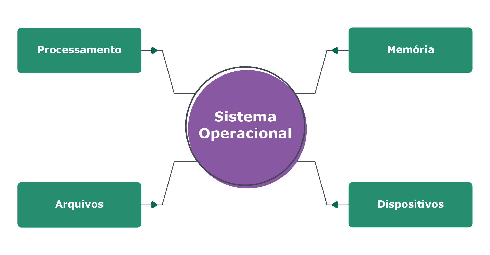

## Sistema Operacional - Gerenciamentos

Windows, MacOS, Linux e outros SOs (como Android, iOS, etc!) possuem vantagens, desvantagens e particularidades. Apesar de suas diferenças, os diversos sistemas operacionais compartilham de um conceito principal: realizam a gerência do hardware e sua interação com os softwares, controlando os processos, arquivos, memória, rede e os dispositivos conectados ao computador. Dessa forma, ele trabalha como um intermediário, fazendo com que software e hardware interajam corretamente, garantindo que todas as partes trabalhem juntas como um "time" e agindo como um líder responsável por manter a harmonia entre sistemas de memória, arquivos, processos, dispositivos, etc.



### Memória

A memória é gerenciada pelo SO: o SO realiza a troca de dados com o processador, a memória principal e a memória secundária, buscando por espaços vazios na memória e os preenchendo com dados para o funcionamento de programas e comandos. Esse processo é chamado de alocação. Ao longo da evolução dos computadores, esse processo foi evoluindo para se tornar cada vez mais eficiente, utilizando a arquitetura e as características que vimos.

### Processos

O SO também decide como será realizada a distribuição dos diversos processos para serem executados pelo "cérebro" do computador, a CPU. A partir daí, ele acompanha os estados da execução desses processos realizando os devidos tratamentos, como voltar ou remover o processo da fila de processamentos.

Mas o que são esses processos? 🤔 Tudo que você executa no computador é realizado com base em processos: um programa que você abre, um comando que você executa no terminal, etc. Agora vamos dar uma olhadinha, na prática, nos processos que estão sendo executados na nossa máquina nesse momento. Abra o terminal e execute o comando abaixo:

```
$ ps auxww
```

O que foi exibido no seu terminal são todos os processos que estão sendo gerenciados nesse momento pelo seu SO. Bastante coisa, né?!
O comando ps funciona como se fosse uma fotografia dos processos no momento que você o executa. Vamos para um outro comando que nos mostra os processos em tempo real:

```
$ top
```

Perceba que no cabeçalho do comando já é exibido os totais por status dos processos em sua máquina. Em seguida temos algumas médias do uso dos recursos e depois temos a listagem dos processos. Uma versão mais sofisticada desse comando é o htop. Aqui é legal perceber como os recursos da sua máquina estão sendo explorados e como a quantidade de processos constantemente muda de estado. Você também pode executar alguns comandos ou abrir alguns programas e acompanhar seus processos. 🔝

### Arquivos

O SO também controla os arquivos do computador, sejam eles arquivos de dados, de programas ou aplicativos instalados. Através da interface do SO, conseguimos navegar entre diretórios armazenados nos diversos dispositivos de memória secundária do nosso computador, seja o HD, um pendrive ou nosso celular que esteja conectado em nossa máquina, sendo possível abrir, criar, deletar, copiar e editar arquivos.

Além disso, o SO é responsável por gerenciar o sistema de permissões desses arquivos, controlando os diversos tipos de acesso, por exemplo, impedindo que um usuário comum execute um comando que precisa de permissão de super usuário.

### Scheduling (agendador de tarefas)

O escalonamento de processos ou agendador de tarefas (em inglês scheduling) é uma atividade organizacional feita pelo escalonador (scheduler) da CPU ou de um sistema distribuído, possibilitando executar os processos mais viáveis e concorrentes, priorizando determinados tipos de processos, como os de I/O Bound https://pt.wikipedia.org/wiki/I/O_bound e os CPU Bound https://pt.wikipedia.org/wiki/CPU_bound .

O escalonador de processo é um processo que deve ser executado quando ocorre uma mudança de contexto (troca de processo), ao passo que ele escolhe o processo que será executado pela CPU, sendo o escalonamento realizado com o auxílio do hardware. Acesse esse link para ver mais sobre o Scheduler. https://pt.wikipedia.org/wiki/Escalonamento_de_processos
