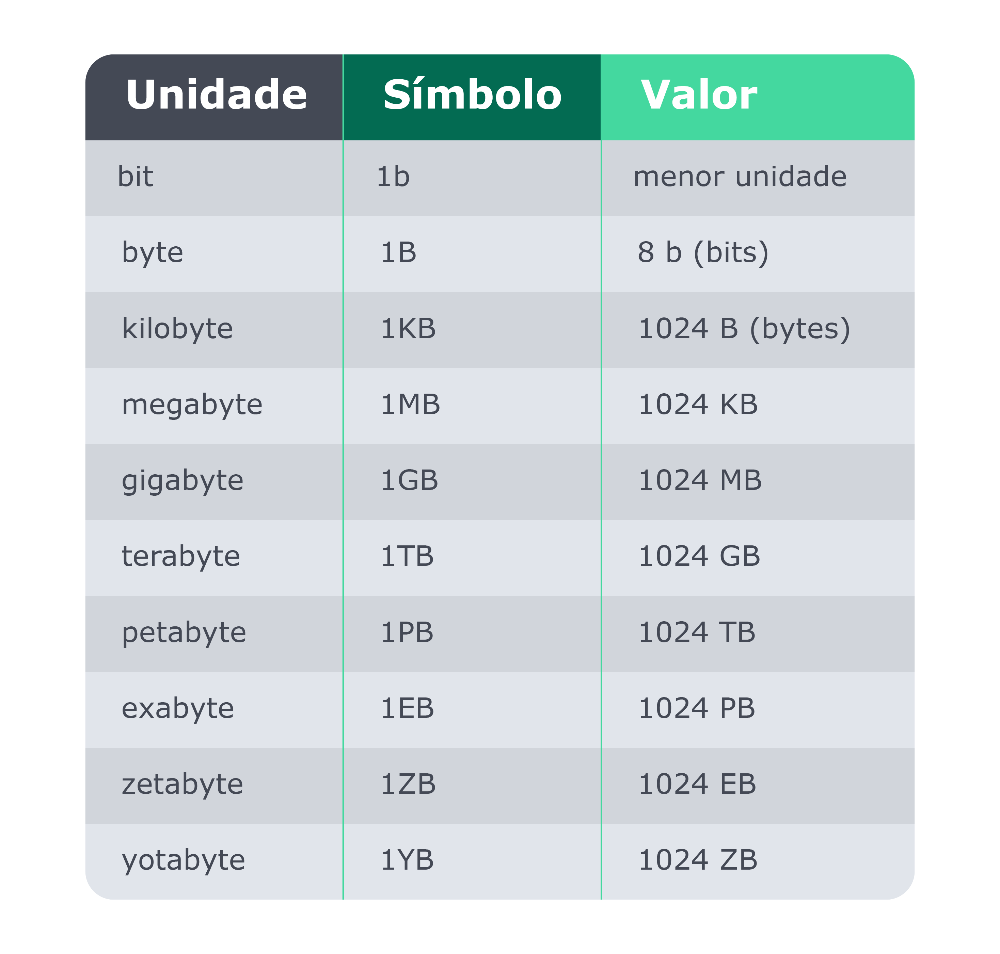
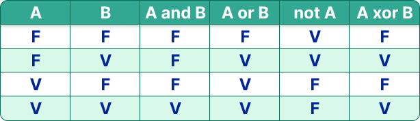

## Lógica binária

Tendo noção de como figuras como Von Neumann e Turing idealizaram e trabalharam na construção dos primeiros computadores, vamos dar um passo atrás pra compreender um conceito fundamental, a lógica binária.

O sistema binário foi inventado pelo matemático alemão Gottfried Leibniz, no século 18. Os computadores processam informações baseando-se no sistema binário com o que chamamos de bits. Um bit é a menor unidade em um sistema digital e pode assumir o valor 0 ou 1. Eletronicamente esse valor pode ser representado pela presença ou ausência de tensão ou corrente elétrica.

O bit é representado por um "b" (minúsculo) e o agrupamento de 8 bits correspondem à 1 byte, representado por um "B" (maiúsculo). 1 byte é capaz de armazenar um valor decimal entre 0 e 255 (0000 0000 e 1111 1111).

Relembre também as unidades de medidas com a tabela abaixo:

**_Em resumo:_ 📝**

Convencionalmente, a presença de tensão ou corrente elétrica pode ser considerada como verdadeiro, 1, e a ausência como falso, 0;

Os dispositivos que podem se comportar como chaves eletrônicas são os transistores, onde a tensão ou corrente na entrada resulta na presença ou ausência de uma tensão ou corrente na saída;

Transistores podem ser agrupados de maneira a formarem as portas lógicas NOT, AND, OR, XOR, entre outras. Estas portas lógicas apresentam, para uma mesma combinação de valores de entrada (conjunto de fios com ou sem tensão/corrente elétrica 0s e 1s), a mesma saída. As portas lógicas seguem a mesma ideia das condicionais utilizadas nas linguagens de programação, como podemos ver na tabela abaixo:

Portas lógicas podem formar circuitos de soma de bits. Daí temos adição, subtração, multiplicação, divisão, e assim sucessivamente, sempre seguindo a lógica binária.

Temos, após essa longa jornada, um conjunto de circuitos capaz de ler valores, dá-los como saída e capaz de fazer operações com eles. Temos a cabeça leitora da máquina de Turing, ou, os princípios de um processador! Falta aqui só um componente fundamental: a memória! 🧠
