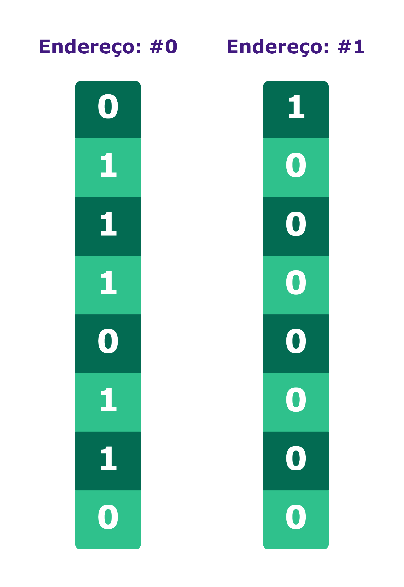

## Memória Principal - RAM

Na computação, a memória é um dispositivo ou sistema que é usado para armazenar informações para uso imediato em um computador ou hardware de computador, ou, ainda, dispositivos eletrônicos digitais. O termo memória é muitas vezes sinônimo do termo armazenamento primário ou memória principal. De maneira simples, pode-se dizer que memória é um conjunto de blocos endereçáveis que guardam dados.

### Memória principal: uma grande biblioteca

A memória principal pode ser vista como uma grande biblioteca, possuindo diversas prateleiras, cada uma com a capacidade de armazenar alguns livros. Para organizar e tornar fácil a localização de um livro entre os corredores e seções, cada prateleira possui um identificador único, um endereço, que permite que um livro específico seja facilmente localizado.

### Células

Essas diversas "prateleiras" são as células da memória principal, cada uma sendo capaz de armazenar uma informação (ou um fragmento de uma) e, para localizá-las, são utilizados seus endereços, os chamados ADDRESSES ou ADDR.

Cada célula pode armazenar diversas informações como dados para serem processados, incluindo endereços de outras células, instruções e resultados de processamentos. Essas informações são armazenadas em bits e as células possuem uma capacidade limitada de armazenamento: por exemplo, 8 bits (1 byte) por célula.

A capacidade total da memória é dada pela quantidade de suas células multiplicada pela capacidade de armazenamento de cada uma. Por exemplo, uma memória com 1024 células de 8 bits (1 byte) tem a capacidade de armazenar 1024 bytes (8192 bits), ou 1KB (você pode imaginar como são formadas aquelas memórias de 4GB ou 8GB 👀).

### Endereços

Cada célula possui um endereço único, que é chamado de address ou ADDR, e estes são um conjunto de números que, para o computador, é representado por um número binário como todo o resto, ou seja, utilizando somente os dígitos 0 ou 1.

A quantidade de dígitos utilizados para representar um endereço varia e, com ela, a quantidade de células endereçáveis. Por exemplo: se utilizarmos apenas 1 dígito, só poderemos localizar duas células, uma com endereço #0 e outra com o endereço #1. Agora, se tivermos 2 dígitos, poderemos ter os endereços #00, #01, #10 e #11 e assim por diante. Normalmente a memória principal de um computador possui milhares de endereços possíveis e mesmo computadores de pequeno porte possuem algumas centenas de células na memória.

⚠️ Importante: lembre-se que o conceito de computador aqui vai além dos nossos computadores pessoais. Estamos seguindo o modelo de Van Neumann, portanto essas características são válidas para diversos dispositivos, como seu smartphone, tablet, alguns computadores de bordo de veículos, entre outros que usam essa arquitetura. As "máquinas de Turing" estão por toda parte!
