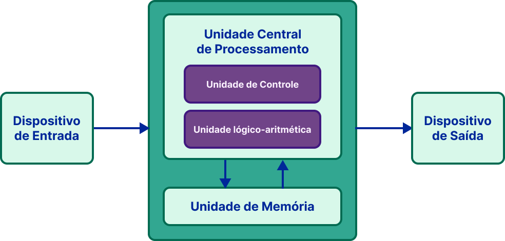

## Processador - CPU

A CPU, ou unidade central de processamento, funciona em conjunto com a memória principal, lendo e executando as instruções e dados armazenados nela e gravando o resultado de tais processamentos.

### ULA (unidade lógico-aritmética)

ULA é o componente responsável por realizar operações lógicas (como as realizadas pelas portas lógicas AND, OR, etc, entre outras operações lógicas) e aritméticas (como somas, subtrações, multiplicações, etc).

### Unidade de Controle

A Unidade de Controle é responsável por extrair dados da memória, decodificá-los e executá-los, consultando a ULA quando necessário.

### Registradores

O processador possui células internas de memória, chamadas de registradores. Neles, o processador vai armazenar os dados lidos da memória que está usando no processamento. As operações a serem realizadas também são representadas como números na memória, e um conjunto delas forma o que chamamos de uma instrução.

Por exemplo: realizar uma soma. A CPU funciona executando um loop desde sua inicialização, onde ela realiza a leitura de algumas instruções pré-definidas, executa elas e então passa a buscar e consequentemente a executar as instruções na memória.

A CPU pode ler da memória uma instrução, por exemplo, indicando para definir o valor do endereço #1000 0000 para 1000 1010. A partir disso, ela enviará um comando para a memória principal para atribuir o valor 1000 1010 para a célula de endereço #1000 0000. Da mesma forma, o processador consegue realizar outras operações matemáticas básicas buscando os dados de entrada e as instruções na memória e, então, salvando os resultados também na memória principal.

Dessa forma, tudo no computador é tratado como dados e instruções, sempre utilizando números através da representação binária.

Pense no que é um monitor de computador: uma matriz de pequenas luzes que chamamos de pixels. Cada pixel é composto por três luzes: uma vermelha (R), uma verde (G) e uma azul (B). Um byte codifica, em oito bits, o quão intensamente cada uma dessas três luzinhas deve se acender. Se quisermos exibir uma imagem em um monitor com resolução de 1280 pixels horizontais por 720 pixels verticais (HD), são necessários 1280 x 720 x 3 = 2.764.800 bytes (quase 3MB) em memória para armazenar a intensidade luminosa de cada luzinha presente no monitor. Realizando operações lógicas ou aritméticas nos valores armazenados na memória, mudamos a imagem que é exibida.

Bom, começamos com teoria computacional e sinais elétricos, vimos estes se transformarem em lógica e agora conseguimos ter uma ideia, ainda que um tanto abstrata, de como o nosso computador opera! A seguir vamos trabalhar mais conceitos importantes para fundamentar bem as bases de nossa teoria!

Bora lá? 🚀

### Operações por segundo

Para gerenciar todas as atividades e a comunicação entre os componentes do computador, existe um componente eletrônico que gera um sinal de "clock". Esse sinal é uma alternância entre tensões altas e baixas a cada fração de tempo, seguindo a mesma ideia de representação de 0 e 1.

A frequência do clock é medida em hertz (Hz), ciclos por segundo. Ou seja, o número de operações básicas capazes de serem executadas em 1 segundo. O período de um clock é o tempo entre uma operação e outra.

Dessa forma, um computador com um processador com frequência de 1Hz consegue realizar uma operação básica por segundo. Esse número costuma ser muito maior, como 2GHz, o que significa que essa CPU consegue realizar cerca de 2 bilhões de operações básicas (ciclos) por segundo, com cada ciclo demorando 0,0000000005 segundos ou 0,5 nanossegundos.

Um processador não necessariamente consegue executar uma instrução por ciclo, pois isso depende de sua arquitetura. Em processadores de computadores Desktop normalmente uma instrução possui de 5 a 10 operações básicas, fazendo com que a execução de uma instrução demore mais do que somente um ciclo.

Atualmente, existem diversos tipos de processadores com vários recursos para aumentar seu poder computacional, como, por exemplo, processadores multi-cores (com mais de um núcleo) com 4 ou 8 cores que conseguem processar muito mais instruções. Um quad-core (4 núcleos) com 2GHz, por exemplo, pode executar por volta de 1 bilhão de instruções por segundo, com algumas operações básicas cada uma.
