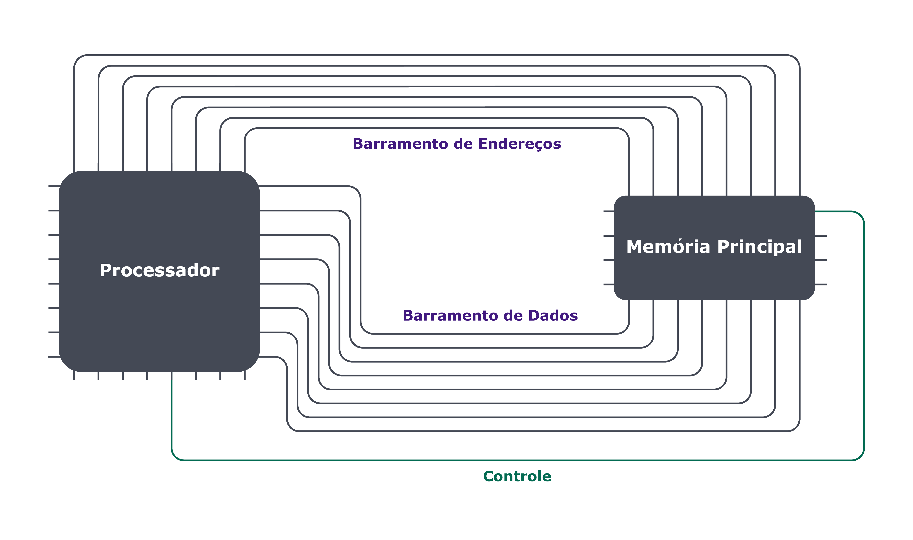

## Barramentos

Agora que vimos um pouco como cada um desses dois componentes, memória e CPU, se comportam, vamos entrar um pouco mais a fundo no funcionamento dos dois em conjunto, que é o que de fato faz a "magia" acontecer. 🪄

Ambos componentes realizam a troca constante de informações: o processador está constantemente buscando por instruções na memória e dados a serem processados e devolvendo os resultados desses processamentos para a memória. E como isso é feito?

Para realizar essa troca são realizados dois tipos de operações, uma sendo a leitura da memória para carregar quais são as instruções a serem executadas. Esses dados são lidos e gravados em registradores do processador. Esse processo é chamado de load. A outra operação é quando o processador precisa armazenar dados na memória como os resultados dos processamentos e das operações que ele realizou durante uma operação. Esse processo é chamado de store.

Essas comunicações dos componentes são realizadas a partir de "vias" que ligam os dois componentes. Essas vias são chamadas de barramentos, que são conjuntos de fios. Conforme vimos, ambos componentes utilizam números binários representados por grandezas elétricas (tensão/corrente). Dessa forma, os barramentos conseguem comunicá-los transmitindo essas grandezas.

Basicamente a memória principal é ligada a CPU por 3 dessas vias:

Endereço (ADDR): Indica o endereço da célula de memória para aquela operação;

Dados (DATA): Transfere a informação da memória para a CPU e vice-versa.

Controle (CTRL): Indica a "direção" dos dados para a operação, ou seja, se os dados serão transferidos da CPU para a memória (escrita) ou da memória para a CPU (leitura).

No exemplo abaixo, temos os dois componentes interligados. Perceba como a CPU envia os dados de acordo com o necessário para executar a operação desejada:

Sabe as pequenas linhas que você vê nas placas de circuito? São barramentos como esses ligando as diversas peças de diversas formas! 😄
