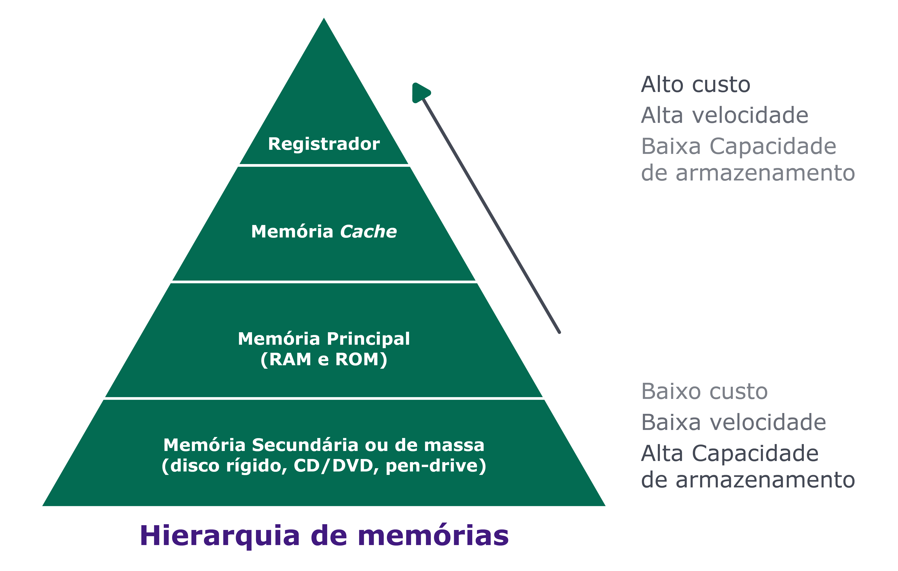

## Hierarquia das memórias

Vimos que a CPU, antes de processar uma instrução, busca as informações da memória principal para seus registradores internos, que usará para realizar as operações. Porém, esse espaço dos registradores internos é bem pequeno, sendo capaz de armazenar apenas o dado para aquela operação que está sendo executada no momento (alguns bytes).

Por isso, a CPU precisa constantemente trocar dados de seus registradores com a memória RAM. Perceba que esse processo precisa ser extremamente rápido, caso contrário a CPU ficará ociosa aguardando a transferência de dados com a memória, "desperdiçando" seus ciclos, o que impacta diretamente na performance dos processamentos.

Para se ter uma ideia, a CPU acessa um dado em seus registradores quase que instantaneamente, em apenas um ciclo. Já para buscar um dado da memória esse tempo é um pouco maior: em computadores modernos, essa operação pode levar algumas centenas de ciclos, o que equivale a 1 microssegundo, o que parece bem rápido, porém, para a quantidade de leituras que são feitas para as execuções esse tempo se torna "uma eternidade"!

Com o avanço das tecnologias a velocidade das CPUs cresceu de maneira exponencial. A velocidade das memórias também aumentou, porém sem conseguir acompanhar a evolução dos processadores. Além disso, a velocidade delas está diretamente relacionadas com seus preços: quanto mais rápidas, mais caras. 💸

Para aumentar o poder dos computadores, pessoas pesquisadoras desenvolveram estratégias para lidar com essas questões de memória. A principal foi a criação de uma hierarquia de memórias. Essa hierarquia faz com que os dados que são acessados com mais frequência sejam armazenados em memórias de acesso mais rápido. Por exemplo, os dados que estão sendo trabalhados pela CPU. Enquanto isso, os outros dados acessados com menos frequência são armazenados em memórias mais baratas e lentas como, por exemplo, nossos arquivos no HD.

**Em geral a hierarquia é composta da seguinte maneira:**

### Registradores

Na ponta superior da pirâmide estão os registradores. Eles são utilizados para armazenar um volume pequeno de dados, possuindo altíssima velocidade.

### Memória Cache

Na sequência temos os caches L1, L2 e L3. Esses componentes são de acesso mais rápido do que a memória principal (sendo o L1 o mais rápido, em seguida o L2 e depois o L3) e são integrados à CPU. As memórias cache são utilizadas para armazenar alguns dados de maneira estratégica, como os dados que são lidos com maior frequência na RAM. Dessa forma, ao terem os dados encontrados nesses dispositivos, não é necessário buscá-los na memória principal, aumentando a performance do computador, tendo em vista que as chamadas a eles são centenas de vezes mais rápidas do que para a RAM. Sabe o \_cache do seu navegador?) Lá ficam os dados dos sites que você acessa com mais frequência. O navegador os recupera de lá em vez de buscá-los no servidor para ser mais rápido!

### Memória principal (RAM e ROM)

Seguindo a hierarquia temos as memórias RAM e as memórias ROM (Read-Only Memory), sendo essa segunda memória somente de leitura, que é um tipo de memória que não permite a escrita de dados, porém seus dados não são perdidos quando ela é desligada. Em geral, essas memórias são utilizadas para guardar configurações mais básicas do sistema como, por exemplo, os dados para inicializar alguns componentes do computador.

### Memória secundária ou de massa

Por último temos as memórias secundárias, como HDs, SSDs, CD/DVDs, pendrives e afins. Esses dispositivos são mais lentos por fazerem a gravação física das informações nos dispositivos, porém não perdem informações quando desligados e são capazes de armazenar grande volume de dados.

Vemos então, para concluir, que as memórias tem dois tradeoffs a se considerar:

**Velocidade versus volatilidade:** memórias de escrita e leitura mais rápidas tendem a ser voláteis, ou seja, quando o computador é desligado os dados da memória são apagados! Nos HDs (não voláteis) isso não acontece. Na memória RAM (volátil) sim.

**Velocidade versus capacidade:** memórias mais rápidas costumam ser mais caras, e por isso costumam ser comercializadas com capacidades menores. Um pente de 8GB de RAM custa aproximadamente o mesmo que um SSD de 240GB ou que um HD de 1TB.
