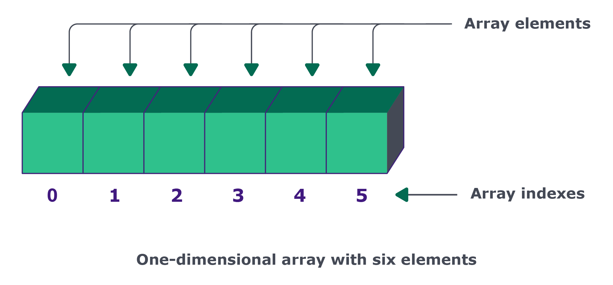

## Por que arrays?



Array é um tipo abstrato de dado (TAD) que possui uma coleção de elementos que são acessados através do índice. Um array pode armazenar todo o tipo de dado e estes normalmente são de tipos homogêneos, ou seja, do mesmo tipo.

> 💡 Em python, listas armazenam somente uma referência a um objeto. Portanto, um objeto armazenado em uma lista, modificado posteriormente, será modificado na lista.

TADS podem ser implementados de maneiras variadas, porém normalmente são representados através de arrays estáticos (cuidado para não confundir o tipo abstrato com implementação concreta) e arrays dinâmicos. A implementação estática define um valor fixo de tamanho e não pode ser modificada durante a execução do programa, já a dinâmica, permite que ele cresça à medida que novos elementos são inseridos.

A principal característica de um array é que elementos são armazenados e recuperados através de índices, o mesmo índice utilizado para adicionar um elemento pode ser utilizado para a sua recuperação.

Devemos lembrar sempre que a maneira como os índices trabalham é específica da implementação, mas podemos pensar neles como o número da posição em que se encontram em uma coleção e que tipicamente começam em zero.

Agora que entendemos um pouco sobre o TAD, que tal implementarmos a estrutura de dados (ED) Array?

Devemos implementar pelo menos um jeito de recuperar e armazenar um dado através do índice. Para isso, vamos escrever o código abaixo:

> Nota: Lembre-se de criar e ativar o ambiente isolado.
> array_example.py

```"""Perceba que temos uma coleção de valores
e operações que atuam sobre estes valores,
de acordo com o que foi definido pelo TAD."""


class Array:
    def __init__(self):
        self.data = []

    def __len__(self):
        # quando pedido o tamanho do array
        # retorne o tamanho de data
        return len(self.data)

    def __str__(self):
        # converte para string e exibe os valores de data
        return str(self.data)

    def get(self, index):
        return self.data[index]

    def set(self, index, value):
        self.data.insert(index, value)


# vamos inicializar e preencher uma estrutura de dados array
array = Array()
array.set(0, "Felipe")
array.set(1, "Ana")
array.set(2, "Shirley")
array.set(3, "Miguel")

# para acessar um elemento do array, utilizamos seu índice
print(array.get(0))  # saída: Felipe
print(array.get(2))  # saída: Shirley
print("-----")

# podemos iterar sobre seus elementos da seguinte maneira
index = 0
# enquanto há elementos no array
while index < len(array):
    # recupera o elemento através de um índice
    print("Index:", index, ", Nome:", array.get(index))
    index += 1
```

Relembrando o problema das notas, como arrays são estruturas eficientes para consultas, podemos buscar um estudante, através de um índice, e percorrer suas notas de uma maneira eficaz. Ainda temos o detalhe de que não ocorrem tantas inserções de notas, somente quando um estudante entrar em recuperação.

Mas porque não ter inserções é uma coisa boa? Vamos entender o que acontece quando inserimos elementos em um array.
