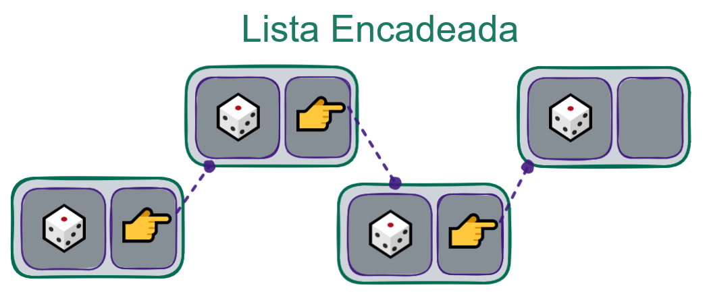
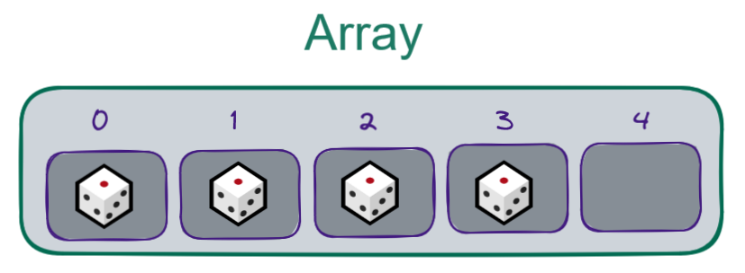

## O que é uma Lista Encadeada?

Ligando vários nós encadeados através de seus ponteiros, temos uma lista encadeada! Lembrando que cada nó contém um valor além do ponteiro, temos assim uma estrutura capaz de conter uma quantidade indefinida de elementos em sequência.

**Listas Encadeadas, também conhecidas como Listas Ligadas, ou em inglês linked lists, são um Tipo Abstrato de Dados capaz de armazenar elementos de forma sequencial.**

Aí você pode se perguntar: Já não tínhamos o Array, que faz exatamente a mesma coisa?" 🤔 A resposta nesse caso é: a estrutura faz a mesma coisa, porém a ordem de complexidade de suas operações é bem diferente!

Lembra dos problemas que tínhamos com os Arrays, de todo o trabalho necessário para redimensionar a estrutura e para inserir ou remover elementos? 🤔 As listas encadeadas não possuem alguns destes problemas. Por exemplo, como cada nó que compõe a lista tem um endereço de memória, não é necessário alocar todos os elementos da lista de forma sequencial nela, um diretamente seguido do próximo, e também não precisamos escolher um tamanho inicial para a lista encadeada quando ela é criada.

Vamos analisar as operações que podem ser feitas em listas, para podermos compará-las com estas mesmas operações feitas em Arrays, em questões de velocidade e memória utilizada:

> ▶️ Inicialização: Para o array, precisamos escolher um tamanho inicial. Isto pode ser problemático se não soubermos de antemão quantos elementos esta estrutura precisará armazenar. Estimar errado pode desperdiçar memória com espaço não utilizado, ou se precisarmos de um array maior vamos ter que criar outro e realocar todos os elementos. Já para uma lista encadeada, basta criarmos os primeiros elementos. Se não forem adicionados mais, a lista não está desperdiçando espaço, e caso precisemos de mais itens, basta criar eles em qualquer lugar da memória e alterar os ponteiros da lista já existente para apontar para os novos elementos, de acordo com a ordem desejada.

> ▶️ Busca e Acesso: Aqui é onde o array leva vantagem. No array, sabemos exatamente a posição de cada elemento na memória, então se precisarmos acessar um específico (que esteja por exemplo, na metade do array) isso é trivial, já sabemos o endereço. Porém, em uma lista encadeada os elementos estão espalhados. Para buscar o enésimo número da lista, precisamos percorrer os N números, buscando ponteiros para achar o próximo. Esta operação pode ser mais custosa.

💡 Um detalhe importante é que, para realizar a inserção em uma lista encadeada, também precisaremos buscar esta posição. Para saber qual estrutura é melhor em casos de inserção, precisamos somar o custo de busca e de inserção. Portanto, para comparar o tempo de inserção em arrays com o tempo de inserção em listas encadeadas, precisamos levar em consideração também o tempo de busca em cada uma destas estruturas, de forma a termos o custo total da operação.

> ▶️ Inserção Inserir em um array tem três casos:

O espaço em que queremos inserir está vago. Neste caso, a operação é extremamente simples e rápida.

O espaço em que queremos inserir já está ocupado. Neste caso, vamos precisar mover todos os itens uma posição para frente na memória para liberar o espaço desejado. Esta operação custa muito.

O espaço em que queremos inserir não existe no array. Neste caso, precisamos criar um array novo, com as novas dimensões desejadas, transferir todos os elementos, e então inserir o novo. Isso também é bem custoso.

Já para uma lista encadeada, todas as inserções são extremamente rápidas. Para inserir no final, apenas criamos um novo nó em qualquer lugar da memória e fazemos o último nó da lista apontar para este novo nó que foi criado, fazendo com que este passe a ser o último. Para inserir no começo ou no meio, não precisamos mover ninguém de lugar, só criamos o novo nó e ajustamos os ponteiros.

Exemplificando: Suponha que temos uma lista com os nós A e C, sendo que A aponta para C (ou seja, A é o primeiro elemento, C é o segundo). Se quisermos inserir um nó B entre o A e o C, primeiramente criamos o novo nó B e fazemos ele apontar para o elemento que A aponta (que neste caso é o C). Em seguida, fazemos A apontar para B. Pronto. E isto pode ser feito com esta mesma simplicidade em uma lista com milhares de elementos, bastando fazer o novo elemento apontar para o próximo, e o anterior apontar para o novo.

LinkedLists não tem as restrições de acesso como nas seguintes TADs:

FILA: acessa apenas o primeiro elemento;

PILHA: acessa apenas o último elemento;

DEQUE: acessa apenas as extremidades.

💡 Ou seja, uma Lista Encadeada possibilita acessar qualquer elemento, sem exceção.
