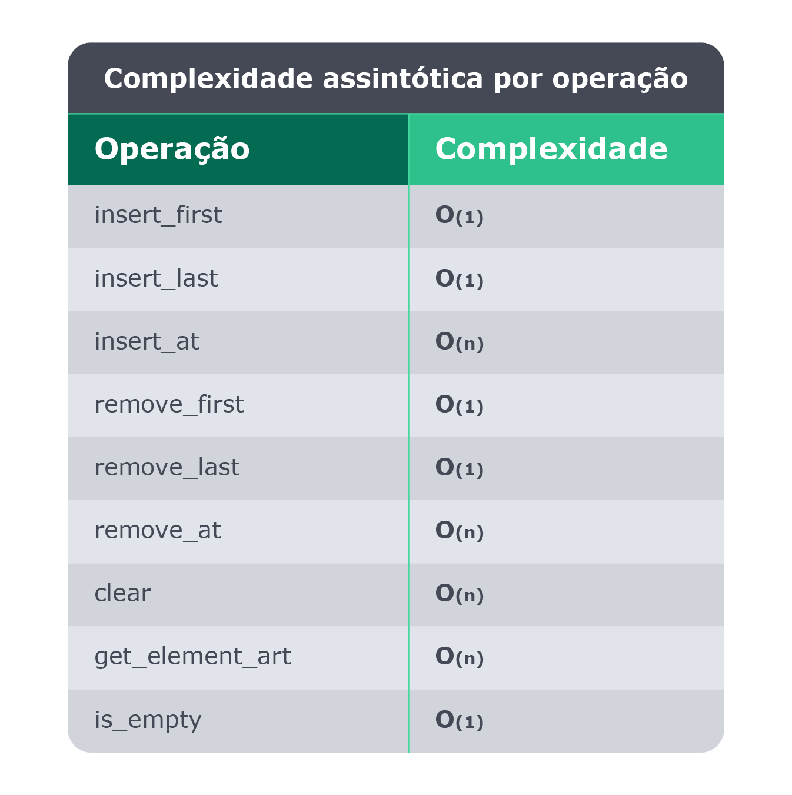

## Quais as operações mais comuns?

Ao se manipular uma LinkedList existem algumas operações que são comumente utilizadas:

A operação insert_first nos permite adicionar um Node no início da lista;

A operação insert_last nos permite adicionar um Node no final da lista;

A operação insert_at nos permite adicionar um Node em qualquer posição da lista;

A operação remove_first nos permite remover um Node do início da lista;

A operação remove_last nos permite remover um Node do final da lista;

A operação remove_at nos permite remover um Node em qualquer posição da lista;

A operação clear nos permite remover todos os Nodes da lista;

A operação get_element_at nos permite visualizar o Node em qualquer posição da lista;

A operação is_empty nos permite identificar se existe ao menos um Node na lista.

