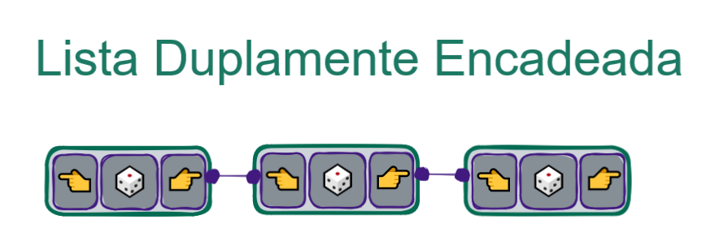

## Encadeamento duplo

As listas encadeadas normais têm seus nós ligados por ponteiros em somente uma direção. Mas e se precisarmos, por algum motivo, percorrer a lista também no sentido oposto? Nada nos impede de criar ponteiros no sentido oposto também, fazendo com que cada nó aponte para o anterior e o próximo ao mesmo tempo!

✔️A vantagem é termos mais facilidade ap percorrer esta lista no sentido oposto. ❌A desvantagem é ocuparmos mais espaço de memória, pois temos uma quantidade maior de ponteiros. Podemos construir nossos nós com mais de um ponteiro, isso possibilita montarmos estruturas diferentes, como as listas duplamente encadeadas, ou árvores por exemplo.

**O principal motivo da evolução da lista encadeada para a lista duplamente encadeada é a capacidade de otimização em operações nas extremidades.**

Vimos no conteúdo anterior que operações a serem realizadas no final como insert_last e remove_last teriam complexidade de O(n). Neste caso, como temos uma forma de guardar a primeira e a última posição, podemos obter complexidade O(1), em ambas operações.

Agora que temos referências no começo e np final da lista, vamos nomeá-los: o primeiro nó da lista se chama HEAD, a cabeça da lista. O último nó da lista se chama TAIL, a cauda da lista. Assim evitamos confundir a qual ponta da lista estamos nos referindo.
