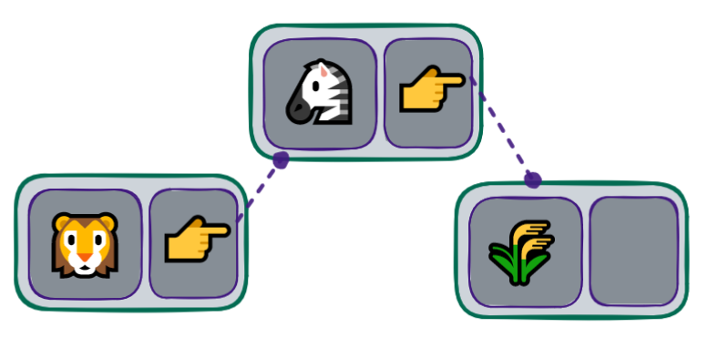

## Implementação de uma LinkedList

Devemos utilizar a classe criada anteriormente, para criar nossa estrutura da LinkedList:



```python
linked_list_content.py

from node import Node


class LinkedList:
    def __init__(self):
        self.head_value = None
        self.__length = 0

    def __str__(self):
        return f"LinkedList(len={self.__length}, value={self.head_value})"

    def __len__(self):
        return self.__length
```

💡 Utilizamos o conceito Literal String Interpolation na função **str**. Caso haja dúvidas, dê uma olhada na doc do pep-0498.

Agora vamos implementar as operações do LinkedList para entendermos melhor as funcionalidades dessa estrutura de dados.
