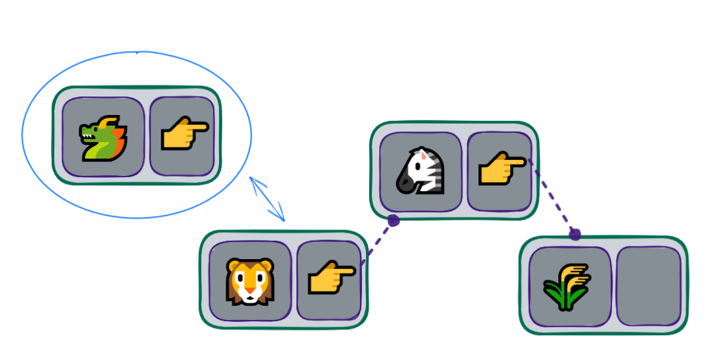

## Implementação de uma LinkedList

Devemos utilizar a classe criada anteriormente, para criar nossa estrutura da LinkedList:


```python
linked_list_content.py

from node import Node


class LinkedList:
    def __init__(self):
        self.head_value = None
        self.__length = 0

    def __str__(self):
        return f"LinkedList(len={self.__length}, value={self.head_value})"

    def __len__(self):
        return self.__length
```

💡 Utilizamos o conceito Literal String Interpolation na função **str**. Caso haja dúvidas, dê uma olhada na doc do pep-0498.

Agora vamos implementar as operações do LinkedList para entendermos melhor as funcionalidades dessa estrutura de dados.

### Inserir no início



Devemos informar que o elemento que estamos inserindo é o novo head_value:

```
linked_list_content.py

# from node import Node


class LinkedList:
    # ...

    def insert_first(self, value):
        first_value = Node(value)
        self.head_value = first_value
        self.__length += 1
```

Caso optemos por inserir o valor 3, teremos o resultado:

`LinkedList(len=1 value=Node(value=3 next=None))`

No entanto, seguir essa abordagem faz com que os elementos anteriores sejam sobrepostos pelo novo. Dito isso, devemos indicar que o elemento atual, head_value, será o next do elemento que estamos inserindo.

Resumindo: ✏️ o next será preenchido com o valor que está atualmente na head_value, para que o novo valor, que estamos inserindo no início da lista, seja preenchido na variável head_value, tornando-se a "cabeça" da lista.

```
# from node import Node


class LinkedList:
    # ...

    def insert_first(self, value):
        first_value = Node(value)
        first_value.next = self.head_value
        self.head_value = first_value
        self.__length += 1
```

Desta forma, adicionando o valor 3 e posteriormente o valor 1 teremos o resultado:

    ```LinkedList(len=2 value=Node(value=1 next=Node(value=3 next=None)))```
