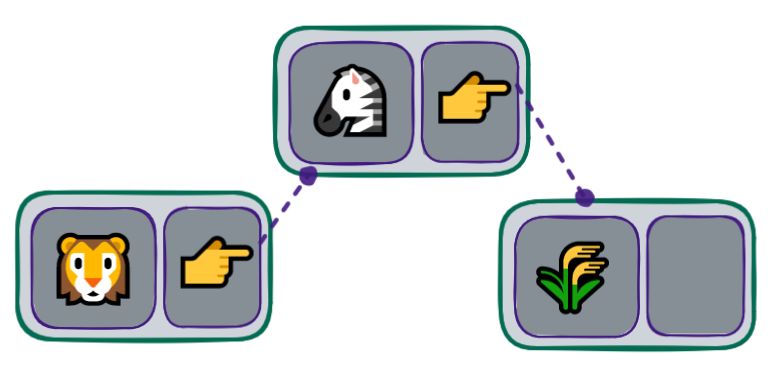
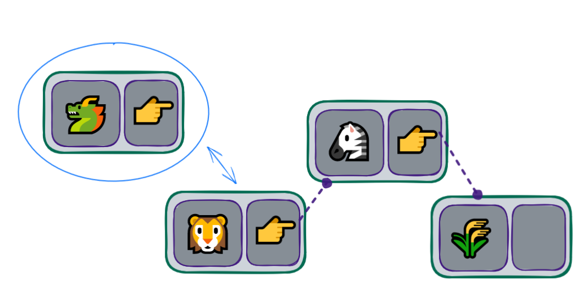
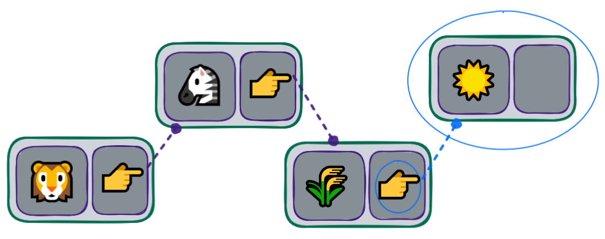
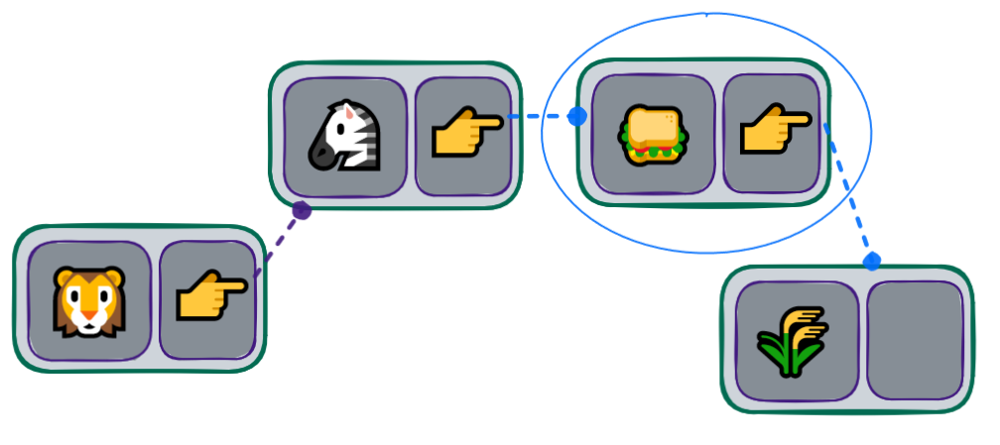
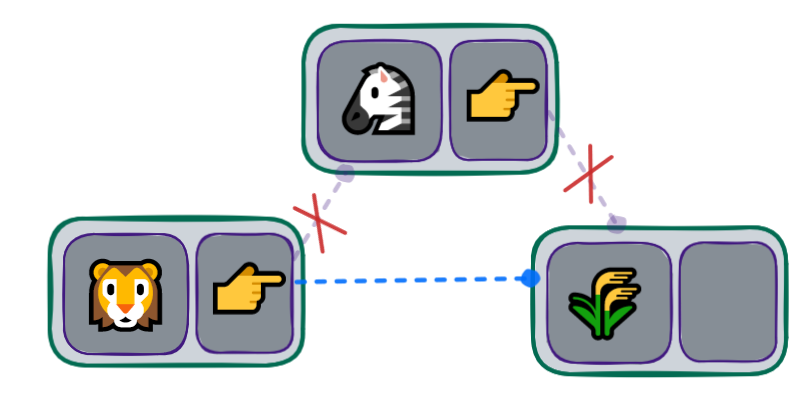

## Implementação de uma LinkedList

Devemos utilizar a classe criada anteriormente, para criar nossa estrutura da LinkedList:



```python
linked_list_content.py

from node import Node


class LinkedList:
    def __init__(self):
        self.head_value = None
        self.__length = 0

    def __str__(self):
        return f"LinkedList(len={self.__length}, value={self.head_value})"

    def __len__(self):
        return self.__length
```

💡 Utilizamos o conceito Literal String Interpolation na função **str**. Caso haja dúvidas, dê uma olhada na doc do pep-0498.

Agora vamos implementar as operações do LinkedList para entendermos melhor as funcionalidades dessa estrutura de dados.

### Inserir no início



Devemos informar que o elemento que estamos inserindo é o novo head_value:

```
linked_list_content.py

# from node import Node


class LinkedList:
    # ...

    def insert_first(self, value):
        first_value = Node(value)
        self.head_value = first_value
        self.__length += 1
```

Caso optemos por inserir o valor 3, teremos o resultado:

`LinkedList(len=1 value=Node(value=3 next=None))`

No entanto, seguir essa abordagem faz com que os elementos anteriores sejam sobrepostos pelo novo. Dito isso, devemos indicar que o elemento atual, head_value, será o next do elemento que estamos inserindo.

Resumindo: ✏️ o next será preenchido com o valor que está atualmente na head_value, para que o novo valor, que estamos inserindo no início da lista, seja preenchido na variável head_value, tornando-se a "cabeça" da lista.

```
# from node import Node


class LinkedList:
    # ...

    def insert_first(self, value):
        first_value = Node(value)
        first_value.next = self.head_value
        self.head_value = first_value
        self.__length += 1
```

Desta forma, adicionando o valor 3 e posteriormente o valor 1 teremos o resultado:

    ```LinkedList(len=2 value=Node(value=1 next=Node(value=3 next=None)))```

<hr>

## Inserir no final



Devemos informar que o elemento que estamos inserindo será o último na nossa estrutura de cadeia de Nodes:

> linked_list_content.py

# from node import Node

```
class LinkedList:
    # ...

    def insert_last(self, value):
        last_value = Node(value)
        current_value = self.head_value

        while current_value.next:
            current_value = current_value.next
        current_value.next = last_value
        self.__length += 1
```

Idealmente esta abordagem estaria correta, desde que houvesse ao menos um elemento em nossa estrutura. Porém, caso não haja nenhum elemento, o trecho while current_value.next: causaria o erro AttributeError: 'NoneType' object has no attribute 'next'.

Isso acontece, pois o head_value ainda não possui valor. Para corrigir essa lógica, podemos utilizar a função insert_first escrita previamente:

> linked_list_content.py

```
# from node import Node


class LinkedList:
    # ...

    def insert_last(self, value):
        last_value = Node(value)
        current_value = self.head_value

        # Mais abaixo criaremos o método is_empty()
        # que substituirá a condição deste if
        if current_value is None:
            return self.insert_first(value)

        while current_value.next:
            current_value = current_value.next
        current_value.next = last_value
        self.__length += 1
```

Desta forma, adicionando o valor 3 e posteriormente o valor 1 teremos o resultado:

`LinkedList(len=2 value=Node(value=3 next=Node(value=1 next=None)))`

Percebam que usamos a variável auxiliar current_value para percorrer toda a cadeia de Nodes. Isto é necessário, pois assim não perdemos a referência para a cabeça da estrutura, head_value.

<hr>

## Inserir em qualquer posição



Devemos informar que o elemento que estamos inserindo será adicionado na posição desejada em nossa estrutura.

👀 De olho na dica: a primeira posição, assim como em arrays, será considerada como 0

Levaremos em consideração as seguintes observações:

> Se o elemento tem a posição inferior a 1, será adicionado na posição inicial, utilizando a função insert_first;

> Se o elemento tem a posição igual ou superior à quantidade de elementos, será adicionado na posição final, utilizando a função insert_last.

```
linked_list_content.py
# from node import Node


class LinkedList:
    # ...

    def insert_at(self, value, position):
        if position < 1:
            return self.insert_first(value)
        if position >= len(self):
            return self.insert_last(value)
        current_value = self.head_value
        while position > 1:
            current_value = current_value.next
            position -= 1
        next_value = Node(value)
        next_value.next = current_value.next
        current_value.next = next_value
        self.__length += 1
```

Desta forma podemos voltar nossos esforços apenas para a parte que estava "descoberta". Ou seja, voltamos a nossa lógica apenas para as posições do meio da nossa estrutura. A lógica é similar ao inserir no final insert_last, no entanto, não analisamos se existe um próximo, mas sim se o próximo é a posição que queremos inserir o novo valor.

<hr>

## Remover no início

Devemos informar que o elemento que estamos removendo será o último da nossa estrutura de cadeia de Nodes. Os problemas vistos na sessão Inserir no final também se aplicam aqui.

Dito isso, caso tenhamos apenas um elemento em nossa estrutura, invocaremos a função de remoção existente, remove_first:

```
linked_list_content.py
# from node import Node


class LinkedList:
    # ...

    def remove_last(self):
        if len(self) <= 1:
            return self.remove_first()

        previous_to_be_removed = self.head_value

        while previous_to_be_removed.next.next:
            previous_to_be_removed = previous_to_be_removed.next

        value_to_be_removed = previous_to_be_removed.next
        previous_to_be_removed.next = None
        self.__length -= 1
        return value_to_be_removed
```

> 💡 Veja que essa função requer uma atenção especial, pois além de uma variável auxiliar que utilizamos como ponteiro para identificar o Node a ser removido, precisamos ter uma outra variável para indicar o Node anterior. Desta forma, indicamos que o Node anterior ao último vai apontar para None como próximo, liberando assim a referência ao anteriormente tido como último em nossa estrutura.

<hr>

## Remover em qualquer posição



Devemos informar a posição do elemento que desejamos a remoção de nossa estrutura.

Levaremos em consideração as seguintes observações:

> Se o elemento tem a posição inferior a 1, será removido na posição inicial, utilizando a função remove_first;

> Se o elemento tem a posição igual ou superior a quantidade de elementos, será removido na posição final, utilizando a função remove_last.

```
linked_list_content.py

# from node import Node


class LinkedList:
    # ...

    def remove_at(self, position):
        if position < 1:
            return self.remove_first()
        if position >= len(self):
            return self.remove_last()

        previous_to_be_removed = self.head_value
        while position > 1:
            previous_to_be_removed = previous_to_be_removed.next
            position -= 1
        value_to_be_removed = previous_to_be_removed.next
        previous_to_be_removed.next = value_to_be_removed.next
        value_to_be_removed.next = None
        self.__length -= 1
        return value_to_be_removed
```

Desta forma, podemos voltar nossos esforços apenas para a parte que estava "descoberta". Ou seja, voltamos a nossa lógica apenas para as posições do meio da nossa estrutura. A lógica é similar ao remover do final remove_last, no entanto, não analisamos se existe um próximo, mas sim se o próximo é a posição que queremos remover.

<hr>

## Obter elemento em qualquer posição

Devemos informar a posição do elemento que desejamos visualizar o conteúdo. Esta função deve retornar uma cópia do Node existente em nossa estrutura.

Levaremos em consideração as seguintes observações:

> Se o elemento tem a posição inferior a 1, será retornado o conteúdo da posição inicial;

> Se o elemento tem a posição igual ou superior a quantidade de elementos, será retornado o conteúdo da posição final.

```
linked_list_content.py

# from node import Node


class LinkedList:
    # ...

    def get_element_at(self, position):
        value_returned = None
        value_to_be_returned = self.head_value
        if value_to_be_returned:
            while position > 0 and value_to_be_returned.next:
                value_to_be_returned = value_to_be_returned.next
                position -= 1
            if value_to_be_returned:
                value_returned = Node(value_to_be_returned.value)
        return value_returned
```

⚠️Um ponto de atenção para as verificações constantes presentes no código. Elas indicam que:

Caso não haja elementos em nossa estrutura, será retornado None;

Caso a posição seja menor igual a 0, será retornado o primeiro elemento;

Caso a posição seja maior ou igual a N, onde N é o tamanho da lista, será retornado o último elemento.

Por fim, retornamos um novo Node com o mesmo valor do existente em nossa estrutura. Isto é necessário para que retornemos apenas o valor, e não a referência aos demais elementos.

<hr>

## Está vazia

Devemos informar se a estrutura está vazia. Nesse caso, como possuímos um campo length, podemos utilizá-lo como ponto a ser analisado, afinal, se o mesmo for 0 nossa estrutura não possui elementos.

```
linked_list_content.py

# from node import Node


class LinkedList:
    # ...

    def is_empty(self):
        return not self.__length
```

O uso do not neste contexto nos informa se a estrutura está vazia, já que not 0 == True.

<hr>

## Por fim nossa classe ficou assim:

```
from node import Node
class LinkedList:

    def __init__(self):
        self.head_value = None
        self.__length = 0

    def __str__(self):
        return f"LinkedList(len={self.__length}, value={self.head_value})"

    def __len__(self):
        return self.__length

    def insert_first(self, value):
        first_value = Node(value)
        first_value.next = self.head_value
        self.head_value = first_value
        self.__length += 1

    def insert_last(self, value):
        last_value = Node(value)
        current_value = self.head_value

        if self.is_empty():
            return self.insert_first(value)

        while current_value.next:
            current_value = current_value.next
        current_value.next = last_value
        self.__length += 1

    def insert_at(self, value, position):
        if position < 1:
            return self.insert_first(value)
        if position >= len(self):
            return self.insert_last(value)
        current_value = self.head_value
        while position > 1:
            current_value = current_value.next
            position -= 1
        next_value = Node(value)
        next_value.next = current_value.next
        current_value.next = next_value
        self.__length += 1

    def remove_first(self):
        value_to_be_removed = self.head_value
        if value_to_be_removed:
            self.head_value = self.head_value.next
            value_to_be_removed.next = None
            self.__length -= 1
        return value_to_be_removed

    def remove_last(self):
        if len(self) <= 1:
            return self.remove_first()

        previous_to_be_removed = self.head_value

        while previous_to_be_removed.next.next:
            previous_to_be_removed = previous_to_be_removed.next

        value_to_be_removed = previous_to_be_removed.next
        previous_to_be_removed.next = None
        self.__length -= 1
        return value_to_be_removed

    def remove_at(self, position):
        if position < 1:
            return self.remove_first()
        if position >= len(self):
            return self.remove_last()

        previous_to_be_removed = self.head_value

        while position > 1:
            previous_to_be_removed = previous_to_be_removed.next
            position -= 1

        value_to_be_removed = previous_to_be_removed.next
        previous_to_be_removed.next = value_to_be_removed.next
        value_to_be_removed.next = None
        self.__length -= 1

        return value_to_be_removed

    def get_element_at(self, position):
        value_returned = None
        value_to_be_returned = self.head_value
        if value_to_be_returned:
            while position > 0 and value_to_be_returned.next:
                value_to_be_returned = value_to_be_returned.next
                position -= 1
            if value_to_be_returned:
                value_returned = Node(value_to_be_returned.value)
        return value_returned

    def is_empty(self):
        return not self.__length
```

Para testar, apenas rode o arquivo com: `python3 linked_list_content.py` :)
if **name** == "**main**":
linked_list = LinkedList()

    print(linked_list.is_empty()) # saída: True
    linked_list.insert_first(1)
    print(linked_list) # saída: LinkedList(len=1 value=Node(value=1 next=None))

    linked_list.insert_first(2)
    print(linked_list) # saída: LinkedList(len=2 value=Node(value=2 next=Node(value=1 next=None)))

    linked_list.insert_last(3)
    print(linked_list) # saída: LinkedList(len=3 value=Node(value=2 next=Node(value=1 next=Node(value=3 next=None))))

    linked_list.remove_last()
    print(linked_list) # saída: LinkedList(len=2 value=Node(value=2 next=Node(value=1 next=None)))

    linked_list.remove_first()
    print(linked_list) # saída: LinkedList(len=1 value=Node(value=1 next=None))

    linked_list.insert_at(5, 1)
    print(linked_list) # saída: LinkedList(len=2 value=Node(value=1 next=Node(value=5 next=None)))

    linked_list.remove_at(0)
    print(linked_list) # saída: LinkedList(len=1 value=Node(value=5 next=None))

    linked_list.insert_at(6, 1)
    linked_list.insert_at(7, 2)
    linked_list.insert_at(8, 3)
    linked_list.insert_at(9, 4)
    print(linked_list.get_element_at(3)) # saída: Node(value=8 next=None)

## Implementação de uma lista Duplamente Encadeada

Agora é sua vez de praticar! 🚀
Deixamos com você a implementação de uma lista duplamente encadeada! Ela segue os mesmos princípios da implementação que acabamos de fazer, porém utilizando um Nó feito com dois ponteiros: next e previous. ⚠️ Lembre-se de encadear ambos os ponteiros ao adicionar novos nós na estrutura. Isso fará com que as operações relativas ao último elemento da lista sejam mais rápidas e fáceis de implementar.
