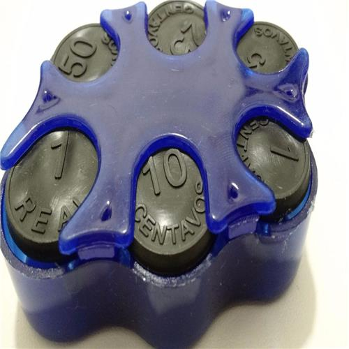

## O que é uma pilha?

A estrutura de pilha é uma estrutura do tipo **LIFO (Last In First Out).** Ou seja, o último elemento a entrar na pilha é o primeiro a sair.

Quem nunca deixou um monte de roupas uma em cima da outra num canto da casa? Nunca organizávamos aquela pilha de roupas e sempre que precisávamos de alguma roupa pegávamos uma de cima por preguiça de organizar as demais roupas. Vocês já tentaram remover uma roupa que estivesse no meio da pilha? Faz uma baita bagunça e sempre era necessário organizar os restante das roupas.

A dica é sempre tentar remover a roupa de cima da pilha de roupas, a mesma coisa deve ser feito com a estrutura de dados pilha. Sempre devemos remover o último item que entrou na pilha, ou seja, o item mais acima. Uma remoção de algum item do meio dará um baita trabalho para reorganizar a pilha.

Assim como no mundo real, quando manipulamos uma pilhas de pratos, por exemplo, só conseguimos efetuar "operações" no topo da pilha. Adicionar um novo prato no topo da pilha é uma tarefa bem simples de ser realizada, assim como também a operação de retirar um prato da pilha para podermos utilizar no almoço. Claro que no mundo real podemos remover um prato do meio, mas convenhamos, dá um pouco de trabalho, não? Na programação remover itens do meio da pilha também não é uma boa ideia.

Num restaurante vocês já perceberam que, quando os pratos disponíveis para as pessoas clientes estão acabando, uma pessoa adiciona uma certa quantidade de pratos no topo de uma pilha de pratos? Neste caso os últimos pratos adicionados serão os primeiros a serem utilizados, pois nós não tiramos os pratos de baixo da pilha e sim do topo. Por favor não tentem tirar pratos debaixo da pilha em casa e nem no restaurante (fora de casa a vergonha pode ser maior 😆)!

Podemos criar uma pilha utilizando alguma outra estruturas de dados como listas encadeadas ou arrays, com a única diferença que todas as operações devem ocorrer com o elemento mais ao topo, ou seja, no último elemento adicionado. Em nosso exemplos vamos utilizar o built-in list para facilitar o entendimento.
O desenho de uma pilha normalmente se parece com um daqueles porta moedas antigos com molas. O desenho seria algo próximo a:

