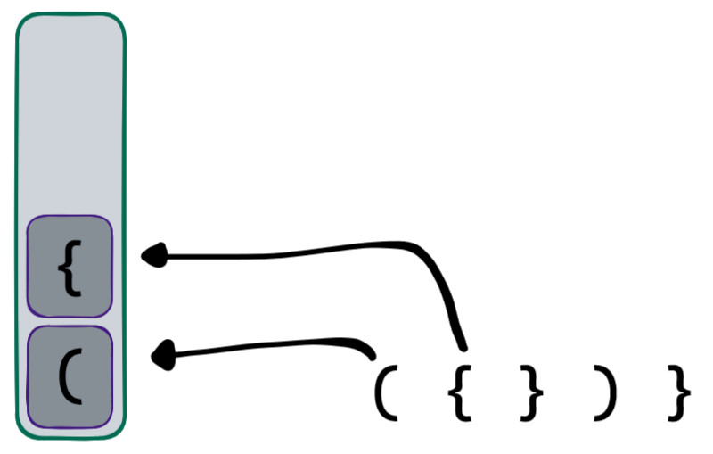
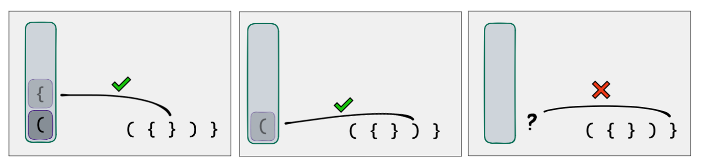

## Concluindo nossa solução

Lembra da nossa necessidade?

"Precisamos de uma forma de lembrar não somente a quantidade de aberturas, como também a ordem"

A pilha faz exatamente isso!😎

Veja o exemplo da string ( { } ) }

Quando os elementos começarem a fechar, sabemos com certeza que o primeiro a ser fechado deve ser o último que foi aberto. (E também o segundo a ser fechado o segundo último que foi aberto, e assim por diante.) Ou seja, Last In, First Out. Agora, para verificar se eles estão sendo fechados corretamente, basta verificarmos o próximo símbolo que acharmos com o símbolo que está no topo da nossa pilha: Se acharmos um }, no topo da pilha deve existir um {. Se acharmos um ), o topo da pilha deve ter um (, e ao final da string, a pilha deve estar vazia, significando que todos os símbolos acharam seu devido par na ordem correta.

Se encontrarmos um elemento fechando na string, e a pilha estiver vazia, significa que fechamos algo sem antes abrir, ou seja, a string não está "balanceada". Se terminarmos a string, e houverem elementos na pilha ainda, significa que abrimos algo sem fechar depois. E se encontrarmos um símbolo na string, e o símbolo no topo da pilha for o par diferente, significa que eles estão na ordem errada. O caso correto é quando terminamos a string com sucesso, e a pilha está vazia!

Conseguimos assim verificar o balanceamento de parênteses e chaves! Este problema é clássico, pois Pilhas é exatamente o conceito utilizado por compiladores e interpretadores para entender operações matemáticas, a qual escopo pertence cada bloco, começo e final de strings, e muitas outras coisas.

Vamos dar uma olhada agora na implementação de Pilhas!
