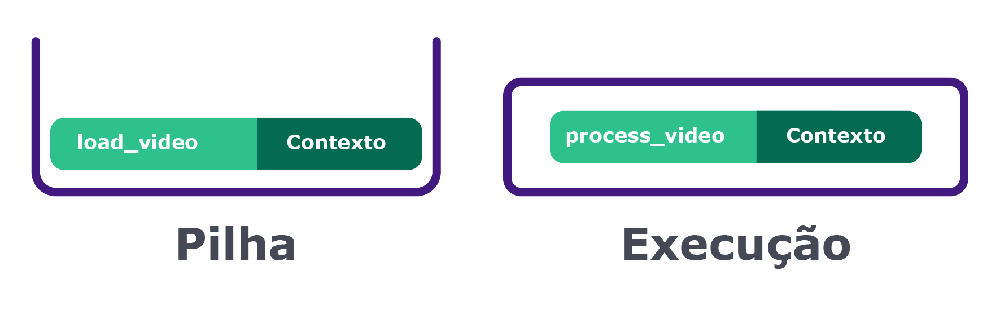
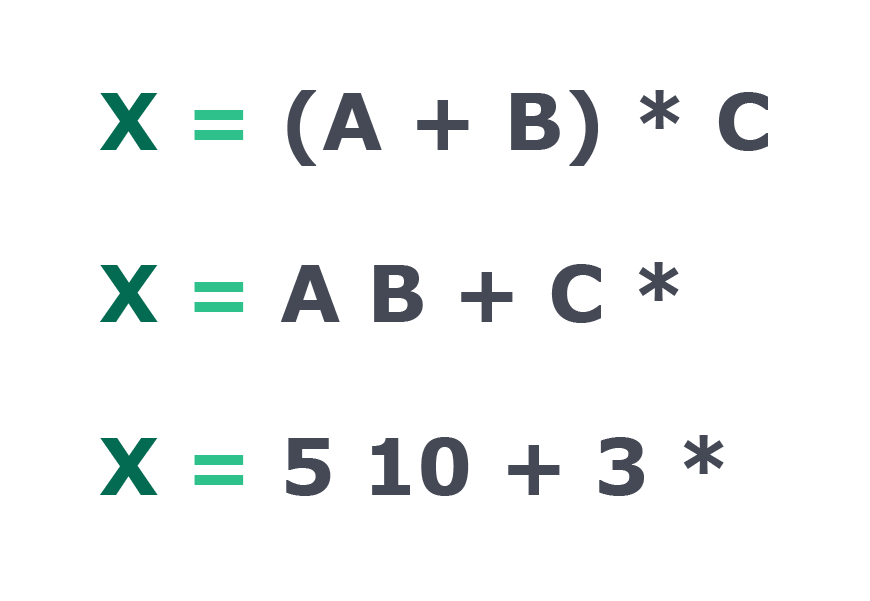
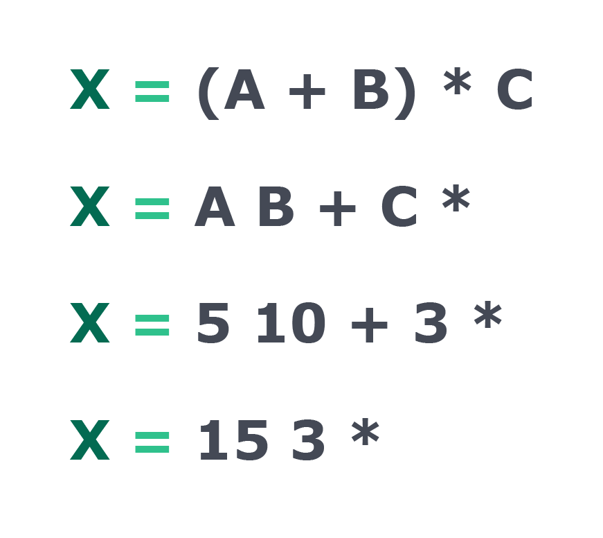
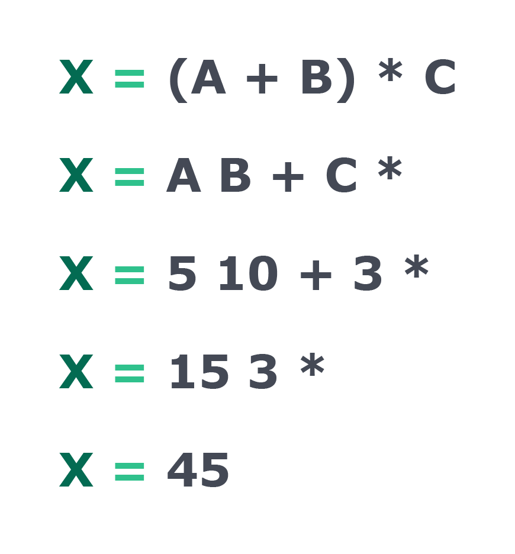
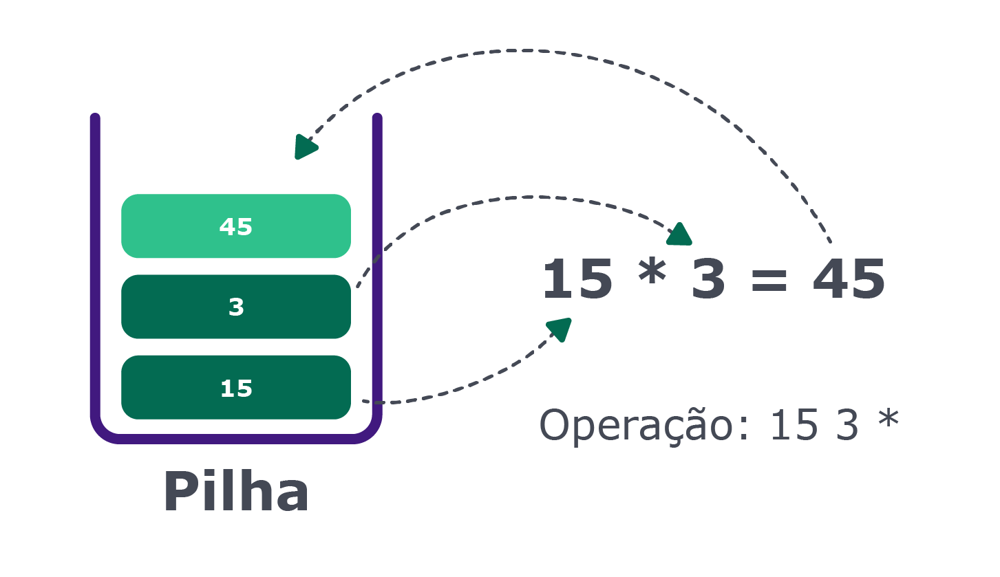

## Utilizando pilhas

Implementação de uma pilha utilizando Python
Para fixar o conteúdo das funções básicas de uma pilha, vamos criar uma classe Stack e aplicar nela as operações que acabamos de ver.

Primeiro iremos declarar a classe chamada Stack no arquivo stack.py. Em seguida, vamos declarar o construtor para termos uma pilha vazia e duas propriedades que serão úteis para implementar as funcionalidades da pilha. A primeira propriedade nos retorna o tamanho da pilha e a segunda propriedade nos indica se a pilha esta vazia.

Nota: Aqui iremos utilizar o tipo built-in de lista para focarmos em entender as pilhas.

> stack.py

```
class Stack():
    def __init__(self):
        self._data = list()

    def size(self):
        return len(self._data)

    def is_empty(self):
        return not bool(self.size())
```

Após adicionar as funções auxiliares, vamos adicionar as operações de push (empilhar itens) e pop (remover itens do topo da pilha). Com esses métodos já poderemos manipular valores na pilha. No arquivo stack.py vamos adicionar os método de push e pop, conforme o código abaixo:

```
class Stack():
    # ...

    def push(self, value):
        self._data.append(value)

    def pop(self):
        if self.is_empty():
            return None

        # -1 se refere ao último objeto da pilha.
        # Ou seja, o valor do topo da pilha
        value = self._data[-1]
        del self._data[-1]
        return value
```

O método push adiciona um novo valor no topo da pilha, enquanto que o método pop irá pegar o elemento do topo e então retornar esse valor. Nem sempre é interessante remover o valor da pilha, por isso iremos implementar o método peek que somente lê o valor no topo da pilha e então o retorna. Vamos adicioná-lo dentro da nossa classe Stack:

> stack.py

```
class Stack():
    # ...

    def peek(self):
        if self.is_empty():
            return None
        value = self._data[-1]
        return value
```

A última funcionalidade da pilha é um método para limpa-la. Para isso iremos adicionar o método clear, que se encarregará de limpar todos os elementos da pilha.

> stack.py

```
class Stack():
    # ...

    def clear(self):
        self._data.clear()
```

Por fim, vamos adicionar o método **str** que fará a impressão de todos os elementos que estão empilhados. Do primeiro ao último item inserido (da parte de baixo da pilha até o topo).

> stack.py

```
class Stack():
    # ...

    def __str__(self):
        str_items = ""
        for i in range(self.size()):
            value = self._data[i]
            str_items += str(value)
            if i + 1 < self.size():
                str_items += ", "

        return "Stack(" + str_items + ")"
```

No final dessas implementações teremos a declaração da classe Stack com todas as operações que podemos realizar com uma pilha. Claro que ainda podemos estender ainda mais a classe Stack para limitar a quantidade de itens na stack e retornar um erro de StackOverflow. Não se preocupem, temos um exercício para isso 😊. No final, o arquivo stack.py terá a seguinte implementação:

> stack.py

```
class Stack():
    def __init__(self):
        self._data = list()

    def size(self):
        return len(self._data)

    def is_empty(self):
        return not bool(self.size())

    def push(self, value):
        self._data.append(value)

    def pop(self):
        if self.is_empty():
            return None

        # -1 se refere ao último objeto da pilha.
        # Ou seja, o valor do topo da pilha
        value = self._data[-1]
        del self._data[-1]
        return value

    def peek(self):
        if self.is_empty():
            return None
        value = self._data[-1]
        return value

    def clear(self):
        self._data.clear()

    def __str__(self):
        str_items = ""
        for i in range(self.size()):
            value = self._data[i]
            str_items += str(value)
            if i + 1 < self.size():
                str_items += ", "

        return "Stack(" + str_items + ")"


if __name__ == "__main__":
    elements = [1, 2, 3, 4, 5, 6, 7, 8, 9, 10]
    content_stack = Stack()

    for elem in elements:
        content_stack.push(elem)

    # saída: Stack(1, 2, 3, 4, 5, 6, 7, 8, 9, 10)
    print(content_stack)
    # saída: 10
    print(content_stack.size())

    # saída: 10
    print(content_stack.peek())
    # saída: 10, pois a função retorna o elemento que está sendo retirado
    print(content_stack.pop())

    # saída: 9, pois, após o 10 ter sido removido, o 9 se tornou o elemento do topo da pilha
    print(content_stack.peek())
    # saída: 9
    print(content_stack.size())

    # saída: None, pois a função não retorna nada!
    print(content_stack.clear())
    # saída: 0
    print(content_stack.size())
```

> Para testar, apenas rode o código com python3 -m stack.py 😊

### Onde pilhas são normalmente utilizadas

As pilhas são utilizadas para resolver diversos problemas em linguagens de programação. Muitas linguagens utilizam a pilha para poder controlar o estado das chamadas de funções ou para resolver expressões matemáticas e lógicas.

Pilhas também podem ser utilizadas para replicar o funcionamento de algoritmos recursivos, ou qualquer outro cenário em que temos uma coleção de elementos e precisamos controlar qual foi o elemento mais recente.

Uma curiosidade interessante é que as pilhas, conceitualmente, não têm limite de tamanho, porém nas implementações reais a linguagem de programação define um tamanho máximo, pois nossos computadores têm memória limitada. Quando, por exemplo, fazemos uma chamada recursiva sem uma condição de parada correta, a pilha de chamadas vai aumentando até o estourar o limite da linguagem. Ao tentarmos adicionar mais um valor, a pilha "transborda" e lança um erro. ... Sabe como é o nome desse erro?

**Stack. Overflow.**

### Utilização de pilhas no controle da chamada de funções

A linguagem Python, por exemplo, utiliza a pilha em duas importantes funcionalidades da aplicação. A primeira é para controlar as chamadas da funções, ou seja, a linguagem mantém uma pilha com quais funções devem ser executadas após a execução de uma função. Ficou confuso? Então vamos a um exemplo!

Considerando que temos uma função com o nome process_video e ela recebe um argumento indicando o caminho de um vídeo. Dentro dessa função é invocado a função load_video, recebendo também o argumento do caminho do vídeo repassado da função process_video. O código dessas funções ficariam parecido com:

```
def load_video(video_path):
    print('Carregando vídeo do caminho:', video_path)
    return 'fake vídeo'

def process_video(video_path):
    print('Carregando vídeo...')
    loaded_video = load_video(video_path)
    # Faz alguma coisa legal com o vídeo
```

Nesse código, ao invocarmos a função para processar o video, o interpretador do Python começa a executa-la e, ao chegar na linha que invocamos a função de leitura do video, o Python faz um push da função corrente (process_video()) na pilha de execução, com todo o seu contexto, para então executar a função de leitura. Quando a função de leitura for finalizada o Python irá fazer um pop da pilha para continuar a execução da aplicação.

Se adicionarmos a função traceback.print_stack(file=sys.stdout) conseguimos ver quais os itens presentes na call stack do Python. Para que vocês possam visualizar basta copiar o código abaixo e executá-lo no modo iterativo do interpretador:

> 💡 Modo iterativo do interpretado: executar o comando python no terminal. Com isso, você irá entrar no IDLE do Python. Após ter entrado, escreva o código abaixo.

```
import traceback
import sys


def load_video(video_path):
    print('Carregando vídeo do caminho:', video_path)
    traceback.print_stack(file=sys.stdout)
    return 'fake vídeo'

def process_video(video_path):
    print('Carregando vídeo...')
    loaded_video = load_video(video_path)
    # Faz alguma coisa legal com o vídeo


process_video('path/to/my/video')
```

Quando a função process_video estiver sendo executada a pilha de chamadas vai ficar parecida com a imagem abaixo.



> 💡 Caso estejam usando o modo iterativo, será exibido no terminal uma stack menor do que quando o código é executado no iPython. A stack será diferente, pois o iPython possui uma estrutura para poder melhorar a interatividade via linha de comando e o print da stack acaba imprimindo essa estrutura também. Se tiver interesse, vale a pena verificar ambos para notar a diferença.

### Utilização de pilhas na resolução de expressões

Outro lugar que pilhas são muito bem aproveitadas é na validação de expressões matemáticas. Existem diversos tipos de representação de expressões, como por exemplo, infixa e pós fixa. Quando escrevemos a expressão (A + B) _ C estamos escrevendo uma expressão no formato infixa. A mesma expressão, quando escrita no formato pós fixa, ficaria um pouco diferente: A B + C _. E como resolveríamos essa expressão? Basicamente nós pegamos os A e B para aplicarmos a operação de soma (o + logo após as variáveis). Quando obtivermos o resultado da soma, aplicamos a operação de multiplicação com a variável C (o \* logo após o C), ou seja, iremos resolvendo a expressão sempre de dois em dois operadores, da esquerda para a direita. Para entendermos melhor como funciona, vamos desenvolver um exemplo, fazendo o passo a passo considerando os valores A = 5, B = 10 e C = 3:

Temos a expressão em pós fixa: A B + C _, substituindo as variáveis ficaríamos com: 5 10 + 3 _.



O primeiro passo é pegar os dois primeiros valores e executar a operação de soma, então iremos resolver a primeira parte da operação (5 10 +). O resultado dessa soma é 15, certo?

Agora pegaremos o resultado e adicionaremos à primeira parte da expressão. A nova expressão fica assim:



Então repetiremos o primeiro passo, mas para operação de multiplicação. Iremos pegar os dois primeiros valores da expressão e executaremos a operação de multiplicação, resolvendo a ultima parte da expressão (15 3 \*). O resultado dessa multiplicação é 45, certo?



Substituindo o resultado na expressão teremos somente um valor nela. Com isso, nossa expressão está resolvida. O resultado de (10 + 5) \* 3 é 45.

Mas como pilhas são utilizadas para a resolução de expressões pós fixa? Percebam que resolvemos a expressão da esquerda para a direita, sempre aplicando as operações nos dois últimos números da expressão, não é mesmo? Dessa forma conseguimos adicionar esses números numa pilha e então aplicamos a operação no primeiro e no segundo item do topo da pilha, até que reste somente um item na pilha (nosso resultado final). Por exemplo, considerando a primeira parte da expressão que resolvemos acima 10 5 +, nós iremos adicionar o valor 10 e 5 no topo da pilha e quando lermos o valor + aplicaremos a operação nos dois itens do topo. Então adicionamos o resultado no topo da pilha:


Com o resultado da operação, nós o adicionamos novamente na pilha para podermos continuar com as outras partes da expressão. A segunda operação de multiplicação, entre o resultado da soma (15) e o valor da variável C (3), segue o mesmo principio da primeiro operação. Nós retiramos os valores da pilha para então executar a multiplicação. Então adicionamos o resultado novamente na pilha, ficando somente com um valor, que é o resultado da expressão.



Se ainda ficou um pouco confuso como utilizar pilhas para a resolução dessas expressões, iremos desenvolver um exemplo prático em conjunto para a resolução dessas expressões.

### Implementando uma função que resolve expressões pós fixas

Agora vamos praticar! Vamos implementar uma função, utilizando stacks, para calcular a expressões pós fixa. Vamos utilizar o mesmo exemplo que vimos anteriormente:(A + b) \* C. Vamos implementar uma função que receba essa expressão, em formato de string, pós fixa e então calcule o resultado da expressão.

O primeiro passo é criar o arquivo expression_solver.py e então escreveremos todo o nosso código nele. Depois iremos declarar uma função chamada solve_expression(), que receberá uma expressão no formato texto como argumento. A função irá instânciar uma pilha para nos auxiliar na resolução da expressão. O código abaixo demonstra essa primeira parte.

Nota: é necessário que o arquivo stack.py, que criamos no início do conteúdo, esteja no mesmo diretório que o arquivo expression_solver.py.

> expression_solver.py

```
from stack import Stack


def solve_expression(expr):
    stack = Stack()

    tokens_list = expr.split(' ')
```

Essa quebra dos tokens será importante para decidirmos o que faremos com cada um dos valores que temos na expressão, seja eles números ou operações. Por enquanto iremos somente implementar as operações de soma e multiplicação!

Bom, com os valores dos tokens, iremos percorrer a nossa lista de tokens e executar as operações de push e pop da stack, para podermos resolver a expressão. Primeiro vamos adicionar o código para executar somente a soma e a adição dos valores na pilha. Depois faremos a operação de multiplicação:

> expression_solver.py

```
# ...


def solve_expression(expr):
    # ...

    for token in tokens_list:
        if token == '+':
            # Sum operation
            result = stack.pop() + stack.pop()
            stack.push(result)
        else:
            # add number operation
            stack.push(int(token))
```

Show! Com a adição desse loop podemos executar expressões somente com a operação de soma. Então a primeira parte da nossa expressão 10 5 + já pode ser executada na nossa função que resolve expressões pós fixa.

Agora teremos que executar a operação de multiplicação e ao final retornar o resultado da expressão, ou seja, o valor que ficou na pilha.

Vamos adicionar mais um pouco de código para podermos executar a segunda parte da nossa expressão, a operação de multiplicação. O código a ser adicionado é uma verificação para fazermos a operação de multiplicação e o calculo da multiplicação em si. Ele é bem parecido com o código da soma, a diferença é que se executa uma multiplicação com os dois valores do topo da lista.

> expression_solver.py

```
# ...


def solve_expression(expr):
    # ...

    # for token in tokens_list:
        # if token == '+':
            # Sum operation
            # result = stack.pop() + stack.pop()
            # stack.push(result)
        elif token == '*':
            # multiply operation
            result = stack.pop() * stack.pop()
            stack.push(result)
        # else:
            # add number operation
            # stack.push(int(token))

    return stack.pop()


print(solve_expression("5 10 + 3 *"))
```

Agora já conseguimos resolver a nossa expressão utilizando a nossa função de resolução de expressões! 🎉 💥

O código final do arquivo expression_solver.py ficou assim:

> expression_solver.py

```
from stack import Stack


def solve_expression(expr):
    stack = Stack()
    tokens_list = expr.split(' ')

    for token in tokens_list:
        if token == '+':
            # Sum operation
            result = stack.pop() + stack.pop()
            stack.push(result)
        elif token == '*':
            # multiply operation
            result = stack.pop() * stack.pop()
            stack.push(result)
        else:
            # add the number operation
            stack.push(int(token))

    return stack.pop()


print(solve_expression("5 10 + 3 *"))
```
