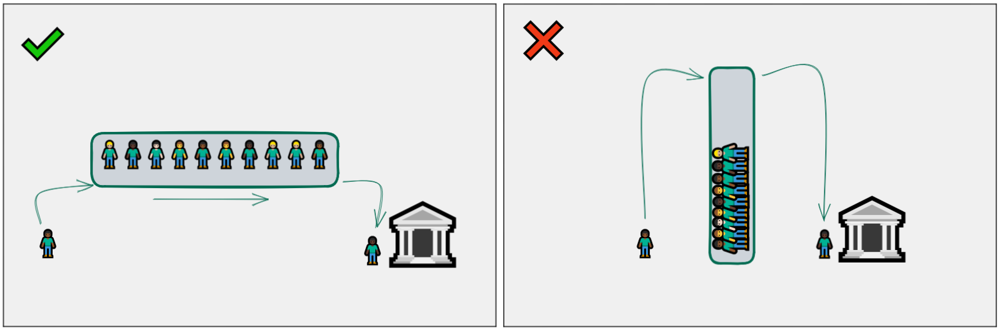

## E os outros problemas?

A analogia ao mundo real que acabamos de fazer demonstra uma coisa: Nem todos os problemas podemos tratar como uma pilha. Por exemplo, a fila do banco. Imagine que você acabou de chegar na fila necessitando atendimento. Você espera receber o atendimento imediatamente após as pessoas que chegaram antes de você, certo? Se tratarmos isso como uma pilha, a primeira que pessoa que chegou vai ser atendida por último, e provavelmente vai ficar esperando umas 8 horas até o banco fechar, pois a fila continua cheia o dia inteiro.

