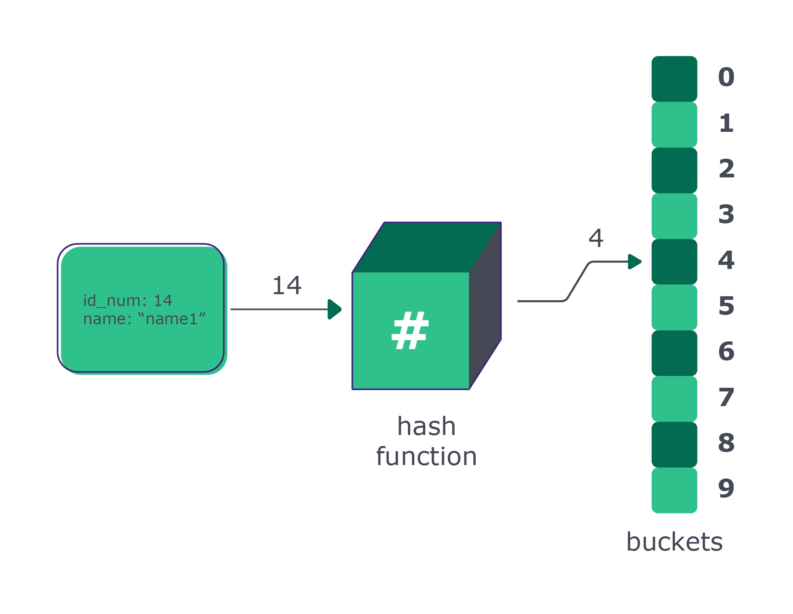

## Hashmap: usando hashing para estruturar dados

**A estratégia de armazenamento de dados da hashmap é submeter o dado a um procedimento matemático (hash function) para obter um endereço único onde ela será guardada (address).** Na relação chave-valor, o id numérico da classe Employee é a chave e o objeto Employee inteiro é o valor. A hash function vai ler o valor da chave para definir o endereço do objeto como um todo.

Uma vez obtido o endereço, basta armazenar o dado no local correto. Na imagem abaixo, esse endereço é o índice no vetor onde a informação está sendo guardada. O local de armazenamento é comumente chamado de buckets (baldes), que é onde vamos jogar os dados:



### Vamos para a prática 💪

Lembra do aplicativo que precisávamos criar para controlar o cadastro de pessoas que trabalham em uma determinada empresa?

O próximo passo no nosso problema é localizar as informações da pessoa do identificador número 14 para corrigir o nome. Para descobrir onde o objeto está armazenado, passamos a chave 14 para a mesma hash function, que resultará no endereço do objeto. Daí, basta fazer as consultas ou atualizações necessárias.

Complexidade: Nesse exemplo, a execução da hash function, bem como a operação de acessar o endereço para leitura ou escrita, tem complexidade O(1). Dessa forma, tanto inserção como consulta têm complexidade constante. Cada dado que entra na hash function sai com seu respectivo endereço. Por isso, hashmaps também são conhecidas como tabelas de espalhamento.

Agora que entendemos bem como funciona o algoritmo de uma hashmap, vamos expressar esses conceitos no código e treinar um pouco de implementação. Construiremos em conjunto uma classe hashmap simples, que consegue lidar com chaves numéricas no formato int, que é o caso do nosso exemplo.

Para isso, vamos criar apenas um arquivo para "codarmos" duas classes que teremos. Crie o arquivo com o nome que preferir e acompanhe o passo a passo.

> ⚠️Atenção: não se esqueça de criar e ativar o ambiente isolado!

### class Employee

Para armazenar os dados da pessoa de forma agregada vamos criar a classe Employee:

```python
class Employee:
    def __init__(self, id_num, name):
        self.id_num = id_num
        self.name = name
```

### Hash Function

Considerando que nossa chave são inteiros, vamos usar a operação mod 10, ou resto da divisão inteira por 10, para definirmos o índice onde o dado vai ser armazenado. Cada número que entra vai resultar em um endereço de 0 a 9. O valor 10 foi escolhido por não ser muito grande. Tanto a operação mod como o valor 10 são escolhas ilustrativas e são apenas um exemplo.

Vamos inicializar nossa classe HashMap e definir o método get_address():

```python
# class Employee:
#     def __init__(self, id_num, name):
#         self.id_num = id_num
#         self.name = name


class HashMap:
    def get_address(self, id_num):
        return id_num % 10
```

### Buckets

Como nossa hash function resulta em endereços de 0 a 9, uma lista com 10 posições é suficiente. Vamos inicializar a lista já do tamanho que precisamos, preenchida com None. Não podemos preencher com um valor numérico, como por exemplo -1, pois isso causaria ambiguidade, afinal, se você quiser guardar o valor -1, não daria para saber se isso é o valor ou um indicativo de que o bucket está vazio. A lista buckets, é um atributo da classe HashMap.

```
# ...


class HashMap:
    def __init__(self):
        self._buckets = [None for i in range(10)]

    # def get_address(self, id_num):
    #     return id_num % 10
```

### insert

Para povoar nossa hash, recebemos o objeto, computamos o seu address a partir da chave numérica, e armazenamos no local adequado.

```
# ...


class HashMap:
    # def __init__(self):
    #     self._buckets = [None for i in range(10)]

    # def get_address(self, id_num):
    #     return id_num % 10

    def insert(self, employee):
        address = self.get_address(employee.id_num)
        self._buckets[address] = employee
```

### get_value

Para acessar o dado de interesse, passamos a chave. A classe identifica o índice, onde a referência para aquele objeto está armazenada, e retorna o valor que estiver no campo name.

```
# ...


class HashMap:
    # def __init__(self):
    #     self._buckets = [None for i in range(10)]

    # def get_address(self, id_num):
    #     return id_num % 10

    # def insert(self, employee):
    #     address = self.get_address(employee.id_num)
    #     self._buckets[address] = employee

    def get_value(self, id_num):
        address = self.get_address(id_num)
        return self._buckets[address].name
```

### has

Para consultar se uma determinada chave existe dentro da sua hash map, basta calcular o address. Além disso, vamos nos certificar de que o conteúdo da lista buckets não é None.

```
# ...


class HashMap:
    # def __init__(self):
    #     self._buckets = [None for i in range(10)]

    # def get_address(self, id_num):
    #     return id_num % 10

    # def insert(self, employee):
    #     address = self.get_address(employee.id_num)
    #     self._buckets[address] = employee

    # def get_value(self, id_num):
    #     address = self.get_address(id_num)
    #     return self._buckets[address].name

    def has(self, id_num):
        address = self.get_address(id_num)
        return self._buckets[address] is not None
```

Pronto! Nossa classe está pronta para ser utilizada no problema proposto com inserção e consulta em O(1). Porém, ela não tem um método para alterar valores. Você vai fazer isso nos exercícios a seguir.

Dito isso, vamos fazer exercícios! 🚀

**Exercício 1: a)** Se ainda não implementou, implemente a classe que acabamos de construir, seguindo o passo a passo anterior!

**Exercício 1: b)** Use a entrada abaixo para criar objetos Employee:

`employees = [(14, "name1"), (23, "name2"), (10, "name3"), (9, "name4")] `

**Exercício 1: c)** Instancie a sua classe HashMap e use os objetos Employee para povoá-la. Imprima na tela o nome da pessoa de id_num = 23, acessando a informação a partir da HashMap.

**Exercício 2:** A pessoa de id_num = 10 está com o nome errado, deveria ser name30. Implemente um método com a assinatura abaixo, onde id_num é a chave para localizar o registro que queremos alterar e new_name é o nome a ser colocado. Verifique se o seu código está realmente alterando o nome, imprimindo o nome antes e depois da alteração:

```def update_value(self, id_num, new_name):
    # ...
```
