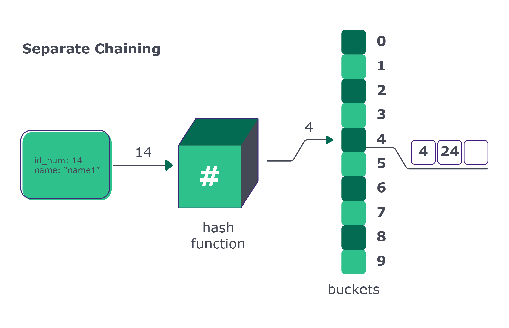
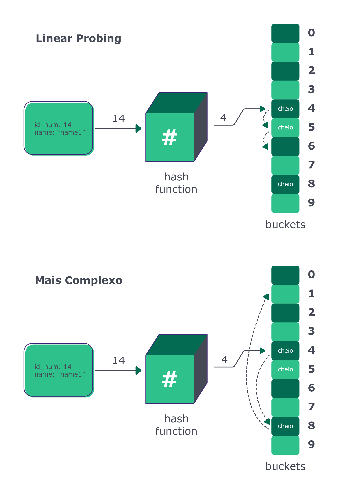

## Colisão

### Quando duas chaves diferentes resultam no mesmo address

Você deve ter percebido um problema enorme com a implementação que fizemos: e quando duas chaves diferentes resultam no mesmo _address?_ Um exemplo simples são as chaves 14 e 24. Ambas resultarão no address = 4. Esse fenômeno é chamado de colisão e existem diversas técnicas para lidar com esse problema. Vamos ver abaixo um pouco mais sobre uma delas.

### Separate Chaining

Assista ao vídeo abaixo e entenda como lidar com o fenômeno de colisão a partir da técnica de **Separate Chaining:**

O jeito mais simples de resolver o problema da colisão é cada bucket segurar uma lista. Daí, caso um elemento receba o mesmo endereço, basta adicionar na lista. Isso faz com que cada bucket tenha seu próprio encadeamento de objetos.



O que teríamos que fazer para alterar essa implementação? A lista buckets não seria mais uma lista. Seria uma lista de listas. A inserção, em vez de apenas colocar o objeto no endereço, precisa adicionar à lista que está nesse endereço. Vamos ver como fica a implementação até aqui:

```
# class Employee:
#     def __init__(self, id_num, name):
#         self.id_num = id_num
#         self.name = name


class HashMap:
    # def __init__(self):
        self._buckets = [[] for i in range(10)]

    # def get_address(self, id_num):
    #     return id_num % 10

    # def insert(self, employee):
        # address = self.get_address(employee.id_num)
        self._buckets[address].append(employee)


# ...
```

> 💡 Repare que a inicialização da lista buckets e a forma como inserimos um dado no bucket estão um pouco diferentes do que fizemos anteriormente.

Como ficam as funções que precisam localizar o elemento exato? Não é mais possível simplesmente resgatar o que estiver no endereço, pois o que está no endereço é uma lista de objetos. Ou seja, teremos que procurar o objeto dentro da lista.

### get_value

Após obter o endereço, vamos iterar sobre a lista até encontrarmos o item com o id_num procurado e retornar o nome. A mesma lógica pode ser aplicada às demais funções e não mostraremos aqui. Implemente-as caso queira treinar mais um pouco. 😉

```
# ...


class HashMap:
    # def __init__(self):
    #     self._buckets = [[] for i in range(10)]

    # def get_address(self, id_num):
    #     return id_num % 10

    # def insert(self, employee):
    #     address = self.get_address(employee.id_num)
    #     self._buckets[address].append(employee)

    def get_value(self, id_num):
        address = self.get_address(id_num)
        for item in self._buckets[address]:
            if item.id_num == id_num:
                return item.name
        return None


# ...
```

### Complexidade

As inserções continuam com complexidade O(1), mas todos os demais métodos agora iteram sobre uma lista de tamanho variado. Caso o item de interesse seja a primeira posição (melhor caso), teremos O(1), mas isso raramente vai acontecer na vida real. No pior caso, será o último, resultando em uma complexidade proporcional ao tamanho da lista que está naquele endereço, o que é uma performance pior do que O(1).

⚠️ Com essa nova implementação, a função update_value(), criada no exercício de fixação 2, parará de funcionar. Isso acontece, pois, como explicado anteriormente, agora nosso bucket é uma lista de listas. Dessa forma, se tentarmos atualizar algum valor, da forma antiga, vai dar erro. Para funcionar, teríamos que fazer algumas alterações, mas para meios didáticos não vamos fazê-las.

### A complexidade não era pra ser O(1)?

Percebemos que a decisão de combinar a hash function "mod" com a forma de tratar colisões "separate chaining", fez com que o acesso à informação não fosse exatamente O(1). Isso demonstra como a análise de complexidade na vida real é mais complicada do que na teoria. E o mais importante: demonstra como as decisões de implementação de cada estrutura de dados afetam a performance final.

### Open Addressing com Linear Probing

Existem outras técnicas de tratamento de colisão, como a Open Addressing, onde o endereço final não é conhecido e o hashcode é utilizado apenas para iniciar a busca de um bucket vazio dentro da própria lista de buckets. Essa busca por um espaço vazio pode ser feita de diversas maneiras.

Quando a busca por um espaço vazio é feita olhando um índice após o outro, é chamada de Linear Probing, mas existem vários outros métodos de busca pelo espaço vazio, incluindo cálculos matemáticos mais complexos para ir "saltando" de índice em índice.



### Anote aí: 📝

As decisões de implementação que precisamos tomar enquanto pessoas desenvolvedoras normalmente são bem complexas e alvo de discussões técnicas, na tentativa de estabelecer as melhores combinações. Mas não se engane, quase nunca existe uma solução geral, do tipo one-size-fits-all, a famosa "bala de prata". Geralmente a melhor decisão depende do uso que você quer fazer da estrutura, restrições de recurso computacional (tempo ou espaço de memória) e as características do dado a ser armazenado.

É por isso que as linguagens geralmente fazem esse trabalho por você e te fornecem uma implementação pronta da estrutura de dados, com as melhores decisões que a equipe da linguagem tomou até agora. Em Python, a classe Dict implementa a hashmap. Em Java, existem duas classes com decisões diferentes de implementação: HashMap e HashTable.

Como pessoa desenvolvedora, é importante que você saiba como a sua linguagem implementa a estrutura, assim é possível entender a real complexidade do seu código. Muitas vezes temos recurso computacional suficiente para que essas diferenças de implementação não representem um problema. Mas quando lidamos com um volume muito alto de dados, ou quando temos poucos recursos computacionais disponíveis, podemos ter problemas reais que afetam a experiência da pessoa usuária.

### Para praticar, vamos fazer mais dois exercícios: 💪

**Exercício 3:** Descubra qual técnica de tratamento de colisão é utilizada pelo Dict, de Python e o HashMap, do Java. Em inglês, o termo de busca é "collision resolution".

**Exercício 4:** Como as diferentes implementações afetam a performance? Quais são os prós e contras da implementação de cada linguagem?
