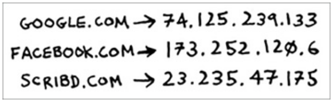
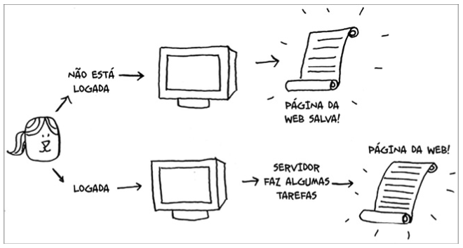

## Exemplos de aplicações que usam Hashmaps

### Resolução DNS

Suponha que você queira acessar um website como o http://adit.io. O seu computador deve traduzir adit.io para a forma de um endereço de IP. Para cada website que você acessar, o endereço deverá ser traduzido para um endereço de IP.
Nossa, mapear o endereço de um website para um endereço IP? Isso parece o caso perfeito para a utilização de tabelas hash! Este processo é chamado de resolução DNS, e as tabelas hash são uma das maneiras pelas quais esta funcionalidade pode ser implementada.

### Cache

Você já conheceu uma criança bastante curiosa? Que faz inúmeras perguntas como “O quão distante Marte fica da Terra?”, “Qual a distância até a Lua?” e “Qual a distância até Júpiter?”. A cada pergunta você precisa pesquisar a resposta e só então você conseguirá responder né? Logo você terá memorizado que a Lua fica a 384.400 km de distância e não precisará mais procurar esta resposta. É desta forma que o cache funciona: os websites lembram dos dados em vez de recalculá-los a cada solicitação.

Agora pense no site da Trybe: você sabia que ali todo o conteúdo é feito sob medida? Pois é, todas as vezes que você acessa a página betrybe.com, os servidores precisam pensar e selecionar qual conteúdo é de seu interesse. Porém, se você não tiver feito login no site da Trybe, verá apenas a página de login, sendo que todas as pessoas verão a mesma página de login. Ou seja, a Trybe engloba diversas solicitações para a mesma informação: “Mostre-me a página inicial quando eu não estiver logado”. Isso evita que o servidor tenha que pensar como a página inicial é, pois ele memoriza como a página inicial deve ser apresentada e então a envia para você.

Isso se chama caching, e esta prática oferece duas vantagens:

<li>Você recebe a página da web muito mais rapidamente, da mesma forma que você memorizou a distância entre a Terra e a Lua. Assim, da próxima vez que uma criança perguntar sobre isso, não será necessário pesquisar no Google, pois você conseguirá responder instantaneamente.
<li>A Trybe precisa trabalhar menos.

Esta técnica é uma maneira comum de agilizar as coisas. Todos os grandes sites usam caching, e os dados destes cachings são armazenados em uma tabela hash! A Trybe não está só aplicando o caching na página de entrada. Ela está fazendo cache das páginas Formação, Blog, Dúvidas e muitas outras. Assim, ela precisa mapear a URL de uma página e relacioná-la aos dados da página.

