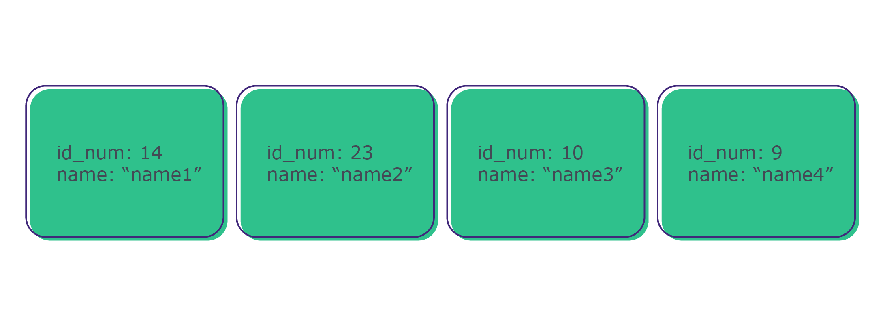

## O que vamos aprender

Hoje vamos aprender sobre a hash map, também conhecida como hash table, uma estrutura de dados muito importante na computação e imprescindível na sua caixa de ferramentas dev por oferecer operações como consulta e inserção em O(1). Além disso, eesa a base de muitas classes baseadas em chave-valor.
Vamos com tudo, porque esse conteúdo está imperdível!

## Você será capaz de

<li>Entender o conceito de hashing e como ele é utilizado para criar estruturas eficientes;
<li>Implementar uma classe HashMap simples com as principais operações;
<li>Compreender como as decisões de implementação impactam na eficiência real da estrutura de dados;
<li>Entender como a classe Dict, de Python, funciona por baixo dos panos.

## Por que isso é importante?

Imagine você precisa criar um aplicativo para controlar o cadastro de pessoas que trabalham em uma determinada empresa. Para simplificar, você só precisa controlar o número de identificação e o nome de cada pessoa. Para guardar esses dados, você pode ter uma classe Employee que agrega as informações. Para armazenar os objetos, uma possível solução é guardá-los em uma lista. Construir essa lista adicionando cada objeto ao final tem complexidade O(1).

Mas agora você precisa alterar o nome da pessoa de id número 14. Como podemos acessar esse objeto para fazer a alteração? Podemos iterar sobre essa lista buscando o id, com complexidade O(n). Se a lista estiver ordenada, podemos realizar uma busca binária e gastar O(log n) para cada busca. Nesse caso, a cada nova pessoa adicionada, a lista precisaria ser novamente ordenada, elevando o custo de inserção para O(n log n).

➡️ O conteúdo de hoje é essencial, justamente porque a hashmap é uma estrutura de dados do tipo chave-valor que nos permite inserir e localizar o cadastro da pessoa em O(1)! Essa estrutura é muito poderosa e, por isso, é largamente utilizada na computação. Por esse motivo também é muito cobrada em entrevistas que exigem resolução de problemas algorítmicos (whiteboard interviews), sobretudo em empresas de grande porte. Heróis de anime sabem bem disso:

https://www.youtube.com/embed/pKO9UjSeLew
